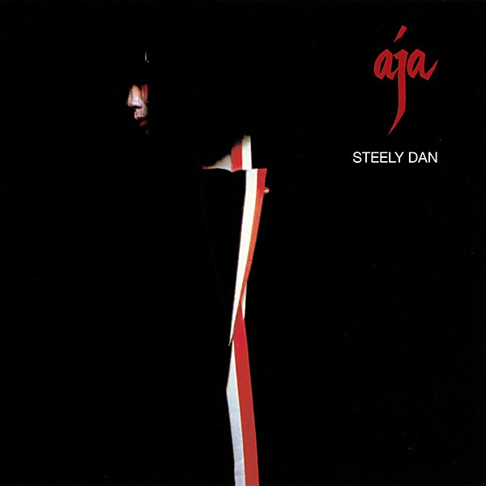

# Aja

By **Steely Dan**

## Album Data

- **Catalog:** Beets
- **Format:** Digital, Album
- **Album:** Aja
- **Artist:** Steely Dan
- **Albumartist:** Steely Dan
- **Genre:** Soft Rock
- **MusicBrainz Album Artist ID:** [e01c3376-15fa-40d7-b747-5f219bdefdd7](https://musicbrainz.org/artist/e01c3376-15fa-40d7-b747-5f219bdefdd7)
- **MusicBrainz Album ID:** [5e8c8780-2b25-4e43-9d0f-804131132eb6](https://musicbrainz.org/release/5e8c8780-2b25-4e43-9d0f-804131132eb6)
- **MusicBrainz Release Group ID:** [8588c5a5-b491-37a4-8d51-2227346a072e](https://musicbrainz.org/release-group/8588c5a5-b491-37a4-8d51-2227346a072e)
- **Year:** 1977
- **Catalog #:** MCAD-31156
- **Label:** MCA Records
- **Total Tracks:** 08

## Album Tracks

### Track 01 - Bodhisattva

- **Artist:** Steely Dan
- **Format:** ALAC
- **Genre:** Progressive Rock
- **Length:** 5:18
- **MusicBrainz Track ID:** [f87d5fdb-77f3-49a2-8bed-0d7d02b02e97](https://musicbrainz.org/recording/f87d5fdb-77f3-49a2-8bed-0d7d02b02e97)
- **Title:** Bodhisattva
- **Track:** 01
- **Year:** 1985

### Track 02 - Razor Boy

- **Artist:** Steely Dan
- **Format:** ALAC
- **Genre:** Jazz Fusion
- **Length:** 3:11
- **MusicBrainz Track ID:** [125cf981-fec9-4723-b83d-303d502aeb8f](https://musicbrainz.org/recording/125cf981-fec9-4723-b83d-303d502aeb8f)
- **Title:** Razor Boy
- **Track:** 02
- **Year:** 1985

### Track 03 - The Boston Rag

- **Artist:** Steely Dan
- **Format:** ALAC
- **Genre:** Jazz Fusion
- **Length:** 5:39
- **MusicBrainz Track ID:** [924fffac-8bb7-4e8d-848a-90e6a828ea8b](https://musicbrainz.org/recording/924fffac-8bb7-4e8d-848a-90e6a828ea8b)
- **Title:** The Boston Rag
- **Track:** 03
- **Year:** 1985

### Track 04 - Your Gold Teeth

- **Artist:** Steely Dan
- **Format:** ALAC
- **Genre:** Uk Garage
- **Length:** 6:59
- **MusicBrainz Track ID:** [0f0829e7-dde2-46bb-bb03-7e5a19cf1b84](https://musicbrainz.org/recording/0f0829e7-dde2-46bb-bb03-7e5a19cf1b84)
- **Title:** Your Gold Teeth
- **Track:** 04
- **Year:** 1985

### Track 05 - Show Biz Kids

- **Artist:** Steely Dan
- **Format:** ALAC
- **Genre:** Progressive Rock
- **Length:** 5:26
- **MusicBrainz Track ID:** [42b150ce-2dd6-457f-937b-aedcb7137114](https://musicbrainz.org/recording/42b150ce-2dd6-457f-937b-aedcb7137114)
- **Title:** Show Biz Kids
- **Track:** 05
- **Year:** 1985

### Track 06 - My Old School

- **Artist:** Steely Dan
- **Format:** ALAC
- **Genre:** Soft Rock
- **Length:** 5:46
- **MusicBrainz Track ID:** [e6fe5188-e68f-46d3-bc3c-c46cb7282bbf](https://musicbrainz.org/recording/e6fe5188-e68f-46d3-bc3c-c46cb7282bbf)
- **Title:** My Old School
- **Track:** 06
- **Year:** 1985

### Track 07 - Pearl of the Quarter

- **Artist:** Steely Dan
- **Format:** ALAC
- **Genre:** Soul
- **Length:** 3:51
- **MusicBrainz Track ID:** [fe0ec5a1-e970-4ee9-8957-d72f86248b51](https://musicbrainz.org/recording/fe0ec5a1-e970-4ee9-8957-d72f86248b51)
- **Title:** Pearl of the Quarter
- **Track:** 07
- **Year:** 1985

### Track 08 - King of the World

- **Artist:** Steely Dan
- **Format:** ALAC
- **Genre:** Soul
- **Length:** 5:00
- **MusicBrainz Track ID:** [b6b3bf3b-6791-43de-96c1-86a5a87c4252](https://musicbrainz.org/recording/b6b3bf3b-6791-43de-96c1-86a5a87c4252)
- **Title:** King of the World
- **Track:** 08
- **Year:** 1985

## See also

- [Countdown to Ecstasy](Countdown_to_Ecstasy.md)
- [Pretzel Logic](Pretzel_Logic.md)
- [CD: Aja](../../CD/Steely_Dan/Aja.md)
- [CD: Countdown To Ecstasy](../../CD/Steely_Dan/Countdown_To_Ecstasy.md)
- [CD: Pretzel Logic](../../CD/Steely_Dan/Pretzel_Logic.md)
- [CD: ](../../CD/Steely_Dan/Steely_Dan.md)
- [Roon: Aja](../../Roon/Steely_Dan/Aja.md)
- [Roon: Can't Buy A Thrill](../../Roon/Steely_Dan/Cant_Buy_A_Thrill.md)
- [Roon: Countdown To Ecstasy](../../Roon/Steely_Dan/Countdown_To_Ecstasy.md)
- [Roon: Katy Lied](../../Roon/Steely_Dan/Katy_Lied.md)
- [Roon: Pretzel Logic](../../Roon/Steely_Dan/Pretzel_Logic.md)
