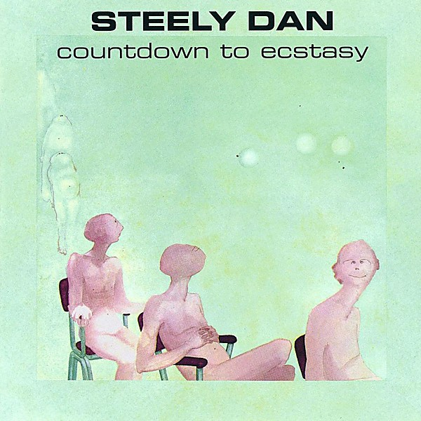

# Countdown to Ecstasy

By **Steely Dan**

## Album Data

- **Catalog:** Beets
- **Format:** Digital, Album
- **Album:** Countdown to Ecstasy
- **Artist:** Steely Dan
- **Albumartist:** Steely Dan
- **Genre:** Soft Rock
- **MusicBrainz Album Artist ID:** [e01c3376-15fa-40d7-b747-5f219bdefdd7](https://musicbrainz.org/artist/e01c3376-15fa-40d7-b747-5f219bdefdd7)
- **MusicBrainz Album ID:** [f663a7e9-c462-495c-a4a6-db97ff181b50](https://musicbrainz.org/release/f663a7e9-c462-495c-a4a6-db97ff181b50)
- **MusicBrainz Release Group ID:** [33726877-dd41-301b-9f1e-498ebbadc7d8](https://musicbrainz.org/release-group/33726877-dd41-301b-9f1e-498ebbadc7d8)
- **Year:** 1985
- **Catalog #:** MCAD-31165
- **Label:** MCA Records
- **Total Tracks:** 11

## Album Tracks

### Track 01 - Rikki Don’t Lose That Number

- **Artist:** Steely Dan
- **Format:** ALAC
- **Genre:** Soft Rock
- **Length:** 4:32
- **MusicBrainz Track ID:** [ae7db225-a7fb-4276-a6d9-6cc88d992fa8](https://musicbrainz.org/recording/ae7db225-a7fb-4276-a6d9-6cc88d992fa8)
- **Title:** Rikki Don’t Lose That Number
- **Track:** 01
- **Year:** 1987

### Track 02 - Night by Night

- **Artist:** Steely Dan
- **Format:** ALAC
- **Genre:** Jazz Fusion
- **Length:** 3:40
- **MusicBrainz Track ID:** [64b01a56-430e-4ed2-9270-45bcc9f1f9bf](https://musicbrainz.org/recording/64b01a56-430e-4ed2-9270-45bcc9f1f9bf)
- **Title:** Night by Night
- **Track:** 02
- **Year:** 1987

### Track 03 - Any Major Dude Will Tell You

- **Artist:** Steely Dan
- **Format:** ALAC
- **Genre:** Soft Rock
- **Length:** 3:08
- **MusicBrainz Track ID:** [d5439552-d683-4e93-9bef-4638e77ed679](https://musicbrainz.org/recording/d5439552-d683-4e93-9bef-4638e77ed679)
- **Title:** Any Major Dude Will Tell You
- **Track:** 03
- **Year:** 1987

### Track 04 - Barrytown

- **Artist:** Steely Dan
- **Format:** ALAC
- **Genre:** Soft Rock
- **Length:** 3:22
- **MusicBrainz Track ID:** [43046dbb-1541-4ff8-9a28-92c6df322b34](https://musicbrainz.org/recording/43046dbb-1541-4ff8-9a28-92c6df322b34)
- **Title:** Barrytown
- **Track:** 04
- **Year:** 1987

### Track 05 - East St. Louis Toodle‐oo

- **Artist:** Steely Dan
- **Format:** ALAC
- **Genre:** Soft Rock
- **Length:** 2:49
- **MusicBrainz Track ID:** [dc42f288-bcc8-4747-979b-d938cf4694dc](https://musicbrainz.org/recording/dc42f288-bcc8-4747-979b-d938cf4694dc)
- **Title:** East St. Louis Toodle‐oo
- **Track:** 05
- **Year:** 1987

### Track 06 - Parker’s Band

- **Artist:** Steely Dan
- **Format:** ALAC
- **Genre:** Soft Rock
- **Length:** 2:45
- **MusicBrainz Track ID:** [96c2b5a2-1863-4cae-9665-859f4ea45bec](https://musicbrainz.org/recording/96c2b5a2-1863-4cae-9665-859f4ea45bec)
- **Title:** Parker’s Band
- **Track:** 06
- **Year:** 1987

### Track 07 - Through With Buzz

- **Artist:** Steely Dan
- **Format:** ALAC
- **Genre:** Soft Rock
- **Length:** 1:34
- **MusicBrainz Track ID:** [8ccc2a04-94a4-4982-b7d3-609fc2f0bedf](https://musicbrainz.org/recording/8ccc2a04-94a4-4982-b7d3-609fc2f0bedf)
- **Title:** Through With Buzz
- **Track:** 07
- **Year:** 1987

### Track 08 - Pretzel Logic

- **Artist:** Steely Dan
- **Format:** ALAC
- **Genre:** Soft Rock
- **Length:** 4:32
- **MusicBrainz Track ID:** [bf1b870f-3246-4948-8397-aad1893cb16d](https://musicbrainz.org/recording/bf1b870f-3246-4948-8397-aad1893cb16d)
- **Title:** Pretzel Logic
- **Track:** 08
- **Year:** 1987

### Track 09 - With a Gun

- **Artist:** Steely Dan
- **Format:** ALAC
- **Genre:** Soft Rock
- **Length:** 2:18
- **MusicBrainz Track ID:** [2251d969-e0d5-4069-9d89-a3b2f370131a](https://musicbrainz.org/recording/2251d969-e0d5-4069-9d89-a3b2f370131a)
- **Title:** With a Gun
- **Track:** 09
- **Year:** 1987

### Track 10 - Charlie Freak

- **Artist:** Steely Dan
- **Format:** ALAC
- **Genre:** Soft Rock
- **Length:** 2:44
- **MusicBrainz Track ID:** [ab13d2d7-447d-4007-bbda-95f3dd1ef70c](https://musicbrainz.org/recording/ab13d2d7-447d-4007-bbda-95f3dd1ef70c)
- **Title:** Charlie Freak
- **Track:** 10
- **Year:** 1987

### Track 11 - Monkey in Your Soul

- **Artist:** Steely Dan
- **Format:** ALAC
- **Genre:** Soft Rock
- **Length:** 2:38
- **MusicBrainz Track ID:** [536145a8-d2e3-42f0-9cd4-917f90cfd9f2](https://musicbrainz.org/recording/536145a8-d2e3-42f0-9cd4-917f90cfd9f2)
- **Title:** Monkey in Your Soul
- **Track:** 11
- **Year:** 1987

## See also

- [Aja](Aja.md)
- [Pretzel Logic](Pretzel_Logic.md)
- [CD: Aja](../../CD/Steely_Dan/Aja.md)
- [CD: Countdown To Ecstasy](../../CD/Steely_Dan/Countdown_To_Ecstasy.md)
- [CD: Pretzel Logic](../../CD/Steely_Dan/Pretzel_Logic.md)
- [CD: ](../../CD/Steely_Dan/Steely_Dan.md)
- [Roon: Aja](../../Roon/Steely_Dan/Aja.md)
- [Roon: Can't Buy A Thrill](../../Roon/Steely_Dan/Cant_Buy_A_Thrill.md)
- [Roon: Countdown To Ecstasy](../../Roon/Steely_Dan/Countdown_To_Ecstasy.md)
- [Roon: Katy Lied](../../Roon/Steely_Dan/Katy_Lied.md)
- [Roon: Pretzel Logic](../../Roon/Steely_Dan/Pretzel_Logic.md)
