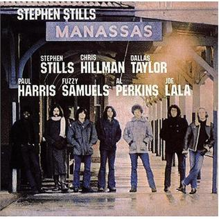

# Manassas

By **Stephen Stills**

## Album Data

- **Catalog:** Beets
- **Format:** Digital, Album
- **Album:** Manassas
- **Artist:** Stephen Stills
- **Albumartist:** Stephen Stills
- **Genre:** Soft Rock
- **MusicBrainz Album Artist ID:** [5642774a-72c0-4099-8da4-7c1ab36378a8](https://musicbrainz.org/artist/5642774a-72c0-4099-8da4-7c1ab36378a8)
- **MusicBrainz Album ID:** [7efd5c03-bc93-43f2-a46c-51ca6d27a02a](https://musicbrainz.org/release/7efd5c03-bc93-43f2-a46c-51ca6d27a02a)
- **MusicBrainz Release Group ID:** [5ee3fdb7-4ae4-3cd0-9a81-e42a60db76dd](https://musicbrainz.org/release-group/5ee3fdb7-4ae4-3cd0-9a81-e42a60db76dd)
- **Year:** 1996
- **Catalog #:** 7567-82808-2
- **Label:** Atlantic
- **Total Tracks:** 21

## Album Tracks

### Track 01 - Song of Love

- **Artist:** Stephen Stills
- **Format:** ALAC
- **Genre:** Soft Rock
- **Length:** 3:26
- **MusicBrainz Track ID:** [37071898-9ac0-4f7b-b13e-1383e17d7365](https://musicbrainz.org/recording/37071898-9ac0-4f7b-b13e-1383e17d7365)
- **Title:** Song of Love
- **Track:** 01
- **Year:** 1996

### Track 02 - Rock & Roll Crazies / Cuban Bluegrass

- **Artist:** Stephen Stills
- **Format:** ALAC
- **Genre:** Soft Rock
- **Length:** 3:31
- **MusicBrainz Track ID:** [37b03e42-b22c-4b87-b1d9-784257baa82e](https://musicbrainz.org/recording/37b03e42-b22c-4b87-b1d9-784257baa82e)
- **Title:** Rock & Roll Crazies / Cuban Bluegrass
- **Track:** 02
- **Year:** 1996

### Track 03 - Jet Set (Sigh)

- **Artist:** Stephen Stills
- **Format:** ALAC
- **Genre:** Southern Rock
- **Length:** 4:22
- **MusicBrainz Track ID:** [baf34138-f429-41d2-9507-8ff8031165aa](https://musicbrainz.org/recording/baf34138-f429-41d2-9507-8ff8031165aa)
- **Title:** Jet Set (Sigh)
- **Track:** 03
- **Year:** 1996

### Track 04 - Anyway

- **Artist:** Stephen Stills
- **Format:** ALAC
- **Genre:** Rock
- **Length:** 3:19
- **MusicBrainz Track ID:** [956243dc-baa8-4eca-ae2e-bdbe7817bc8b](https://musicbrainz.org/recording/956243dc-baa8-4eca-ae2e-bdbe7817bc8b)
- **Title:** Anyway
- **Track:** 04
- **Year:** 1996

### Track 05 - Both of Us (Bound to Lose)

- **Artist:** Stephen Stills
- **Format:** ALAC
- **Genre:** Folk Rock
- **Length:** 3:02
- **MusicBrainz Track ID:** [907e0849-eb1e-4fb2-a2bd-219f337438e0](https://musicbrainz.org/recording/907e0849-eb1e-4fb2-a2bd-219f337438e0)
- **Title:** Both of Us (Bound to Lose)
- **Track:** 05
- **Year:** 1996

### Track 06 - Fallen Eagle

- **Artist:** Stephen Stills
- **Format:** ALAC
- **Genre:** Folk Rock
- **Length:** 2:05
- **MusicBrainz Track ID:** [27bce365-b696-481d-b36b-72dbeca1b3c3](https://musicbrainz.org/recording/27bce365-b696-481d-b36b-72dbeca1b3c3)
- **Title:** Fallen Eagle
- **Track:** 06
- **Year:** 1996

### Track 07 - Jesus Gave Love Away for Free

- **Artist:** Stephen Stills
- **Format:** ALAC
- **Genre:** Rock
- **Length:** 3:01
- **MusicBrainz Track ID:** [120b2b96-a977-45dc-a92d-88842ee44e76](https://musicbrainz.org/recording/120b2b96-a977-45dc-a92d-88842ee44e76)
- **Title:** Jesus Gave Love Away for Free
- **Track:** 07
- **Year:** 1996

### Track 08 - Colorado

- **Artist:** Stephen Stills
- **Format:** ALAC
- **Genre:** Soft Rock
- **Length:** 2:52
- **MusicBrainz Track ID:** [0c442b5d-7274-4fb8-bbc7-89a07c8e5e97](https://musicbrainz.org/recording/0c442b5d-7274-4fb8-bbc7-89a07c8e5e97)
- **Title:** Colorado
- **Track:** 08
- **Year:** 1996

### Track 09 - So Begins the Task

- **Artist:** Stephen Stills
- **Format:** ALAC
- **Genre:** Soft Rock
- **Length:** 3:59
- **MusicBrainz Track ID:** [c5d12cfb-84f2-4be0-87c8-c732feb56d01](https://musicbrainz.org/recording/c5d12cfb-84f2-4be0-87c8-c732feb56d01)
- **Title:** So Begins the Task
- **Track:** 09
- **Year:** 1996

### Track 10 - Hide It So Deep

- **Artist:** Stephen Stills
- **Format:** ALAC
- **Genre:** Country Rock
- **Length:** 2:46
- **MusicBrainz Track ID:** [cf9d1e1f-9165-4dce-97f0-792933c79ebf](https://musicbrainz.org/recording/cf9d1e1f-9165-4dce-97f0-792933c79ebf)
- **Title:** Hide It So Deep
- **Track:** 10
- **Year:** 1996

### Track 11 - Don't Look at My Shadow

- **Artist:** Stephen Stills
- **Format:** ALAC
- **Genre:** Soft Rock
- **Length:** 2:29
- **MusicBrainz Track ID:** [a6ff70ba-0c26-4f06-99cf-67e1a03cd718](https://musicbrainz.org/recording/a6ff70ba-0c26-4f06-99cf-67e1a03cd718)
- **Title:** Don't Look at My Shadow
- **Track:** 11
- **Year:** 1996

### Track 12 - It Doesn't Matter

- **Artist:** Stephen Stills
- **Format:** ALAC
- **Genre:** Folk Rock
- **Length:** 2:30
- **MusicBrainz Track ID:** [9f85f1c1-0fb6-4399-b940-5d5cbe57e1d0](https://musicbrainz.org/recording/9f85f1c1-0fb6-4399-b940-5d5cbe57e1d0)
- **Title:** It Doesn't Matter
- **Track:** 12
- **Year:** 1996

### Track 13 - Johnny's Garden

- **Artist:** Stephen Stills
- **Format:** ALAC
- **Genre:** Soft Rock
- **Length:** 2:45
- **MusicBrainz Track ID:** [364badb4-7201-4c26-82c4-7677fe13e844](https://musicbrainz.org/recording/364badb4-7201-4c26-82c4-7677fe13e844)
- **Title:** Johnny's Garden
- **Track:** 13
- **Year:** 1996

### Track 14 - Bound to Fall

- **Artist:** Stephen Stills
- **Format:** ALAC
- **Genre:** Folk Rock
- **Length:** 1:53
- **MusicBrainz Track ID:** [f9aae4fa-d250-41f4-8e96-2411d192cee7](https://musicbrainz.org/recording/f9aae4fa-d250-41f4-8e96-2411d192cee7)
- **Title:** Bound to Fall
- **Track:** 14
- **Year:** 1996

### Track 15 - How Far

- **Artist:** Stephen Stills
- **Format:** ALAC
- **Genre:** Southern Rock
- **Length:** 2:51
- **MusicBrainz Track ID:** [cc66be6a-ed12-404b-95fa-1558f8d3c698](https://musicbrainz.org/recording/cc66be6a-ed12-404b-95fa-1558f8d3c698)
- **Title:** How Far
- **Track:** 15
- **Year:** 1996

### Track 16 - Move Around

- **Artist:** Stephen Stills
- **Format:** ALAC
- **Genre:** Rock
- **Length:** 4:15
- **MusicBrainz Track ID:** [ebb20739-477b-4d20-abe0-d8f906e93f4a](https://musicbrainz.org/recording/ebb20739-477b-4d20-abe0-d8f906e93f4a)
- **Title:** Move Around
- **Track:** 16
- **Year:** 1996

### Track 17 - The Love Gangster

- **Artist:** Stephen Stills
- **Format:** ALAC
- **Genre:** Rock
- **Length:** 2:51
- **MusicBrainz Track ID:** [5fa8761b-53db-4eca-9509-6aa42651d7a3](https://musicbrainz.org/recording/5fa8761b-53db-4eca-9509-6aa42651d7a3)
- **Title:** The Love Gangster
- **Track:** 17
- **Year:** 1996

### Track 18 - What to Do

- **Artist:** Stephen Stills
- **Format:** ALAC
- **Genre:** Folk Rock
- **Length:** 4:44
- **MusicBrainz Track ID:** [1587d2c6-3014-4084-b12c-4f6a9413832e](https://musicbrainz.org/recording/1587d2c6-3014-4084-b12c-4f6a9413832e)
- **Title:** What to Do
- **Track:** 18
- **Year:** 1996

### Track 19 - Right Now

- **Artist:** Stephen Stills
- **Format:** ALAC
- **Genre:** Country Rock
- **Length:** 2:58
- **MusicBrainz Track ID:** [2ed51c01-69a7-46bf-ab98-f54ae4d4c9fc](https://musicbrainz.org/recording/2ed51c01-69a7-46bf-ab98-f54ae4d4c9fc)
- **Title:** Right Now
- **Track:** 19
- **Year:** 1996

### Track 20 - The Treasure (take One)

- **Artist:** Stephen Stills
- **Format:** ALAC
- **Genre:** Rock
- **Length:** 8:04
- **MusicBrainz Track ID:** [09b08cf5-4301-495d-a331-5b22dddacf57](https://musicbrainz.org/recording/09b08cf5-4301-495d-a331-5b22dddacf57)
- **Title:** The Treasure (take One)
- **Track:** 20
- **Year:** 1996

### Track 21 - Blues Man

- **Artist:** Stephen Stills
- **Format:** ALAC
- **Genre:** Folk Rock
- **Length:** 4:04
- **MusicBrainz Track ID:** [ce7d1943-a839-409d-87ec-32be8d08b3f4](https://musicbrainz.org/recording/ce7d1943-a839-409d-87ec-32be8d08b3f4)
- **Title:** Blues Man
- **Track:** 21
- **Year:** 1996

## See also

- [CD: Manassas](../../CD/Stephen_Stills/Manassas.md)
- [CD: ](../../CD/Stephen_Stills/Stephen_Stills.md)
- [Roon: Carry On](../../Roon/Stephen_Stills/Carry_On.md)
- [Roon: Manassas](../../Roon/Stephen_Stills/Manassas.md)
- [Roon: Stephen Stills 2](../../Roon/Stephen_Stills/Stephen_Stills_2.md)
- [Roon: Stephen Stills](../../Roon/Stephen_Stills/Stephen_Stills.md)
- [Roon: Super Session](../../Roon/Stephen_Stills/Super_Session.md)
