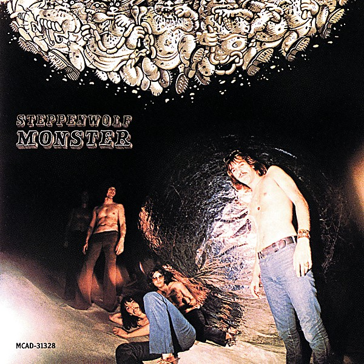

# Monster

By **Steppenwolf**

## Album Data

- **Catalog:** Beets
- **Format:** Digital, Album
- **Album:** Monster
- **Artist:** Steppenwolf
- **Albumartist:** Steppenwolf
- **Genre:** Acid Rock
- **MusicBrainz Album Artist ID:** [12ff8858-bfcb-4812-a8dd-7e9debf0cbee](https://musicbrainz.org/artist/12ff8858-bfcb-4812-a8dd-7e9debf0cbee)
- **MusicBrainz Album ID:** [f1acffd3-66e4-45e9-a2e6-1e38f19d53ca](https://musicbrainz.org/release/f1acffd3-66e4-45e9-a2e6-1e38f19d53ca)
- **MusicBrainz Release Group ID:** [500b38c3-9186-3e14-b820-4707e47e53ee](https://musicbrainz.org/release-group/500b38c3-9186-3e14-b820-4707e47e53ee)
- **Year:** 2015
- **Catalog #:** 
- **Label:** Dunhill ABC
- **Total Tracks:** 11

## Album Tracks

### Track 01 - Sookie Sookie

- **Artist:** Steppenwolf
- **Format:** ALAC
- **Genre:** Acid Rock
- **Length:** 3:17
- **MusicBrainz Track ID:** [cb37d137-9ff6-42a8-9547-02085e0050ed](https://musicbrainz.org/recording/cb37d137-9ff6-42a8-9547-02085e0050ed)
- **Title:** Sookie Sookie
- **Track:** 01
- **Year:** 2014

### Track 02 - Everybody's Next One

- **Artist:** Steppenwolf
- **Format:** ALAC
- **Genre:** Acid Rock
- **Length:** 3:00
- **MusicBrainz Track ID:** [458e8058-ad42-410f-8768-866c79c0ed03](https://musicbrainz.org/recording/458e8058-ad42-410f-8768-866c79c0ed03)
- **Title:** Everybody's Next One
- **Track:** 02
- **Year:** 2014

### Track 03 - Berry Rides Again

- **Artist:** Steppenwolf
- **Format:** ALAC
- **Genre:** Rock And Roll
- **Length:** 2:52
- **MusicBrainz Track ID:** [03a77521-56cd-4e20-8a25-ae254b7c96b4](https://musicbrainz.org/recording/03a77521-56cd-4e20-8a25-ae254b7c96b4)
- **Title:** Berry Rides Again
- **Track:** 03
- **Year:** 2014

### Track 04 - Hoochie Coochie Man

- **Artist:** Steppenwolf
- **Format:** ALAC
- **Genre:** Acid Rock
- **Length:** 5:15
- **MusicBrainz Track ID:** [c0ab8164-d7aa-490e-9adc-d083b9af71f9](https://musicbrainz.org/recording/c0ab8164-d7aa-490e-9adc-d083b9af71f9)
- **Title:** Hoochie Coochie Man
- **Track:** 04
- **Year:** 2014

### Track 05 - Born to Be Wild

- **Artist:** Steppenwolf
- **Format:** ALAC
- **Genre:** Hard Rock
- **Length:** 3:32
- **MusicBrainz Track ID:** [11e0f961-d6b7-4cce-ab3f-dc0ca92a1602](https://musicbrainz.org/recording/11e0f961-d6b7-4cce-ab3f-dc0ca92a1602)
- **Title:** Born to Be Wild
- **Track:** 05
- **Year:** 2014

### Track 06 - Your Wall's Too High

- **Artist:** Steppenwolf
- **Format:** ALAC
- **Genre:** Acid Rock
- **Length:** 5:48
- **MusicBrainz Track ID:** [090ac629-f09e-4c47-b6e3-458486adf4ec](https://musicbrainz.org/recording/090ac629-f09e-4c47-b6e3-458486adf4ec)
- **Title:** Your Wall's Too High
- **Track:** 06
- **Year:** 2014

### Track 07 - Desperation

- **Artist:** Steppenwolf
- **Format:** ALAC
- **Genre:** Acid Rock
- **Length:** 5:47
- **MusicBrainz Track ID:** [7073d1ff-8d77-41f8-bb1d-5b8bd3c2155e](https://musicbrainz.org/recording/7073d1ff-8d77-41f8-bb1d-5b8bd3c2155e)
- **Title:** Desperation
- **Track:** 07
- **Year:** 2014

### Track 08 - The Pusher

- **Artist:** Steppenwolf
- **Format:** ALAC
- **Genre:** Psychedelic Rock
- **Length:** 5:52
- **MusicBrainz Track ID:** [9d099f5c-56a7-41e5-9313-674edcfff660](https://musicbrainz.org/recording/9d099f5c-56a7-41e5-9313-674edcfff660)
- **Title:** The Pusher
- **Track:** 08
- **Year:** 2014

### Track 09 - A Girl I Knew

- **Artist:** Steppenwolf
- **Format:** ALAC
- **Genre:** Acid Rock
- **Length:** 2:42
- **MusicBrainz Track ID:** [46527d16-05e8-477e-91c3-f09d3e12f33e](https://musicbrainz.org/recording/46527d16-05e8-477e-91c3-f09d3e12f33e)
- **Title:** A Girl I Knew
- **Track:** 09
- **Year:** 2014

### Track 10 - Take What You Need

- **Artist:** Steppenwolf
- **Format:** ALAC
- **Genre:** Acid Rock
- **Length:** 3:31
- **MusicBrainz Track ID:** [4cfccda6-d525-45b8-a5d4-b361798e4507](https://musicbrainz.org/recording/4cfccda6-d525-45b8-a5d4-b361798e4507)
- **Title:** Take What You Need
- **Track:** 10
- **Year:** 2014

### Track 11 - The Ostrich

- **Artist:** Steppenwolf
- **Format:** ALAC
- **Genre:** Psychedelic Rock
- **Length:** 5:45
- **MusicBrainz Track ID:** [cbb5ce12-92ea-42d0-8e81-e09e736059d7](https://musicbrainz.org/recording/cbb5ce12-92ea-42d0-8e81-e09e736059d7)
- **Title:** The Ostrich
- **Track:** 11
- **Year:** 2014

## See also

- [Steppenwolf](Steppenwolf.md)
- [The Second](The_Second.md)
- [CD: Monster](../../CD/Steppenwolf/Monster.md)
- [CD: ](../../CD/Steppenwolf/Steppenwolf_index.md)
- [CD: Steppenwolf](../../CD/Steppenwolf/Steppenwolf.md)
- [CD: The Second](../../CD/Steppenwolf/The_Second.md)
- [Roon: Monster](../../Roon/Steppenwolf/Monster.md)
- [Roon: Steppenwolf](../../Roon/Steppenwolf/Steppenwolf.md)
- [Roon: The Second](../../Roon/Steppenwolf/The_Second.md)
- [Vinyl: Monster](../../Vinyl/Steppenwolf/Monster.md)
- [Vinyl: ](../../Vinyl/Steppenwolf/Steppenwolf_index.md)
- [Vinyl: Steppenwolf](../../Vinyl/Steppenwolf/Steppenwolf.md)
