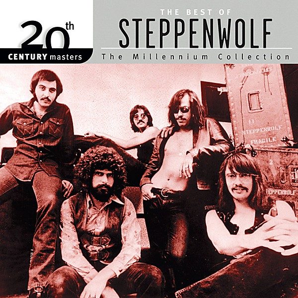

# Steppenwolf

By **Steppenwolf**

## Album Data

- **Catalog:** Beets
- **Format:** Digital, Album
- **Album:** Steppenwolf
- **Artist:** Steppenwolf
- **Albumartist:** Steppenwolf
- **Genre:** Acid Rock
- **MusicBrainz Album Artist ID:** [12ff8858-bfcb-4812-a8dd-7e9debf0cbee](https://musicbrainz.org/artist/12ff8858-bfcb-4812-a8dd-7e9debf0cbee)
- **MusicBrainz Album ID:** [7a6e915c-7a01-494d-b0b5-98526b569cae](https://musicbrainz.org/release/7a6e915c-7a01-494d-b0b5-98526b569cae)
- **MusicBrainz Release Group ID:** [38562fbb-157e-3803-b343-94f6a710444b](https://musicbrainz.org/release-group/38562fbb-157e-3803-b343-94f6a710444b)
- **Year:** 2014
- **Catalog #:** 
- **Label:** Geffen Records
- **Total Tracks:** 12

## Album Tracks

### Track 01 - Faster Than the Speed of Life

- **Artist:** Steppenwolf
- **Format:** ALAC
- **Genre:** Psychedelic Rock
- **Length:** 3:16
- **MusicBrainz Track ID:** [87924477-de88-4642-b6f1-4de47b5df042](https://musicbrainz.org/recording/87924477-de88-4642-b6f1-4de47b5df042)
- **Title:** Faster Than the Speed of Life
- **Track:** 01
- **Year:** 2015

### Track 02 - Tighten Up Your Wig

- **Artist:** Steppenwolf
- **Format:** ALAC
- **Genre:** Psychedelic Rock
- **Length:** 3:10
- **MusicBrainz Track ID:** [17c14b69-9e6a-4e11-bcb9-cb4f39a13360](https://musicbrainz.org/recording/17c14b69-9e6a-4e11-bcb9-cb4f39a13360)
- **Title:** Tighten Up Your Wig
- **Track:** 02
- **Year:** 2015

### Track 03 - None of Your Doing

- **Artist:** Steppenwolf
- **Format:** ALAC
- **Genre:** Hard Rock
- **Length:** 2:54
- **MusicBrainz Track ID:** [11b4a26c-adab-484d-a543-385a64f8f255](https://musicbrainz.org/recording/11b4a26c-adab-484d-a543-385a64f8f255)
- **Title:** None of Your Doing
- **Track:** 03
- **Year:** 2015

### Track 04 - Spiritual Fantasy

- **Artist:** Steppenwolf
- **Format:** ALAC
- **Genre:** Psychedelic Rock
- **Length:** 3:44
- **MusicBrainz Track ID:** [0239c23b-af36-4e11-be8c-c3704166e40d](https://musicbrainz.org/recording/0239c23b-af36-4e11-be8c-c3704166e40d)
- **Title:** Spiritual Fantasy
- **Track:** 04
- **Year:** 2015

### Track 05 - Don’t Step on the Grass, Sam

- **Artist:** Steppenwolf
- **Format:** ALAC
- **Genre:** Stoner Rock
- **Length:** 5:42
- **MusicBrainz Track ID:** [acf8bbf0-095d-4409-91ae-5523f4d52e83](https://musicbrainz.org/recording/acf8bbf0-095d-4409-91ae-5523f4d52e83)
- **Title:** Don’t Step on the Grass, Sam
- **Track:** 05
- **Year:** 2015

### Track 06 - 28

- **Artist:** Steppenwolf
- **Format:** ALAC
- **Genre:** Psychedelic Rock
- **Length:** 3:14
- **MusicBrainz Track ID:** [eea106d6-0ef9-4f9d-ae71-cedac3d16cd9](https://musicbrainz.org/recording/eea106d6-0ef9-4f9d-ae71-cedac3d16cd9)
- **Title:** 28
- **Track:** 06
- **Year:** 2015

### Track 07 - Magic Carpet Ride

- **Artist:** Steppenwolf
- **Format:** ALAC
- **Genre:** Psychedelic Rock
- **Length:** 4:31
- **MusicBrainz Track ID:** [453ddc4d-f8c2-406b-a14a-43dab56da555](https://musicbrainz.org/recording/453ddc4d-f8c2-406b-a14a-43dab56da555)
- **Title:** Magic Carpet Ride
- **Track:** 07
- **Year:** 2015

### Track 08 - Disappointment Number (Unknown)

- **Artist:** Steppenwolf
- **Format:** ALAC
- **Genre:** Psychedelic Rock
- **Length:** 4:52
- **MusicBrainz Track ID:** [4a4a4a29-bc41-487f-9c4b-f49ee43ca58f](https://musicbrainz.org/recording/4a4a4a29-bc41-487f-9c4b-f49ee43ca58f)
- **Title:** Disappointment Number (Unknown)
- **Track:** 08
- **Year:** 2015

### Track 09 - Lost and Found by Trial and Error

- **Artist:** Steppenwolf
- **Format:** ALAC
- **Genre:** Hard Rock
- **Length:** 2:07
- **MusicBrainz Track ID:** [c08fe12e-1d06-4130-9eb4-a1b73bf3e9aa](https://musicbrainz.org/recording/c08fe12e-1d06-4130-9eb4-a1b73bf3e9aa)
- **Title:** Lost and Found by Trial and Error
- **Track:** 09
- **Year:** 2015

### Track 10 - Hodge, Podge, Strained Through a Leslie

- **Artist:** Steppenwolf
- **Format:** ALAC
- **Genre:** Rock
- **Length:** 2:48
- **MusicBrainz Track ID:** [ded80728-6326-431c-9949-21fad7424a6a](https://musicbrainz.org/recording/ded80728-6326-431c-9949-21fad7424a6a)
- **Title:** Hodge, Podge, Strained Through a Leslie
- **Track:** 10
- **Year:** 2015

### Track 11 - Resurrection

- **Artist:** Steppenwolf
- **Format:** ALAC
- **Genre:** Rock
- **Length:** 2:52
- **MusicBrainz Track ID:** [d7807f6c-c05f-4d62-b0c2-56185b1a8c3d](https://musicbrainz.org/recording/d7807f6c-c05f-4d62-b0c2-56185b1a8c3d)
- **Title:** Resurrection
- **Track:** 11
- **Year:** 2015

### Track 12 - Reflections

- **Artist:** Steppenwolf
- **Format:** ALAC
- **Genre:** Rock
- **Length:** 0:43
- **MusicBrainz Track ID:** [54a8de3d-dc5e-4018-9feb-6933a11e057b](https://musicbrainz.org/recording/54a8de3d-dc5e-4018-9feb-6933a11e057b)
- **Title:** Reflections
- **Track:** 12
- **Year:** 2015

## See also

- [Monster](Monster.md)
- [The Second](The_Second.md)
- [CD: Monster](../../CD/Steppenwolf/Monster.md)
- [CD: ](../../CD/Steppenwolf/Steppenwolf_index.md)
- [CD: Steppenwolf](../../CD/Steppenwolf/Steppenwolf.md)
- [CD: The Second](../../CD/Steppenwolf/The_Second.md)
- [Roon: Monster](../../Roon/Steppenwolf/Monster.md)
- [Roon: Steppenwolf](../../Roon/Steppenwolf/Steppenwolf.md)
- [Roon: The Second](../../Roon/Steppenwolf/The_Second.md)
- [Vinyl: Monster](../../Vinyl/Steppenwolf/Monster.md)
- [Vinyl: ](../../Vinyl/Steppenwolf/Steppenwolf_index.md)
- [Vinyl: Steppenwolf](../../Vinyl/Steppenwolf/Steppenwolf.md)
