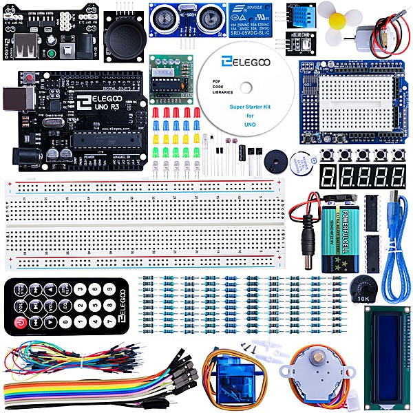

# The Best Of Bordwell

By **Steve Bordwell**

## Album Data

- **Catalog:** Beets
- **Format:** Digital, Album
- **Album:** The Best Of Bordwell
- **Artist:** Steve Bordwell
- **Albumartist:** Steve Bordwell
- **Genre:** Unknown
- **MusicBrainz Album Artist ID:** 
- **MusicBrainz Album ID:** 
- **MusicBrainz Release Group ID:** 
- **Year:** 0000
### Track 00 - 03-Terror Man

- **Artist:** Steve Bordwell
- **Format:** ALAC
- **Genre:** Unknown
- **Length:** 2:59
- **MusicBrainz Track ID:** 
- **Title:** 03-Terror Man
- **Track:** 00
- **Year:** 0000

### Track 00 - 04-Giving All For Your Country

- **Artist:** Steve Bordwell
- **Format:** ALAC
- **Genre:** Unknown
- **Length:** 1:49
- **MusicBrainz Track ID:** 
- **Title:** 04-Giving All For Your Country
- **Track:** 00
- **Year:** 0000

### Track 00 - 05-Fools

- **Artist:** Steve Bordwell
- **Format:** ALAC
- **Genre:** Unknown
- **Length:** 3:16
- **MusicBrainz Track ID:** 
- **Title:** 05-Fools
- **Track:** 00
- **Year:** 0000

### Track 00 - 06-Neighbours

- **Artist:** Steve Bordwell
- **Format:** ALAC
- **Genre:** Unknown
- **Length:** 2:31
- **MusicBrainz Track ID:** 
- **Title:** 06-Neighbours
- **Track:** 00
- **Year:** 0000

### Track 00 - 07-The Houses of The Holy

- **Artist:** Steve Bordwell
- **Format:** ALAC
- **Genre:** Unknown
- **Length:** 2:59
- **MusicBrainz Track ID:** 
- **Title:** 07-The Houses of The Holy
- **Track:** 00
- **Year:** 0000

### Track 00 - 08-The Redeemer

- **Artist:** Steve Bordwell
- **Format:** ALAC
- **Genre:** Unknown
- **Length:** 2:51
- **MusicBrainz Track ID:** 
- **Title:** 08-The Redeemer
- **Track:** 00
- **Year:** 0000

### Track 00 - 09-The Space Age Tripper

- **Artist:** Steve Bordwell
- **Format:** ALAC
- **Genre:** Unknown
- **Length:** 3:37
- **MusicBrainz Track ID:** 
- **Title:** 09-The Space Age Tripper
- **Track:** 00
- **Year:** 0000

### Track 00 - 10-A Reflection

- **Artist:** Steve Bordwell
- **Format:** ALAC
- **Genre:** Unknown
- **Length:** 2:57
- **MusicBrainz Track ID:** 
- **Title:** 10-A Reflection
- **Track:** 00
- **Year:** 0000

### Track 00 - 11-Dawn Time Creation

- **Artist:** Steve Bordwell
- **Format:** ALAC
- **Genre:** Unknown
- **Length:** 2:31
- **MusicBrainz Track ID:** 
- **Title:** 11-Dawn Time Creation
- **Track:** 00
- **Year:** 0000

### Track 00 - 12-Memories of Time Gone By

- **Artist:** Steve Bordwell
- **Format:** ALAC
- **Genre:** Unknown
- **Length:** 1:28
- **MusicBrainz Track ID:** 
- **Title:** 12-Memories of Time Gone By
- **Track:** 00
- **Year:** 0000

### Track 00 - 13-Hideaway

- **Artist:** Steve Bordwell
- **Format:** ALAC
- **Genre:** Unknown
- **Length:** 1:49
- **MusicBrainz Track ID:** 
- **Title:** 13-Hideaway
- **Track:** 00
- **Year:** 0000

### Track 00 - 14-What I Want To Be

- **Artist:** Steve Bordwell
- **Format:** ALAC
- **Genre:** Unknown
- **Length:** 4:02
- **MusicBrainz Track ID:** 
- **Title:** 14-What I Want To Be
- **Track:** 00
- **Year:** 0000

### Track 00 - 15-Helter Skelter (effects)

- **Artist:** Steve Bordwell
- **Format:** ALAC
- **Genre:** Unknown
- **Length:** 8:01
- **MusicBrainz Track ID:** 
- **Title:** 15-Helter Skelter (effects)
- **Track:** 00
- **Year:** 0000

### Track 00 - 16-The Trial of Cranston Snord

- **Artist:** Steve Bordwell
- **Format:** ALAC
- **Genre:** Unknown
- **Length:** 7:55
- **MusicBrainz Track ID:** 
- **Title:** 16-The Trial of Cranston Snord
- **Track:** 00
- **Year:** 0000

### Track 00 - 17-Group Free Association

- **Artist:** Steve Bordwell
- **Format:** ALAC
- **Genre:** Unknown
- **Length:** 4:17
- **MusicBrainz Track ID:** 
- **Title:** 17-Group Free Association
- **Track:** 00
- **Year:** 0000

### Track 00 - 18-Boxes

- **Artist:** Steve Bordwell
- **Format:** ALAC
- **Genre:** Unknown
- **Length:** 5:22
- **MusicBrainz Track ID:** 
- **Title:** 18-Boxes
- **Track:** 00
- **Year:** 0000

### Track 00 - 19-Appalachian Alice

- **Artist:** Steve Bordwell
- **Format:** ALAC
- **Genre:** Unknown
- **Length:** 13:34
- **MusicBrainz Track ID:** 
- **Title:** 19-Appalachian Alice
- **Track:** 00
- **Year:** 0000

### Track 00 - 20-Writing in the Stone

- **Artist:** Steve Bordwell
- **Format:** ALAC
- **Genre:** Unknown
- **Length:** 5:28
- **MusicBrainz Track ID:** 
- **Title:** 20-Writing in the Stone
- **Track:** 00
- **Year:** 0000

### Track 00 - 21-Aqualung

- **Artist:** Steve Bordwell
- **Format:** ALAC
- **Genre:** Unknown
- **Length:** 0:29
- **MusicBrainz Track ID:** 
- **Title:** 21-Aqualung
- **Track:** 00
- **Year:** 0000

### Track 00 - Enter Into Gentleness II

- **Artist:** Steve Bordwell
- **Format:** ALAC
- **Genre:** Unknown
- **Length:** 4:40
- **MusicBrainz Track ID:** 
- **Title:** Enter Into Gentleness II
- **Track:** 00
- **Year:** 0000

### Track 00 - Enter Into Gentleness III

- **Artist:** Steve Bordwell
- **Format:** ALAC
- **Genre:** Unknown
- **Length:** 5:13
- **MusicBrainz Track ID:** 
- **Title:** Enter Into Gentleness III
- **Track:** 00
- **Year:** 0000

## See also

- [Roon: The Best Of Bordwell](../../Roon/Steve_Bordwell/The_Best_Of_Bordwell.md)
