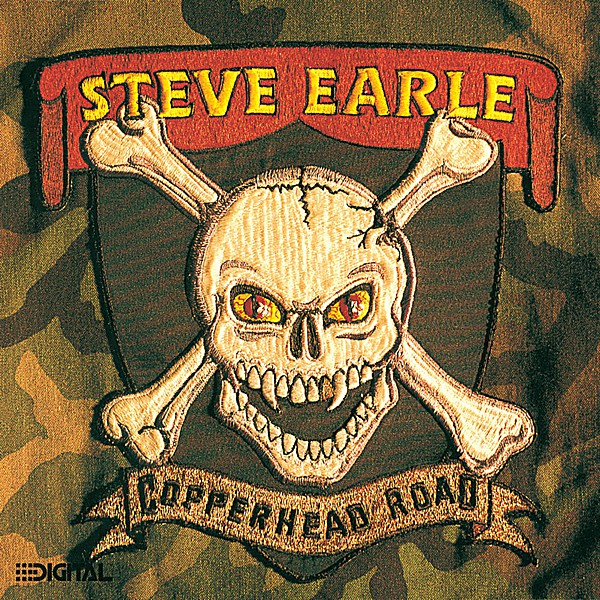

# Copperhead Road

By **Steve Earle**

## Album Data

- **Catalog:** Beets
- **Format:** Digital, Album
- **Album:** Copperhead Road
- **Artist:** Steve Earle
- **Albumartist:** Steve Earle
- **Genre:** Country Rock
- **MusicBrainz Album Artist ID:** [ec863030-7c13-45a3-a025-a69195d3a020](https://musicbrainz.org/artist/ec863030-7c13-45a3-a025-a69195d3a020)
- **MusicBrainz Album ID:** [25b3c0ab-1f98-4a94-9121-6074c1c81410](https://musicbrainz.org/release/25b3c0ab-1f98-4a94-9121-6074c1c81410)
- **MusicBrainz Release Group ID:** [49e94e1c-ee94-31b8-8266-07cbefd0e965](https://musicbrainz.org/release-group/49e94e1c-ee94-31b8-8266-07cbefd0e965)
- **Year:** 1988
- **Catalog #:** WH 3302-2
- **Label:** Winter Harvest
- **Total Tracks:** 13

## Album Tracks

### Track 01 - Hometown Blues

- **Artist:** Steve Earle
- **Format:** ALAC
- **Genre:** Country
- **Length:** 2:41
- **MusicBrainz Track ID:** [2056de69-54db-4035-a87c-a30d71ebfea7](https://musicbrainz.org/recording/2056de69-54db-4035-a87c-a30d71ebfea7)
- **Title:** Hometown Blues
- **Track:** 01
- **Year:** 1995

### Track 02 - Mercenary Song

- **Artist:** Steve Earle
- **Format:** ALAC
- **Genre:** Country
- **Length:** 2:39
- **MusicBrainz Track ID:** [a8c67144-0d2d-4ac0-9a04-682ade6e1c9f](https://musicbrainz.org/recording/a8c67144-0d2d-4ac0-9a04-682ade6e1c9f)
- **Title:** Mercenary Song
- **Track:** 02
- **Year:** 1995

### Track 03 - Goodbye

- **Artist:** Steve Earle
- **Format:** ALAC
- **Genre:** Americana
- **Length:** 4:57
- **MusicBrainz Track ID:** [ff09307e-a08a-4fb1-9a84-0aa3af62ad4f](https://musicbrainz.org/recording/ff09307e-a08a-4fb1-9a84-0aa3af62ad4f)
- **Title:** Goodbye
- **Track:** 03
- **Year:** 1995

### Track 04 - Tom Ames’ Prayer

- **Artist:** Steve Earle
- **Format:** ALAC
- **Genre:** Country Rock
- **Length:** 3:02
- **MusicBrainz Track ID:** [f101ff68-46cd-4bf9-b65f-ba9aa5d9c33f](https://musicbrainz.org/recording/f101ff68-46cd-4bf9-b65f-ba9aa5d9c33f)
- **Title:** Tom Ames’ Prayer
- **Track:** 04
- **Year:** 1995

### Track 05 - I'm Nothin’ Without You

- **Artist:** Steve Earle
- **Format:** ALAC
- **Genre:** Country Rock
- **Length:** 3:02
- **MusicBrainz Track ID:** [843b9898-b0be-4a13-b76a-ff0e7a8fe5c9](https://musicbrainz.org/recording/843b9898-b0be-4a13-b76a-ff0e7a8fe5c9)
- **Title:** I'm Nothin’ Without You
- **Track:** 05
- **Year:** 1995

### Track 06 - Angel Is the Devil

- **Artist:** Steve Earle
- **Format:** ALAC
- **Genre:** Country
- **Length:** 2:12
- **MusicBrainz Track ID:** [10537039-fb13-40c9-b85e-2b3b9ee00369](https://musicbrainz.org/recording/10537039-fb13-40c9-b85e-2b3b9ee00369)
- **Title:** Angel Is the Devil
- **Track:** 06
- **Year:** 1995

### Track 07 - I’m Looking Through You

- **Artist:** Steve Earle
- **Format:** ALAC
- **Genre:** Country Rock
- **Length:** 2:28
- **MusicBrainz Track ID:** [822cf895-69f8-4d10-90b9-cbeb0d83db13](https://musicbrainz.org/recording/822cf895-69f8-4d10-90b9-cbeb0d83db13)
- **Title:** I’m Looking Through You
- **Track:** 07
- **Year:** 1995

### Track 08 - Northern Winds

- **Artist:** Steve Earle
- **Format:** ALAC
- **Genre:** Alternative Country
- **Length:** 1:40
- **MusicBrainz Track ID:** [323221e3-d031-4d54-9707-4da6d0acad3c](https://musicbrainz.org/recording/323221e3-d031-4d54-9707-4da6d0acad3c)
- **Title:** Northern Winds
- **Track:** 08
- **Year:** 1995

### Track 09 - Ben McCulloch

- **Artist:** Steve Earle
- **Format:** ALAC
- **Genre:** Country
- **Length:** 4:09
- **MusicBrainz Track ID:** [519d4ffb-3728-45bf-b999-b09140570b83](https://musicbrainz.org/recording/519d4ffb-3728-45bf-b999-b09140570b83)
- **Title:** Ben McCulloch
- **Track:** 09
- **Year:** 1995

### Track 10 - Rivers of Babylon

- **Artist:** Steve Earle
- **Format:** ALAC
- **Genre:** Country
- **Length:** 3:03
- **MusicBrainz Track ID:** [54e354f1-b757-4f56-89a1-3e266a975e40](https://musicbrainz.org/recording/54e354f1-b757-4f56-89a1-3e266a975e40)
- **Title:** Rivers of Babylon
- **Track:** 10
- **Year:** 1995

### Track 11 - Tecumseh Valley

- **Artist:** Steve Earle
- **Format:** ALAC
- **Genre:** Country
- **Length:** 4:29
- **MusicBrainz Track ID:** [b9897ee1-999c-4027-bfa2-409357f4c954](https://musicbrainz.org/recording/b9897ee1-999c-4027-bfa2-409357f4c954)
- **Title:** Tecumseh Valley
- **Track:** 11
- **Year:** 1995

### Track 12 - Sometimes She Forgets

- **Artist:** Steve Earle
- **Format:** ALAC
- **Genre:** Country Rock
- **Length:** 3:01
- **MusicBrainz Track ID:** [5abeb1d9-55a4-4822-8785-504eb448f2f4](https://musicbrainz.org/recording/5abeb1d9-55a4-4822-8785-504eb448f2f4)
- **Title:** Sometimes She Forgets
- **Track:** 12
- **Year:** 1995

### Track 13 - Mystery Train Part II

- **Artist:** Steve Earle
- **Format:** ALAC
- **Genre:** Country
- **Length:** 2:31
- **MusicBrainz Track ID:** [6de134a5-1708-4693-9cb6-26d92fdfc217](https://musicbrainz.org/recording/6de134a5-1708-4693-9cb6-26d92fdfc217)
- **Title:** Mystery Train Part II
- **Track:** 13
- **Year:** 1995

## See also

- [Guitar Town](Guitar_Town.md)
- [I Feel Alright](I_Feel_Alright.md)
- [Train a Comin’](Train_a_Comin’.md)
- [Trancendental Blues](Trancendental_Blues.md)
- [CD: Copperhead Road](../../CD/Steve_Earle/Copperhead_Road.md)
- [CD: ](../../CD/Steve_Earle/Steve_Earle.md)
- [Roon: Copperhead Road](../../Roon/Steve_Earle/Copperhead_Road.md)
- [Roon: Train A Comin'](../../Roon/Steve_Earle/Train_A_Comin.md)
