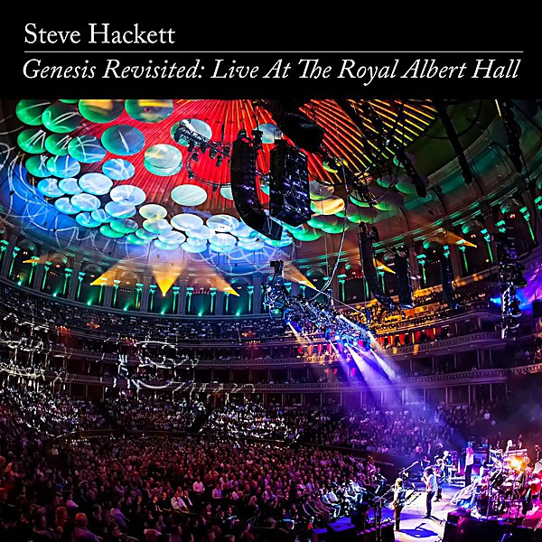

# Genesis Revisited

By **Steve Hackett**

## Album Data

- **Catalog:** Beets
- **Format:** Digital, Album
- **Album:** Genesis Revisited
- **Artist:** Steve Hackett
- **Albumartist:** Steve Hackett
- **Genre:** Progressive Rock
- **MusicBrainz Album Artist ID:** [f4eb8346-052d-4a5c-8393-cba3aeadb4d9](https://musicbrainz.org/artist/f4eb8346-052d-4a5c-8393-cba3aeadb4d9)
- **MusicBrainz Album ID:** [b932c7fc-8cfd-4fa5-af91-8f2e80b95db6](https://musicbrainz.org/release/b932c7fc-8cfd-4fa5-af91-8f2e80b95db6)
- **MusicBrainz Release Group ID:** [2dc8371a-d061-41bb-9283-1103a7ea07d6](https://musicbrainz.org/release-group/2dc8371a-d061-41bb-9283-1103a7ea07d6)
- **Year:** 2014
- **Catalog #:** IOMCD 400
- **Label:** Inside Out Music
- **Total Tracks:** 18

## Album Tracks

### Track 01 - Dance on a Volcano

- **Artist:** Steve Hackett
- **Format:** ALAC
- **Genre:** Progressive Rock
- **Length:** 6:39
- **MusicBrainz Track ID:** [a1d37294-4ca1-4fe3-ae69-6ecb39c1c976](https://musicbrainz.org/recording/a1d37294-4ca1-4fe3-ae69-6ecb39c1c976)
- **Title:** Dance on a Volcano
- **Track:** 01
- **Year:** 2014

### Track 02 - Dancing With the Moonlit Knight

- **Artist:** Steve Hackett
- **Format:** ALAC
- **Genre:** Progressive Rock
- **Length:** 7:53
- **MusicBrainz Track ID:** [6cf3e538-de6f-4dd9-adae-376fa47645d6](https://musicbrainz.org/recording/6cf3e538-de6f-4dd9-adae-376fa47645d6)
- **Title:** Dancing With the Moonlit Knight
- **Track:** 02
- **Year:** 2014

### Track 03 - Fly on a Windshield

- **Artist:** Steve Hackett
- **Format:** ALAC
- **Genre:** Progressive Rock
- **Length:** 3:39
- **MusicBrainz Track ID:** [824b1dd0-c1fd-49b8-9c46-c803e2a048fb](https://musicbrainz.org/recording/824b1dd0-c1fd-49b8-9c46-c803e2a048fb)
- **Title:** Fly on a Windshield
- **Track:** 03
- **Year:** 2014

### Track 04 - Broadway Melody of 1974

- **Artist:** Steve Hackett
- **Format:** ALAC
- **Genre:** Progressive Rock
- **Length:** 2:54
- **MusicBrainz Track ID:** [7d3f8ef6-0171-4403-9d72-88c5b9712ccf](https://musicbrainz.org/recording/7d3f8ef6-0171-4403-9d72-88c5b9712ccf)
- **Title:** Broadway Melody of 1974
- **Track:** 04
- **Year:** 2014

### Track 05 - Carpet Crawlers

- **Artist:** Steve Hackett
- **Format:** ALAC
- **Genre:** Progressive Rock
- **Length:** 6:09
- **MusicBrainz Track ID:** [f6335282-5548-4051-9a00-8f1c075b917f](https://musicbrainz.org/recording/f6335282-5548-4051-9a00-8f1c075b917f)
- **Title:** Carpet Crawlers
- **Track:** 05
- **Year:** 2014

### Track 06 - The Return of the Giant Hogweed

- **Artist:** Steve Hackett
- **Format:** ALAC
- **Genre:** Progressive Rock
- **Length:** 8:38
- **MusicBrainz Track ID:** [df0cb34c-632b-471c-9029-fcf5fbd0afa7](https://musicbrainz.org/recording/df0cb34c-632b-471c-9029-fcf5fbd0afa7)
- **Title:** The Return of the Giant Hogweed
- **Track:** 06
- **Year:** 2014

### Track 07 - The Musical Box

- **Artist:** Steve Hackett
- **Format:** ALAC
- **Genre:** Progressive Rock
- **Length:** 11:25
- **MusicBrainz Track ID:** [9c5e25ca-53f6-4b0c-917f-a8b283b06865](https://musicbrainz.org/recording/9c5e25ca-53f6-4b0c-917f-a8b283b06865)
- **Title:** The Musical Box
- **Track:** 07
- **Year:** 2014

### Track 08 - Horizons

- **Artist:** Steve Hackett
- **Format:** ALAC
- **Genre:** Progressive Rock
- **Length:** 2:01
- **MusicBrainz Track ID:** [c223be4e-9abe-47b9-a525-68eccdd82f7f](https://musicbrainz.org/recording/c223be4e-9abe-47b9-a525-68eccdd82f7f)
- **Title:** Horizons
- **Track:** 08
- **Year:** 2014

### Track 09 - Unquiet Slumbers for the Sleepers

- **Artist:** Steve Hackett
- **Format:** ALAC
- **Genre:** Progressive Rock
- **Length:** 2:13
- **MusicBrainz Track ID:** [d3c26df4-b45c-49de-a3f5-5012921654b0](https://musicbrainz.org/recording/d3c26df4-b45c-49de-a3f5-5012921654b0)
- **Title:** Unquiet Slumbers for the Sleepers
- **Track:** 09
- **Year:** 2014

### Track 10 - In That Quiet Earth

- **Artist:** Steve Hackett
- **Format:** ALAC
- **Genre:** Progressive Rock
- **Length:** 4:59
- **MusicBrainz Track ID:** [0cc50963-b8f0-4f79-8e31-dfe367d21e98](https://musicbrainz.org/recording/0cc50963-b8f0-4f79-8e31-dfe367d21e98)
- **Title:** In That Quiet Earth
- **Track:** 10
- **Year:** 2014

### Track 11 - Afterglow

- **Artist:** Steve Hackett
- **Format:** ALAC
- **Genre:** Progressive Rock
- **Length:** 4:12
- **MusicBrainz Track ID:** [4321370b-6394-4fa5-b0e4-8d90267b7859](https://musicbrainz.org/recording/4321370b-6394-4fa5-b0e4-8d90267b7859)
- **Title:** Afterglow
- **Track:** 11
- **Year:** 2014

### Track 12 - I Know What I Like

- **Artist:** Steve Hackett
- **Format:** ALAC
- **Genre:** Progressive Rock
- **Length:** 6:36
- **MusicBrainz Track ID:** [8022abcf-fcc9-41af-aed3-6b457b6d0739](https://musicbrainz.org/recording/8022abcf-fcc9-41af-aed3-6b457b6d0739)
- **Title:** I Know What I Like
- **Track:** 12
- **Year:** 2014

### Track 13 - Firth of Fifth

- **Artist:** Steve Hackett
- **Format:** ALAC
- **Genre:** Progressive Rock
- **Length:** 10:15
- **MusicBrainz Track ID:** [08547231-a227-49dd-9402-f529cf13b039](https://musicbrainz.org/recording/08547231-a227-49dd-9402-f529cf13b039)
- **Title:** Firth of Fifth
- **Track:** 13
- **Year:** 2014

### Track 14 - Ripples

- **Artist:** Steve Hackett
- **Format:** ALAC
- **Genre:** Progressive Rock
- **Length:** 5:28
- **MusicBrainz Track ID:** [e62f58f0-f185-4904-b607-f75231a78340](https://musicbrainz.org/recording/e62f58f0-f185-4904-b607-f75231a78340)
- **Title:** Ripples
- **Track:** 14
- **Year:** 2014

### Track 15 - The Fountain of Salmacis

- **Artist:** Steve Hackett
- **Format:** ALAC
- **Genre:** Progressive Rock
- **Length:** 8:00
- **MusicBrainz Track ID:** [ac035196-c9d9-4b16-b8fa-48533385245f](https://musicbrainz.org/recording/ac035196-c9d9-4b16-b8fa-48533385245f)
- **Title:** The Fountain of Salmacis
- **Track:** 15
- **Year:** 2014

### Track 16 - Supper’s Ready

- **Artist:** Steve Hackett
- **Format:** ALAC
- **Genre:** Progressive Rock
- **Length:** 26:15
- **MusicBrainz Track ID:** [7e68fa5c-ce38-4509-ab49-a87db263e704](https://musicbrainz.org/recording/7e68fa5c-ce38-4509-ab49-a87db263e704)
- **Title:** Supper’s Ready
- **Track:** 16
- **Year:** 2014

### Track 17 - Watcher of the Skies

- **Artist:** Steve Hackett
- **Format:** ALAC
- **Genre:** Progressive Rock
- **Length:** 9:07
- **MusicBrainz Track ID:** [4b41d4ef-acc1-4f24-b38b-cd9ecb8ff7c0](https://musicbrainz.org/recording/4b41d4ef-acc1-4f24-b38b-cd9ecb8ff7c0)
- **Title:** Watcher of the Skies
- **Track:** 17
- **Year:** 2014

### Track 18 - Los Endos

- **Artist:** Steve Hackett
- **Format:** ALAC
- **Genre:** Progressive Rock
- **Length:** 8:55
- **MusicBrainz Track ID:** [ebbb4525-a077-4c8d-95e3-657e3e09f9de](https://musicbrainz.org/recording/ebbb4525-a077-4c8d-95e3-657e3e09f9de)
- **Title:** Los Endos
- **Track:** 18
- **Year:** 2014

## See also

- [Genesis Revisited II](Genesis_Revisited_II.md)
