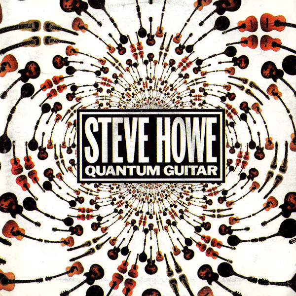

# Quantum Guitar

By **Steve Howe**

## Album Data

- **Catalog:** Beets
- **Format:** Digital, Album
- **Album:** Quantum Guitar
- **Artist:** Steve Howe
- **Albumartist:** Steve Howe
- **Genre:** Progressive Rock
- **MusicBrainz Album Artist ID:** 
- **MusicBrainz Album ID:** 
- **MusicBrainz Release Group ID:** 
- **Year:** 0000
- **Catalog #:** 
- **Label:** 
- **Total Tracks:** 00

## Album Tracks

### Track 00 - Walk Don't Run

- **Artist:** Steve Howe
- **Format:** ALAC
- **Genre:** Progressive Rock
- **Length:** 3:03
- **MusicBrainz Track ID:** 
- **Title:** Walk Don't Run
- **Track:** 00
- **Year:** 0000

## See also

- [Roon: The 3 Ages of Magick](../../Roon/Steve_Howe/The_3_Ages_of_Magick.md)
