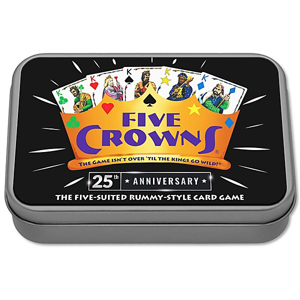

# Return of The SJ5 (MP3 Format)

By **Steve Jackson Five**

## Album Data

- **Catalog:** Beets
- **Format:** Digital, Album
- **Album:** Return of The SJ5 (MP3 Format)
- **Artist:** Steve Jackson Five
- **Albumartist:** Steve Jackson Five
- **Genre:** Unknown
- **MusicBrainz Album Artist ID:** 
- **MusicBrainz Album ID:** 
- **MusicBrainz Release Group ID:** 
- **Year:** 0000
- **Catalog #:** 
- **Label:** 
- **Total Tracks:** 00

## Album Tracks

### Track 00 - 00 - Dead-in-the-eye-GB-81416-7.31

- **Artist:** Steve Jackson Five
- **Format:** MP3
- **Genre:** Unknown
- **Length:** 3:35
- **MusicBrainz Track ID:** 
- **Title:** 00 - Dead-in-the-eye-GB-81416-7.31
- **Track:** 00
- **Year:** 0000

### Track 00 - 00 - I-cant-decide-81416-11.13

- **Artist:** Steve Jackson Five
- **Format:** MP3
- **Genre:** Unknown
- **Length:** 3:48
- **MusicBrainz Track ID:** 
- **Title:** 00 - I-cant-decide-81416-11.13
- **Track:** 00
- **Year:** 0000

### Track 00 - 00 - I-need-a-muse-GB-81416-7.58

- **Artist:** Steve Jackson Five
- **Format:** MP3
- **Genre:** Unknown
- **Length:** 3:59
- **MusicBrainz Track ID:** 
- **Title:** 00 - I-need-a-muse-GB-81416-7.58
- **Track:** 00
- **Year:** 0000

## See also

- [Juicy Parts](Juicy_Parts.md)
- [Kissmas](Kissmas.md)
- [Roon: Steve Jackson Five - Kissmas](../../Roon/Steve_Jackson_Five/Steve_Jackson_Five_-_Kissmas.md)
