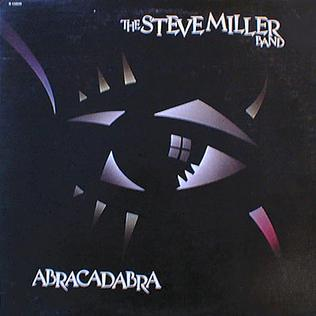

# Abracadabra

By **Steve Miller Band**

## Album Data

- **Catalog:** Beets
- **Format:** Digital, Album
- **Album:** Abracadabra
- **Artist:** Steve Miller Band
- **Albumartist:** Steve Miller Band
- **Genre:** Psychedelic Rock
- **MusicBrainz Album Artist ID:** [e57f0cac-4f56-473c-8d7e-d93f753fd586](https://musicbrainz.org/artist/e57f0cac-4f56-473c-8d7e-d93f753fd586)
- **MusicBrainz Album ID:** [b9c08a67-dfe0-3537-8bd2-a4905cf62c36](https://musicbrainz.org/release/b9c08a67-dfe0-3537-8bd2-a4905cf62c36)
- **MusicBrainz Release Group ID:** [ac8ca6a0-b24b-314c-ba05-c6b22c564ac9](https://musicbrainz.org/release-group/ac8ca6a0-b24b-314c-ba05-c6b22c564ac9)
- **Year:** 1982
- **Catalog #:** GZS-1077
- **Label:** DCC Compact Classics
- **Total Tracks:** 12

## Album Tracks

### Track 01 - Threshold

- **Artist:** Steve Miller Band
- **Format:** ALAC
- **Genre:** Psychedelic Rock
- **Length:** 1:06
- **MusicBrainz Track ID:** [5ce572d0-a215-4cd5-a733-468bfbd661f8](https://musicbrainz.org/recording/5ce572d0-a215-4cd5-a733-468bfbd661f8)
- **Title:** Threshold
- **Track:** 01
- **Year:** 1995

### Track 02 - Jet Airliner

- **Artist:** Steve Miller Band
- **Format:** ALAC
- **Genre:** Southern Rock
- **Length:** 4:25
- **MusicBrainz Track ID:** [e95aa500-e296-4322-aff0-b74ed1d9d3c0](https://musicbrainz.org/recording/e95aa500-e296-4322-aff0-b74ed1d9d3c0)
- **Title:** Jet Airliner
- **Track:** 02
- **Year:** 1995

### Track 03 - Winter Time

- **Artist:** Steve Miller Band
- **Format:** ALAC
- **Genre:** Rock
- **Length:** 3:12
- **MusicBrainz Track ID:** [8417a0ce-bc88-47a1-a423-bd7c3e7016d3](https://musicbrainz.org/recording/8417a0ce-bc88-47a1-a423-bd7c3e7016d3)
- **Title:** Winter Time
- **Track:** 03
- **Year:** 1995

### Track 04 - Swingtown

- **Artist:** Steve Miller Band
- **Format:** ALAC
- **Genre:** Southern Rock
- **Length:** 3:56
- **MusicBrainz Track ID:** [5b3fa3cb-e629-4fd7-9a84-a263e95a7c11](https://musicbrainz.org/recording/5b3fa3cb-e629-4fd7-9a84-a263e95a7c11)
- **Title:** Swingtown
- **Track:** 04
- **Year:** 1995

### Track 05 - True Fine Love

- **Artist:** Steve Miller Band
- **Format:** ALAC
- **Genre:** Soft Rock
- **Length:** 2:39
- **MusicBrainz Track ID:** [ee9e55fa-32e1-4b30-aef2-6f22b0b48a7e](https://musicbrainz.org/recording/ee9e55fa-32e1-4b30-aef2-6f22b0b48a7e)
- **Title:** True Fine Love
- **Track:** 05
- **Year:** 1995

### Track 06 - Wish Upon a Star

- **Artist:** Steve Miller Band
- **Format:** ALAC
- **Genre:** Psychedelic Rock
- **Length:** 3:39
- **MusicBrainz Track ID:** [5f6ba42d-c1b2-4622-b1d9-43ed4ad96c84](https://musicbrainz.org/recording/5f6ba42d-c1b2-4622-b1d9-43ed4ad96c84)
- **Title:** Wish Upon a Star
- **Track:** 06
- **Year:** 1995

### Track 07 - Jungle Love

- **Artist:** Steve Miller Band
- **Format:** ALAC
- **Genre:** Southern Rock
- **Length:** 3:07
- **MusicBrainz Track ID:** [47e7fe29-68ee-4c9f-a1e5-af6583847bcd](https://musicbrainz.org/recording/47e7fe29-68ee-4c9f-a1e5-af6583847bcd)
- **Title:** Jungle Love
- **Track:** 07
- **Year:** 1995

### Track 08 - Electro Lux Imbroglio

- **Artist:** Steve Miller Band
- **Format:** ALAC
- **Genre:** Electronic
- **Length:** 0:57
- **MusicBrainz Track ID:** [786f5b57-89af-4775-8bde-d35cb317d5fa](https://musicbrainz.org/recording/786f5b57-89af-4775-8bde-d35cb317d5fa)
- **Title:** Electro Lux Imbroglio
- **Track:** 08
- **Year:** 1995

### Track 09 - Sacrifice

- **Artist:** Steve Miller Band
- **Format:** ALAC
- **Genre:** Psychedelic Rock
- **Length:** 5:20
- **MusicBrainz Track ID:** [d5f24f9b-c864-443f-92e1-f9d236f91ce8](https://musicbrainz.org/recording/d5f24f9b-c864-443f-92e1-f9d236f91ce8)
- **Title:** Sacrifice
- **Track:** 09
- **Year:** 1995

### Track 10 - The Stake

- **Artist:** Steve Miller Band
- **Format:** ALAC
- **Genre:** Southern Rock
- **Length:** 3:58
- **MusicBrainz Track ID:** [1d63ca53-7990-437b-b97c-53def19212ef](https://musicbrainz.org/recording/1d63ca53-7990-437b-b97c-53def19212ef)
- **Title:** The Stake
- **Track:** 10
- **Year:** 1995

### Track 11 - My Own Space

- **Artist:** Steve Miller Band
- **Format:** ALAC
- **Genre:** Psychedelic Rock
- **Length:** 3:04
- **MusicBrainz Track ID:** [4d60eb4d-9594-4383-9260-74e5452a43bb](https://musicbrainz.org/recording/4d60eb4d-9594-4383-9260-74e5452a43bb)
- **Title:** My Own Space
- **Track:** 11
- **Year:** 1995

### Track 12 - Babes in the Wood

- **Artist:** Steve Miller Band
- **Format:** ALAC
- **Genre:** Soft Rock
- **Length:** 2:32
- **MusicBrainz Track ID:** [b311a73a-cd79-477a-b783-0bb4fbce6a7b](https://musicbrainz.org/recording/b311a73a-cd79-477a-b783-0bb4fbce6a7b)
- **Title:** Babes in the Wood
- **Track:** 12
- **Year:** 1995

## See also

- [Book of Dreams](Book_of_Dreams.md)
- [Fly Like an Eagle](Fly_Like_an_Eagle.md)
- [The Joker](The_Joker.md)
- [CD: Book Of Dreams](../../CD/Steve_Miller_Band/Book_Of_Dreams.md)
- [CD: ](../../CD/Steve_Miller_Band/Steve_Miller_Band.md)
- [CD: The Joker](../../CD/Steve_Miller_Band/The_Joker.md)
- [Roon: Abracadabra](../../Roon/Steve_Miller_Band/Abracadabra.md)
- [Roon: Bingo!](../../Roon/Steve_Miller_Band/Bingo!.md)
- [Roon: Book Of Dreams](../../Roon/Steve_Miller_Band/Book_Of_Dreams.md)
- [Roon: Brave New World](../../Roon/Steve_Miller_Band/Brave_New_World.md)
- [Roon: Children Of The Future](../../Roon/Steve_Miller_Band/Children_Of_The_Future.md)
- [Roon: Fly Like An Eagle](../../Roon/Steve_Miller_Band/Fly_Like_An_Eagle.md)
- [Roon: Live! Breaking Ground August 3, 1977 (Live)](../../Roon/Steve_Miller_Band/Live!_Breaking_Ground_August_3__1977_Live.md)
- [Roon: Living In The 20th Century](../../Roon/Steve_Miller_Band/Living_In_The_20th_Century.md)
- [Roon: Number 5](../../Roon/Steve_Miller_Band/Number_5.md)
- [Roon: Recall The Beginning…A Journey From Eden](../../Roon/Steve_Miller_Band/Recall_The_Beginning…A_Journey_From_Eden.md)
- [Roon: Sailor](../../Roon/Steve_Miller_Band/Sailor.md)
- [Roon: The Joker](../../Roon/Steve_Miller_Band/The_Joker.md)
- [Roon: Your Saving Grace](../../Roon/Steve_Miller_Band/Your_Saving_Grace.md)
