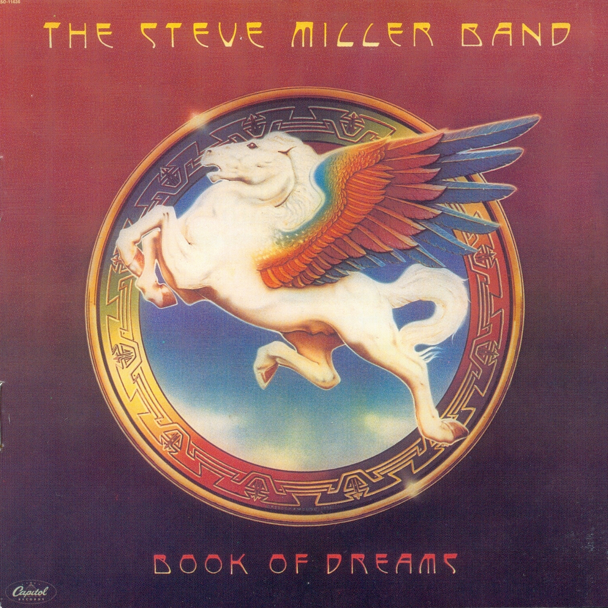

# Book of Dreams

By **Steve Miller Band**

## Album Data

- **Catalog:** Beets
- **Format:** Digital, Album
- **Album:** Book of Dreams
- **Artist:** Steve Miller Band
- **Albumartist:** Steve Miller Band
- **Genre:** Southern Rock
- **MusicBrainz Album Artist ID:** [e57f0cac-4f56-473c-8d7e-d93f753fd586](https://musicbrainz.org/artist/e57f0cac-4f56-473c-8d7e-d93f753fd586)
- **MusicBrainz Album ID:** [a22b5914-c551-463d-ad87-d4056494f7d0](https://musicbrainz.org/release/a22b5914-c551-463d-ad87-d4056494f7d0)
- **MusicBrainz Release Group ID:** [9cb417e6-bf80-37f7-a7a5-ae7ab3daf8e4](https://musicbrainz.org/release-group/9cb417e6-bf80-37f7-a7a5-ae7ab3daf8e4)
- **Year:** 1995
- **Catalog #:** CDP 7 46475 2
- **Label:** Capitol Records
- **Total Tracks:** 12

## Album Tracks

### Track 01 - Space Intro

- **Artist:** Steve Miller Band
- **Format:** ALAC
- **Genre:** Rock
- **Length:** 1:14
- **MusicBrainz Track ID:** [766da381-44e6-4126-b0ec-bc683ed67f26](https://musicbrainz.org/recording/766da381-44e6-4126-b0ec-bc683ed67f26)
- **Title:** Space Intro
- **Track:** 01
- **Year:** 1988

### Track 02 - Fly Like an Eagle

- **Artist:** Steve Miller Band
- **Format:** ALAC
- **Genre:** Rock
- **Length:** 4:42
- **MusicBrainz Track ID:** [53259175-2714-4c53-92a8-cd5afb1a0731](https://musicbrainz.org/recording/53259175-2714-4c53-92a8-cd5afb1a0731)
- **Title:** Fly Like an Eagle
- **Track:** 02
- **Year:** 1988

### Track 03 - Wild Mountain Honey

- **Artist:** Steve Miller Band
- **Format:** ALAC
- **Genre:** Rock
- **Length:** 4:49
- **MusicBrainz Track ID:** [920726ad-cdd7-4370-a2a8-70d615837fac](https://musicbrainz.org/recording/920726ad-cdd7-4370-a2a8-70d615837fac)
- **Title:** Wild Mountain Honey
- **Track:** 03
- **Year:** 1988

### Track 04 - Serenade

- **Artist:** Steve Miller Band
- **Format:** ALAC
- **Genre:** Rock
- **Length:** 3:11
- **MusicBrainz Track ID:** [4c324a81-02a6-4f97-a130-ffe3649481c0](https://musicbrainz.org/recording/4c324a81-02a6-4f97-a130-ffe3649481c0)
- **Title:** Serenade
- **Track:** 04
- **Year:** 1988

### Track 05 - Dance, Dance, Dance

- **Artist:** Steve Miller Band
- **Format:** ALAC
- **Genre:** Southern Rock
- **Length:** 2:17
- **MusicBrainz Track ID:** [8f9bf9fc-cd7a-49b1-a0c2-85a99b578b26](https://musicbrainz.org/recording/8f9bf9fc-cd7a-49b1-a0c2-85a99b578b26)
- **Title:** Dance, Dance, Dance
- **Track:** 05
- **Year:** 1988

### Track 06 - Mercury Blues

- **Artist:** Steve Miller Band
- **Format:** ALAC
- **Genre:** Acid Rock
- **Length:** 3:43
- **MusicBrainz Track ID:** [99efcfc3-95a7-4a64-a26f-a538d8b42338](https://musicbrainz.org/recording/99efcfc3-95a7-4a64-a26f-a538d8b42338)
- **Title:** Mercury Blues
- **Track:** 06
- **Year:** 1988

### Track 07 - Take the Money and Run

- **Artist:** Steve Miller Band
- **Format:** ALAC
- **Genre:** Southern Rock
- **Length:** 2:50
- **MusicBrainz Track ID:** [6eee6ec5-0c5c-45c3-b75d-633fdade4186](https://musicbrainz.org/recording/6eee6ec5-0c5c-45c3-b75d-633fdade4186)
- **Title:** Take the Money and Run
- **Track:** 07
- **Year:** 1988

### Track 08 - Rock’n Me

- **Artist:** Steve Miller Band
- **Format:** ALAC
- **Genre:** Rock
- **Length:** 3:07
- **MusicBrainz Track ID:** [878c1503-d59f-4b0a-8bc3-3744f1cd1411](https://musicbrainz.org/recording/878c1503-d59f-4b0a-8bc3-3744f1cd1411)
- **Title:** Rock’n Me
- **Track:** 08
- **Year:** 1988

### Track 09 - You Send Me

- **Artist:** Steve Miller Band
- **Format:** ALAC
- **Genre:** Folk Rock
- **Length:** 2:42
- **MusicBrainz Track ID:** [159de0f5-8952-4f6d-848f-ade0ac0fabdc](https://musicbrainz.org/recording/159de0f5-8952-4f6d-848f-ade0ac0fabdc)
- **Title:** You Send Me
- **Track:** 09
- **Year:** 1988

### Track 10 - Blue Odyssey

- **Artist:** Steve Miller Band
- **Format:** ALAC
- **Genre:** Rock
- **Length:** 0:53
- **MusicBrainz Track ID:** [8693b4d3-766b-4bf9-a86a-fe23bb0de165](https://musicbrainz.org/recording/8693b4d3-766b-4bf9-a86a-fe23bb0de165)
- **Title:** Blue Odyssey
- **Track:** 10
- **Year:** 1988

### Track 11 - Sweet Maree

- **Artist:** Steve Miller Band
- **Format:** ALAC
- **Genre:** Hard Rock
- **Length:** 4:18
- **MusicBrainz Track ID:** [b539ff07-3992-414b-99d2-9ed264107c75](https://musicbrainz.org/recording/b539ff07-3992-414b-99d2-9ed264107c75)
- **Title:** Sweet Maree
- **Track:** 11
- **Year:** 1988

### Track 12 - The Window

- **Artist:** Steve Miller Band
- **Format:** ALAC
- **Genre:** Rock
- **Length:** 4:16
- **MusicBrainz Track ID:** [eed51e23-bd03-428d-b280-283ec44a40b2](https://musicbrainz.org/recording/eed51e23-bd03-428d-b280-283ec44a40b2)
- **Title:** The Window
- **Track:** 12
- **Year:** 1988

## See also

- [Abracadabra](Abracadabra.md)
- [Fly Like an Eagle](Fly_Like_an_Eagle.md)
- [The Joker](The_Joker.md)
- [CD: Book Of Dreams](../../CD/Steve_Miller_Band/Book_Of_Dreams.md)
- [CD: ](../../CD/Steve_Miller_Band/Steve_Miller_Band.md)
- [CD: The Joker](../../CD/Steve_Miller_Band/The_Joker.md)
- [Roon: Abracadabra](../../Roon/Steve_Miller_Band/Abracadabra.md)
- [Roon: Bingo!](../../Roon/Steve_Miller_Band/Bingo!.md)
- [Roon: Book Of Dreams](../../Roon/Steve_Miller_Band/Book_Of_Dreams.md)
- [Roon: Brave New World](../../Roon/Steve_Miller_Band/Brave_New_World.md)
- [Roon: Children Of The Future](../../Roon/Steve_Miller_Band/Children_Of_The_Future.md)
- [Roon: Fly Like An Eagle](../../Roon/Steve_Miller_Band/Fly_Like_An_Eagle.md)
- [Roon: Live! Breaking Ground August 3, 1977 (Live)](../../Roon/Steve_Miller_Band/Live!_Breaking_Ground_August_3__1977_Live.md)
- [Roon: Living In The 20th Century](../../Roon/Steve_Miller_Band/Living_In_The_20th_Century.md)
- [Roon: Number 5](../../Roon/Steve_Miller_Band/Number_5.md)
- [Roon: Recall The Beginning…A Journey From Eden](../../Roon/Steve_Miller_Band/Recall_The_Beginning…A_Journey_From_Eden.md)
- [Roon: Sailor](../../Roon/Steve_Miller_Band/Sailor.md)
- [Roon: The Joker](../../Roon/Steve_Miller_Band/The_Joker.md)
- [Roon: Your Saving Grace](../../Roon/Steve_Miller_Band/Your_Saving_Grace.md)
