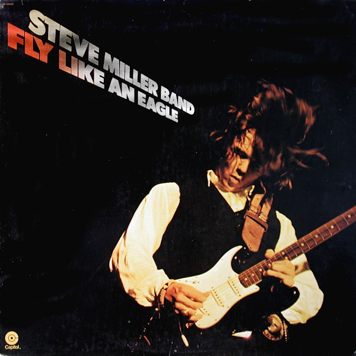

# Fly Like an Eagle

By **Steve Miller Band**

## Album Data

- **Catalog:** Beets
- **Format:** Digital, Album
- **Album:** Fly Like an Eagle
- **Artist:** Steve Miller Band
- **Albumartist:** Steve Miller Band
- **Genre:** Rock
- **MusicBrainz Album Artist ID:** [e57f0cac-4f56-473c-8d7e-d93f753fd586](https://musicbrainz.org/artist/e57f0cac-4f56-473c-8d7e-d93f753fd586)
- **MusicBrainz Album ID:** [4edaabee-7cbd-3cb4-9828-9910f87bf4ab](https://musicbrainz.org/release/4edaabee-7cbd-3cb4-9828-9910f87bf4ab)
- **MusicBrainz Release Group ID:** [03cf0b3d-48f1-3b04-a3be-5e4d5b7dcae2](https://musicbrainz.org/release-group/03cf0b3d-48f1-3b04-a3be-5e4d5b7dcae2)
- **Year:** 1988
- **Catalog #:** CDP 7 94445 2
- **Label:** Capitol Records
- **Total Tracks:** 09

## Album Tracks

### Track 01 - Sugar Babe

- **Artist:** Steve Miller Band
- **Format:** ALAC
- **Genre:** Southern Rock
- **Length:** 4:02
- **MusicBrainz Track ID:** [f0739950-7861-4718-af06-65e5db571ccd](https://musicbrainz.org/recording/f0739950-7861-4718-af06-65e5db571ccd)
- **Title:** Sugar Babe
- **Track:** 01
- **Year:** 1991

### Track 02 - Mary Lou

- **Artist:** Steve Miller Band
- **Format:** ALAC
- **Genre:** Indie Rock
- **Length:** 2:56
- **MusicBrainz Track ID:** [e1211232-0e54-4227-beb4-077c03cdc532](https://musicbrainz.org/recording/e1211232-0e54-4227-beb4-077c03cdc532)
- **Title:** Mary Lou
- **Track:** 02
- **Year:** 1991

### Track 03 - Shu Ba Da Du Ma Ma Ma Ma

- **Artist:** Steve Miller Band
- **Format:** ALAC
- **Genre:** Southern Rock
- **Length:** 5:42
- **MusicBrainz Track ID:** [134136b4-7e4a-439b-bc2b-2e2ce9426a17](https://musicbrainz.org/recording/134136b4-7e4a-439b-bc2b-2e2ce9426a17)
- **Title:** Shu Ba Da Du Ma Ma Ma Ma
- **Track:** 03
- **Year:** 1991

### Track 04 - Your Cash Ain't Nothin' but Trash

- **Artist:** Steve Miller Band
- **Format:** ALAC
- **Genre:** Blues
- **Length:** 3:22
- **MusicBrainz Track ID:** [fc88b6c7-05c4-450d-a1c0-b3d254c1a450](https://musicbrainz.org/recording/fc88b6c7-05c4-450d-a1c0-b3d254c1a450)
- **Title:** Your Cash Ain't Nothin' but Trash
- **Track:** 04
- **Year:** 1991

### Track 05 - The Joker

- **Artist:** Steve Miller Band
- **Format:** ALAC
- **Genre:** Rock
- **Length:** 4:26
- **MusicBrainz Track ID:** [177727a4-92ee-4efe-8498-df6f33ca9372](https://musicbrainz.org/recording/177727a4-92ee-4efe-8498-df6f33ca9372)
- **Title:** The Joker
- **Track:** 05
- **Year:** 1991

### Track 06 - The Lovin' Cup

- **Artist:** Steve Miller Band
- **Format:** ALAC
- **Genre:** Blues
- **Length:** 2:11
- **MusicBrainz Track ID:** [bd27c4c4-d874-4cf4-a725-759d88853a41](https://musicbrainz.org/recording/bd27c4c4-d874-4cf4-a725-759d88853a41)
- **Title:** The Lovin' Cup
- **Track:** 06
- **Year:** 1991

### Track 07 - Come on in My Kitchen

- **Artist:** Steve Miller Band
- **Format:** ALAC
- **Genre:** Southern Rock
- **Length:** 4:06
- **MusicBrainz Track ID:** [077c16ff-5b3e-48b0-86db-7e6c75f8de4e](https://musicbrainz.org/recording/077c16ff-5b3e-48b0-86db-7e6c75f8de4e)
- **Title:** Come on in My Kitchen
- **Track:** 07
- **Year:** 1991

### Track 08 - Evil

- **Artist:** Steve Miller Band
- **Format:** ALAC
- **Genre:** Southern Rock
- **Length:** 4:34
- **MusicBrainz Track ID:** [79915a3a-c8d5-406a-9a19-f7d4e950318e](https://musicbrainz.org/recording/79915a3a-c8d5-406a-9a19-f7d4e950318e)
- **Title:** Evil
- **Track:** 08
- **Year:** 1991

### Track 09 - Something to Believe In

- **Artist:** Steve Miller Band
- **Format:** ALAC
- **Genre:** Folk Rock
- **Length:** 4:42
- **MusicBrainz Track ID:** [37cd2814-971d-4f14-ba31-42e26fa24661](https://musicbrainz.org/recording/37cd2814-971d-4f14-ba31-42e26fa24661)
- **Title:** Something to Believe In
- **Track:** 09
- **Year:** 1991

## See also

- [Abracadabra](Abracadabra.md)
- [Book of Dreams](Book_of_Dreams.md)
- [The Joker](The_Joker.md)
- [CD: Book Of Dreams](../../CD/Steve_Miller_Band/Book_Of_Dreams.md)
- [CD: ](../../CD/Steve_Miller_Band/Steve_Miller_Band.md)
- [CD: The Joker](../../CD/Steve_Miller_Band/The_Joker.md)
- [Roon: Abracadabra](../../Roon/Steve_Miller_Band/Abracadabra.md)
- [Roon: Bingo!](../../Roon/Steve_Miller_Band/Bingo!.md)
- [Roon: Book Of Dreams](../../Roon/Steve_Miller_Band/Book_Of_Dreams.md)
- [Roon: Brave New World](../../Roon/Steve_Miller_Band/Brave_New_World.md)
- [Roon: Children Of The Future](../../Roon/Steve_Miller_Band/Children_Of_The_Future.md)
- [Roon: Fly Like An Eagle](../../Roon/Steve_Miller_Band/Fly_Like_An_Eagle.md)
- [Roon: Live! Breaking Ground August 3, 1977 (Live)](../../Roon/Steve_Miller_Band/Live!_Breaking_Ground_August_3__1977_Live.md)
- [Roon: Living In The 20th Century](../../Roon/Steve_Miller_Band/Living_In_The_20th_Century.md)
- [Roon: Number 5](../../Roon/Steve_Miller_Band/Number_5.md)
- [Roon: Recall The Beginning…A Journey From Eden](../../Roon/Steve_Miller_Band/Recall_The_Beginning…A_Journey_From_Eden.md)
- [Roon: Sailor](../../Roon/Steve_Miller_Band/Sailor.md)
- [Roon: The Joker](../../Roon/Steve_Miller_Band/The_Joker.md)
- [Roon: Your Saving Grace](../../Roon/Steve_Miller_Band/Your_Saving_Grace.md)
