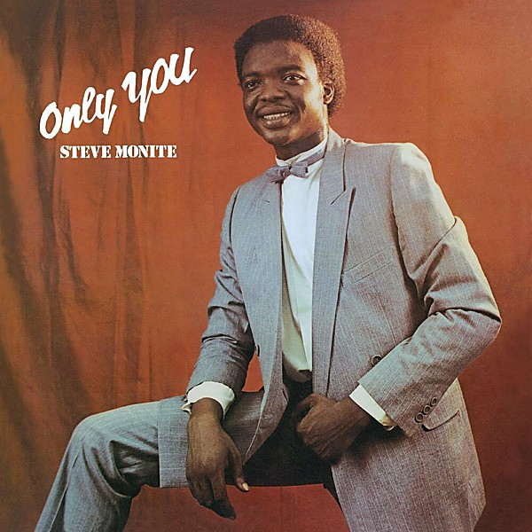

# Only You

By **Steve Monite**

## Album Data

- **Catalog:** Beets
- **Format:** Digital, Album
- **Album:** Only You
- **Artist:** Steve Monite
- **Albumartist:** Steve Monite
- **Genre:** Boogie
- **MusicBrainz Album Artist ID:** [53c7987c-25f8-4d1a-9c64-248355de1bcc](https://musicbrainz.org/artist/53c7987c-25f8-4d1a-9c64-248355de1bcc)
- **MusicBrainz Album ID:** [1f1fb822-c488-4021-b8c1-90f8358b6dbe](https://musicbrainz.org/release/1f1fb822-c488-4021-b8c1-90f8358b6dbe)
- **MusicBrainz Release Group ID:** [38c3cb41-6ebe-4075-a114-2ab5ebca6def](https://musicbrainz.org/release-group/38c3cb41-6ebe-4075-a114-2ab5ebca6def)
- **Year:** 2017
- **Catalog #:** 
- **Label:** PMG
- **Total Tracks:** 06

## Album Tracks

### Track 01 - Only You

- **Artist:** Steve Monite
- **Format:** ALAC
- **Genre:** Boogie
- **Length:** 6:24
- **MusicBrainz Track ID:** [7ba7911d-f548-47cc-b2d1-30ffd954675e](https://musicbrainz.org/recording/7ba7911d-f548-47cc-b2d1-30ffd954675e)
- **Title:** Only You
- **Track:** 01
- **Year:** 2017

### Track 02 - I Had A Dream

- **Artist:** Steve Monite
- **Format:** ALAC
- **Genre:** Boogie
- **Length:** 5:51
- **MusicBrainz Track ID:** [4a3aad82-ffab-4492-9e34-44ec79b8d1b6](https://musicbrainz.org/recording/4a3aad82-ffab-4492-9e34-44ec79b8d1b6)
- **Title:** I Had A Dream
- **Track:** 02
- **Year:** 2017

### Track 03 - Things Fall Apart (Disco Jam)

- **Artist:** Steve Monite
- **Format:** ALAC
- **Genre:** Boogie
- **Length:** 5:51
- **MusicBrainz Track ID:** [af033948-fec2-4482-ab2e-0d9fa6592a78](https://musicbrainz.org/recording/af033948-fec2-4482-ab2e-0d9fa6592a78)
- **Title:** Things Fall Apart (Disco Jam)
- **Track:** 03
- **Year:** 2017

### Track 04 - Welcome My Love

- **Artist:** Steve Monite
- **Format:** ALAC
- **Genre:** Boogie
- **Length:** 6:14
- **MusicBrainz Track ID:** [fafc6c0b-d490-47f6-bca6-31187d839133](https://musicbrainz.org/recording/fafc6c0b-d490-47f6-bca6-31187d839133)
- **Title:** Welcome My Love
- **Track:** 04
- **Year:** 2017

### Track 05 - Only You (Disco Jam)

- **Artist:** Steve Monite
- **Format:** ALAC
- **Genre:** Boogie
- **Length:** 6:32
- **MusicBrainz Track ID:** [f53bca7f-8d69-43f4-b532-2c12a2bea670](https://musicbrainz.org/recording/f53bca7f-8d69-43f4-b532-2c12a2bea670)
- **Title:** Only You (Disco Jam)
- **Track:** 05
- **Year:** 2017

### Track 06 - Things Fall Apart (Vocal)

- **Artist:** Steve Monite
- **Format:** ALAC
- **Genre:** Boogie
- **Length:** 5:34
- **MusicBrainz Track ID:** [62b99189-3a14-4a77-ad5a-8f837620ca6b](https://musicbrainz.org/recording/62b99189-3a14-4a77-ad5a-8f837620ca6b)
- **Title:** Things Fall Apart (Vocal)
- **Track:** 06
- **Year:** 2017

