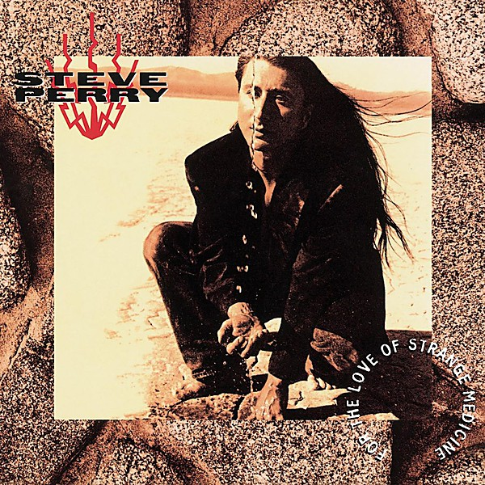

# For the Love of Strange Medicine

By **Steve Perry**

## Album Data

- **Catalog:** Beets
- **Format:** Digital, Album
- **Album:** For the Love of Strange Medicine
- **Artist:** Steve Perry
- **Albumartist:** Steve Perry
- **Genre:** Soft Rock
- **MusicBrainz Album Artist ID:** [88b0ef74-9da8-4998-8e3b-70687575588c](https://musicbrainz.org/artist/88b0ef74-9da8-4998-8e3b-70687575588c)
- **MusicBrainz Album ID:** [c260cc1f-4253-423b-be93-e2930e03e909](https://musicbrainz.org/release/c260cc1f-4253-423b-be93-e2930e03e909)
- **MusicBrainz Release Group ID:** [1838a7b8-6552-390c-a64f-5deb27ef5833](https://musicbrainz.org/release-group/1838a7b8-6552-390c-a64f-5deb27ef5833)
- **Year:** 1994
- **Catalog #:** CK 44287
- **Label:** Columbia
- **Total Tracks:** 11

## Album Tracks

### Track 01 - You Better Wait

- **Artist:** Steve Perry
- **Format:** MP3
- **Genre:** Soft Rock
- **Length:** 4:51
- **MusicBrainz Track ID:** [1a6c54d9-2199-4fe3-a51c-c075f3044b98](https://musicbrainz.org/recording/1a6c54d9-2199-4fe3-a51c-c075f3044b98)
- **Title:** You Better Wait
- **Track:** 01
- **Year:** 1994

### Track 02 - Young Hearts Forever

- **Artist:** Steve Perry
- **Format:** MP3
- **Genre:** Soft Rock
- **Length:** 4:29
- **MusicBrainz Track ID:** [b8c932b1-ced6-477e-a5d6-fc44eb22ef23](https://musicbrainz.org/recording/b8c932b1-ced6-477e-a5d6-fc44eb22ef23)
- **Title:** Young Hearts Forever
- **Track:** 02
- **Year:** 1994

### Track 03 - I Am

- **Artist:** Steve Perry
- **Format:** MP3
- **Genre:** Rock
- **Length:** 4:52
- **MusicBrainz Track ID:** [0f0f3177-92cb-48e8-bf4e-7c8eb279a3b9](https://musicbrainz.org/recording/0f0f3177-92cb-48e8-bf4e-7c8eb279a3b9)
- **Title:** I Am
- **Track:** 03
- **Year:** 1994

### Track 04 - Stand Up (Before It’s Too Late)

- **Artist:** Steve Perry
- **Format:** MP3
- **Genre:** Soft Rock
- **Length:** 4:49
- **MusicBrainz Track ID:** [5417f49f-9152-43a4-9e88-f200d48e06e9](https://musicbrainz.org/recording/5417f49f-9152-43a4-9e88-f200d48e06e9)
- **Title:** Stand Up (Before It’s Too Late)
- **Track:** 04
- **Year:** 1994

### Track 05 - For the Love of Strange Medicine

- **Artist:** Steve Perry
- **Format:** MP3
- **Genre:** Soft Rock
- **Length:** 5:52
- **MusicBrainz Track ID:** [44d7e799-c74f-4a29-a475-4bc304009a84](https://musicbrainz.org/recording/44d7e799-c74f-4a29-a475-4bc304009a84)
- **Title:** For the Love of Strange Medicine
- **Track:** 05
- **Year:** 1994

### Track 06 - Donna Please

- **Artist:** Steve Perry
- **Format:** MP3
- **Genre:** Soft Rock
- **Length:** 3:31
- **MusicBrainz Track ID:** [b71f8341-0a42-4ca4-8579-5b0edfef1489](https://musicbrainz.org/recording/b71f8341-0a42-4ca4-8579-5b0edfef1489)
- **Title:** Donna Please
- **Track:** 06
- **Year:** 1994

### Track 07 - Listen to Your Heart

- **Artist:** Steve Perry
- **Format:** MP3
- **Genre:** Pop Rock
- **Length:** 4:00
- **MusicBrainz Track ID:** [1d6c540b-65ed-4a98-ac15-640ddfe2e75b](https://musicbrainz.org/recording/1d6c540b-65ed-4a98-ac15-640ddfe2e75b)
- **Title:** Listen to Your Heart
- **Track:** 07
- **Year:** 1994

### Track 08 - Tuesday Heartache

- **Artist:** Steve Perry
- **Format:** MP3
- **Genre:** Soft Rock
- **Length:** 5:59
- **MusicBrainz Track ID:** [6781f56f-514c-4b45-bb2f-d9fc3f76b8e1](https://musicbrainz.org/recording/6781f56f-514c-4b45-bb2f-d9fc3f76b8e1)
- **Title:** Tuesday Heartache
- **Track:** 08
- **Year:** 1994

### Track 09 - Missing You

- **Artist:** Steve Perry
- **Format:** MP3
- **Genre:** Soft Rock
- **Length:** 3:47
- **MusicBrainz Track ID:** [bb1260d6-61fe-419d-98ec-f781187f2aa6](https://musicbrainz.org/recording/bb1260d6-61fe-419d-98ec-f781187f2aa6)
- **Title:** Missing You
- **Track:** 09
- **Year:** 1994

### Track 10 - Somewhere There’s Hope

- **Artist:** Steve Perry
- **Format:** MP3
- **Genre:** Soft Rock
- **Length:** 6:08
- **MusicBrainz Track ID:** [2a6157ef-f8c1-441e-a651-5e8087c63fbe](https://musicbrainz.org/recording/2a6157ef-f8c1-441e-a651-5e8087c63fbe)
- **Title:** Somewhere There’s Hope
- **Track:** 10
- **Year:** 1994

### Track 11 - Anyway

- **Artist:** Steve Perry
- **Format:** MP3
- **Genre:** Soft Rock
- **Length:** 4:17
- **MusicBrainz Track ID:** [fa9b3896-564e-457b-a5eb-965a8af46e43](https://musicbrainz.org/recording/fa9b3896-564e-457b-a5eb-965a8af46e43)
- **Title:** Anyway
- **Track:** 11
- **Year:** 1994

