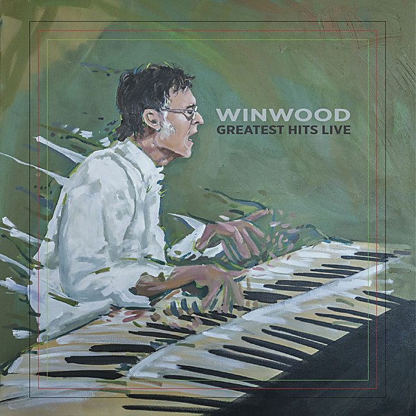

# Greatest Hits Live

By **Steve Winwood**

## Album Data

- **Catalog:** Beets
- **Format:** Digital, Album
- **Album:** Greatest Hits Live
- **Artist:** Steve Winwood
- **Albumartist:** Steve Winwood
- **Genre:** Rock
- **MusicBrainz Album Artist ID:** [885f90ef-6bd9-409a-b2df-e165e553c68e](https://musicbrainz.org/artist/885f90ef-6bd9-409a-b2df-e165e553c68e)
- **MusicBrainz Album ID:** [086e8a59-f8ac-430c-afd9-bc2a618c98c5](https://musicbrainz.org/release/086e8a59-f8ac-430c-afd9-bc2a618c98c5)
- **MusicBrainz Release Group ID:** [67b2e099-167f-4bb0-8a0d-31650f85c492](https://musicbrainz.org/release-group/67b2e099-167f-4bb0-8a0d-31650f85c492)
- **Year:** 2017
- **Catalog #:** WM002
- **Label:** Wincraft Music
- **Total Tracks:** 23

## Album Tracks

### Track 01 - I’m a Man

- **Artist:** Steve Winwood
- **Format:** MP3
- **Genre:** Rock
- **Length:** 6:00
- **MusicBrainz Track ID:** [e173c4af-6fc9-41cd-af1f-24eba2a02955](https://musicbrainz.org/recording/e173c4af-6fc9-41cd-af1f-24eba2a02955)
- **Title:** I’m a Man
- **Track:** 01
- **Year:** 2017

### Track 02 - Them Changes

- **Artist:** Steve Winwood
- **Format:** MP3
- **Genre:** Rock
- **Length:** 5:24
- **MusicBrainz Track ID:** [ceecf029-de3e-4a1a-9fea-7eb694f56224](https://musicbrainz.org/recording/ceecf029-de3e-4a1a-9fea-7eb694f56224)
- **Title:** Them Changes
- **Track:** 02
- **Year:** 2017

### Track 03 - Fly

- **Artist:** Steve Winwood
- **Format:** MP3
- **Genre:** Folk Rock
- **Length:** 8:56
- **MusicBrainz Track ID:** [b1fdf037-5e4b-4a90-86ed-5ac81cf92790](https://musicbrainz.org/recording/b1fdf037-5e4b-4a90-86ed-5ac81cf92790)
- **Title:** Fly
- **Track:** 03
- **Year:** 2017

### Track 04 - Can’t Find My Way Home

- **Artist:** Steve Winwood
- **Format:** MP3
- **Genre:** Rock
- **Length:** 4:49
- **MusicBrainz Track ID:** [9f254a4e-f096-4a4f-b7c7-6b8824c0c9f1](https://musicbrainz.org/recording/9f254a4e-f096-4a4f-b7c7-6b8824c0c9f1)
- **Title:** Can’t Find My Way Home
- **Track:** 04
- **Year:** 2017

### Track 05 - Had to Cry Today

- **Artist:** Steve Winwood
- **Format:** MP3
- **Genre:** Blues
- **Length:** 6:45
- **MusicBrainz Track ID:** [2a7e6dd8-b522-435d-8296-d95807e8dde2](https://musicbrainz.org/recording/2a7e6dd8-b522-435d-8296-d95807e8dde2)
- **Title:** Had to Cry Today
- **Track:** 05
- **Year:** 2017

### Track 06 - Low Spark of High Heeled Boys

- **Artist:** Steve Winwood
- **Format:** MP3
- **Genre:** Downtempo
- **Length:** 8:02
- **MusicBrainz Track ID:** [37e523ca-7cdd-45da-9c32-0b8d9820375f](https://musicbrainz.org/recording/37e523ca-7cdd-45da-9c32-0b8d9820375f)
- **Title:** Low Spark of High Heeled Boys
- **Track:** 06
- **Year:** 2017

### Track 07 - Empty Pages

- **Artist:** Steve Winwood
- **Format:** MP3
- **Genre:** Rock
- **Length:** 6:18
- **MusicBrainz Track ID:** [b22a0034-298b-43d5-a210-7871a99338cd](https://musicbrainz.org/recording/b22a0034-298b-43d5-a210-7871a99338cd)
- **Title:** Empty Pages
- **Track:** 07
- **Year:** 2017

### Track 08 - Back in the High Life Again

- **Artist:** Steve Winwood
- **Format:** MP3
- **Genre:** Rock
- **Length:** 8:15
- **MusicBrainz Track ID:** [40494935-9129-411f-8c3d-cf9916809b0c](https://musicbrainz.org/recording/40494935-9129-411f-8c3d-cf9916809b0c)
- **Title:** Back in the High Life Again
- **Track:** 08
- **Year:** 2017

### Track 09 - Higher Love

- **Artist:** Steve Winwood
- **Format:** MP3
- **Genre:** Soft Rock
- **Length:** 7:09
- **MusicBrainz Track ID:** [e135f2e5-3217-4279-9753-74e00a3542d7](https://musicbrainz.org/recording/e135f2e5-3217-4279-9753-74e00a3542d7)
- **Title:** Higher Love
- **Track:** 09
- **Year:** 2017

### Track 10 - Dear Mr Fantasy

- **Artist:** Steve Winwood
- **Format:** MP3
- **Genre:** Rock
- **Length:** 8:44
- **MusicBrainz Track ID:** [630ce637-43cc-4389-ad24-0e49023e5c97](https://musicbrainz.org/recording/630ce637-43cc-4389-ad24-0e49023e5c97)
- **Title:** Dear Mr Fantasy
- **Track:** 10
- **Year:** 2017

### Track 11 - Gimme Some Lovin’

- **Artist:** Steve Winwood
- **Format:** MP3
- **Genre:** Rock
- **Length:** 5:28
- **MusicBrainz Track ID:** [aa797bef-849c-4b8a-94df-2d268373fd19](https://musicbrainz.org/recording/aa797bef-849c-4b8a-94df-2d268373fd19)
- **Title:** Gimme Some Lovin’
- **Track:** 11
- **Year:** 2017

### Track 12 - Rainmaker

- **Artist:** Steve Winwood
- **Format:** MP3
- **Genre:** Rock
- **Length:** 8:05
- **MusicBrainz Track ID:** [f8b968d1-b660-4b9f-a32b-140a4a48f1cb](https://musicbrainz.org/recording/f8b968d1-b660-4b9f-a32b-140a4a48f1cb)
- **Title:** Rainmaker
- **Track:** 12
- **Year:** 2017

### Track 13 - Pearly Queen

- **Artist:** Steve Winwood
- **Format:** MP3
- **Genre:** Blues
- **Length:** 5:22
- **MusicBrainz Track ID:** [bb2e9992-84fb-4868-ab12-46ffaba3e369](https://musicbrainz.org/recording/bb2e9992-84fb-4868-ab12-46ffaba3e369)
- **Title:** Pearly Queen
- **Track:** 13
- **Year:** 2017

### Track 14 - Glad

- **Artist:** Steve Winwood
- **Format:** MP3
- **Genre:** Rock
- **Length:** 6:32
- **MusicBrainz Track ID:** [63881e7f-e0c7-4ae7-8525-6a361d3cbb1e](https://musicbrainz.org/recording/63881e7f-e0c7-4ae7-8525-6a361d3cbb1e)
- **Title:** Glad
- **Track:** 14
- **Year:** 2017

### Track 15 - Why Can’t We Live Together

- **Artist:** Steve Winwood
- **Format:** MP3
- **Genre:** Rock
- **Length:** 6:11
- **MusicBrainz Track ID:** [79450d45-32ed-4e73-a0fd-18e32743705a](https://musicbrainz.org/recording/79450d45-32ed-4e73-a0fd-18e32743705a)
- **Title:** Why Can’t We Live Together
- **Track:** 15
- **Year:** 2017

### Track 16 - 40,000 Headmen

- **Artist:** Steve Winwood
- **Format:** MP3
- **Genre:** Rock
- **Length:** 4:38
- **MusicBrainz Track ID:** [21a4739f-57cc-478d-9428-64d3bbdd1acf](https://musicbrainz.org/recording/21a4739f-57cc-478d-9428-64d3bbdd1acf)
- **Title:** 40,000 Headmen
- **Track:** 16
- **Year:** 2017

### Track 17 - Walking in the Wind

- **Artist:** Steve Winwood
- **Format:** MP3
- **Genre:** Rock
- **Length:** 7:14
- **MusicBrainz Track ID:** [0079028e-a461-4aaf-9581-bfb31eea3043](https://musicbrainz.org/recording/0079028e-a461-4aaf-9581-bfb31eea3043)
- **Title:** Walking in the Wind
- **Track:** 17
- **Year:** 2017

### Track 18 - Medicated Goo

- **Artist:** Steve Winwood
- **Format:** MP3
- **Genre:** Rock
- **Length:** 6:04
- **MusicBrainz Track ID:** [c07a438c-d611-4112-8d3c-323ecb59a388](https://musicbrainz.org/recording/c07a438c-d611-4112-8d3c-323ecb59a388)
- **Title:** Medicated Goo
- **Track:** 18
- **Year:** 2017

### Track 19 - John Barleycorn

- **Artist:** Steve Winwood
- **Format:** MP3
- **Genre:** Rock
- **Length:** 7:07
- **MusicBrainz Track ID:** [de61cf8e-90ec-4ebd-bad2-326afbb47959](https://musicbrainz.org/recording/de61cf8e-90ec-4ebd-bad2-326afbb47959)
- **Title:** John Barleycorn
- **Track:** 19
- **Year:** 2017

### Track 20 - While You See a Chance

- **Artist:** Steve Winwood
- **Format:** MP3
- **Genre:** Soft Rock
- **Length:** 6:11
- **MusicBrainz Track ID:** [06d30f39-aff1-4046-8038-7d7f0c66f8dd](https://musicbrainz.org/recording/06d30f39-aff1-4046-8038-7d7f0c66f8dd)
- **Title:** While You See a Chance
- **Track:** 20
- **Year:** 2017

### Track 21 - Arc of a Diver

- **Artist:** Steve Winwood
- **Format:** MP3
- **Genre:** Soul
- **Length:** 6:09
- **MusicBrainz Track ID:** [822b7ea1-d7d9-436e-8386-04b35af42fd0](https://musicbrainz.org/recording/822b7ea1-d7d9-436e-8386-04b35af42fd0)
- **Title:** Arc of a Diver
- **Track:** 21
- **Year:** 2017

### Track 22 - Freedom Overspill

- **Artist:** Steve Winwood
- **Format:** MP3
- **Genre:** Blue-Eyed Soul
- **Length:** 5:29
- **MusicBrainz Track ID:** [26e009db-05fa-4480-940d-ed3132ac37bd](https://musicbrainz.org/recording/26e009db-05fa-4480-940d-ed3132ac37bd)
- **Title:** Freedom Overspill
- **Track:** 22
- **Year:** 2017

### Track 23 - Roll With It

- **Artist:** Steve Winwood
- **Format:** MP3
- **Genre:** Blue-Eyed Soul
- **Length:** 5:46
- **MusicBrainz Track ID:** [c8fcbf7f-be83-4bde-b9e6-b6d8ceb3aecb](https://musicbrainz.org/recording/c8fcbf7f-be83-4bde-b9e6-b6d8ceb3aecb)
- **Title:** Roll With It
- **Track:** 23
- **Year:** 2017

## See also

- [Roon: Winwood Greatest Hits Live (Live)](../../Roon/Steve_Winwood/Winwood_Greatest_Hits_Live_Live.md)
