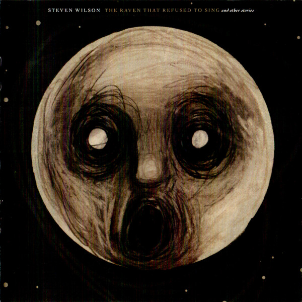

# The Raven That Refused to Sing (and Other Stories)

By **Steven Wilson**

## Album Data

- **Catalog:** Beets
- **Format:** Digital, Album
- **Album:** The Raven That Refused to Sing (and Other Stories)
- **Artist:** Steven Wilson
- **Albumartist:** Steven Wilson
- **Genre:** Progressive Rock
- **MusicBrainz Album Artist ID:** [3a51b862-0144-40f6-aa17-6aaeefea29d9](https://musicbrainz.org/artist/3a51b862-0144-40f6-aa17-6aaeefea29d9)
- **MusicBrainz Album ID:** [d24ca9da-826a-41f4-b816-0a62ab7f48b8](https://musicbrainz.org/release/d24ca9da-826a-41f4-b816-0a62ab7f48b8)
- **MusicBrainz Release Group ID:** [5bfcec4d-1620-4c42-a6f2-6231d05b0e66](https://musicbrainz.org/release-group/5bfcec4d-1620-4c42-a6f2-6231d05b0e66)
- **Year:** 2013
- **Catalog #:** 
- **Label:** SW Records
- **Total Tracks:** 11

## Album Tracks

### Track 01 - To the Bone

- **Artist:** Steven Wilson
- **Format:** ALAC
- **Genre:** Progressive Rock
- **Length:** 6:41
- **MusicBrainz Track ID:** [438cbdd1-1289-4534-a840-b163b70b7a14](https://musicbrainz.org/recording/438cbdd1-1289-4534-a840-b163b70b7a14)
- **Title:** To the Bone
- **Track:** 01
- **Year:** 2017

### Track 02 - Nowhere Now

- **Artist:** Steven Wilson
- **Format:** ALAC
- **Genre:** Progressive Rock
- **Length:** 4:03
- **MusicBrainz Track ID:** [0b30acb2-5e5e-4346-96d4-d123e5cb0e01](https://musicbrainz.org/recording/0b30acb2-5e5e-4346-96d4-d123e5cb0e01)
- **Title:** Nowhere Now
- **Track:** 02
- **Year:** 2017

### Track 04 - The Same Asylum as Before

- **Artist:** Steven Wilson
- **Format:** ALAC
- **Genre:** Progressive Rock
- **Length:** 5:14
- **MusicBrainz Track ID:** [26e0a272-5964-4af2-91a3-c6715e0cbaa5](https://musicbrainz.org/recording/26e0a272-5964-4af2-91a3-c6715e0cbaa5)
- **Title:** The Same Asylum as Before
- **Track:** 04
- **Year:** 2017

### Track 05 - Refuge

- **Artist:** Steven Wilson
- **Format:** ALAC
- **Genre:** Progressive Rock
- **Length:** 6:43
- **MusicBrainz Track ID:** [72b8f241-3107-489a-b72c-3865280366f2](https://musicbrainz.org/recording/72b8f241-3107-489a-b72c-3865280366f2)
- **Title:** Refuge
- **Track:** 05
- **Year:** 2017

### Track 06 - Permanating

- **Artist:** Steven Wilson
- **Format:** ALAC
- **Genre:** Rock
- **Length:** 3:34
- **MusicBrainz Track ID:** [fbcfc50c-8cb7-4fff-93df-321f0a57abb8](https://musicbrainz.org/recording/fbcfc50c-8cb7-4fff-93df-321f0a57abb8)
- **Title:** Permanating
- **Track:** 06
- **Year:** 2017

### Track 08 - People Who Eat Darkness

- **Artist:** Steven Wilson
- **Format:** ALAC
- **Genre:** Progressive Rock
- **Length:** 6:02
- **MusicBrainz Track ID:** [0cd300a8-7454-4806-8ca1-34d9620d09c0](https://musicbrainz.org/recording/0cd300a8-7454-4806-8ca1-34d9620d09c0)
- **Title:** People Who Eat Darkness
- **Track:** 08
- **Year:** 2017

### Track 10 - Detonation

- **Artist:** Steven Wilson
- **Format:** ALAC
- **Genre:** Progressive Rock
- **Length:** 9:19
- **MusicBrainz Track ID:** [e26e1eda-2d41-41ea-9d19-8aa1b7bde593](https://musicbrainz.org/recording/e26e1eda-2d41-41ea-9d19-8aa1b7bde593)
- **Title:** Detonation
- **Track:** 10
- **Year:** 2017

### Track 11 - Song of Unborn

- **Artist:** Steven Wilson
- **Format:** ALAC
- **Genre:** Progressive Rock
- **Length:** 5:55
- **MusicBrainz Track ID:** [0eda1641-619a-459e-9052-b018dc58b3da](https://musicbrainz.org/recording/0eda1641-619a-459e-9052-b018dc58b3da)
- **Title:** Song of Unborn
- **Track:** 11
- **Year:** 2017

### Track 09 - Song of I

- **Artist:** Steven Wilson feat. Sophie Hunger
- **Format:** ALAC
- **Genre:** Progressive Rock
- **Length:** 5:21
- **MusicBrainz Track ID:** [b0c2cfc3-ea00-44d7-a6f9-dbf8f9f8de04](https://musicbrainz.org/recording/b0c2cfc3-ea00-44d7-a6f9-dbf8f9f8de04)
- **Title:** Song of I
- **Track:** 09
- **Year:** 2017

### Track 03 - Pariah

- **Artist:** Steven Wilson feat. Ninet Tayeb
- **Format:** ALAC
- **Genre:** Dream Pop
- **Length:** 4:46
- **MusicBrainz Track ID:** [e0abb5f0-d113-44a1-84e8-372f0233300c](https://musicbrainz.org/recording/e0abb5f0-d113-44a1-84e8-372f0233300c)
- **Title:** Pariah
- **Track:** 03
- **Year:** 2017

### Track 07 - Blank Tapes

- **Artist:** Steven Wilson feat. Ninet Tayeb
- **Format:** ALAC
- **Genre:** Progressive Rock
- **Length:** 2:08
- **MusicBrainz Track ID:** [08ff7b73-5e3b-4661-849d-9b87e53ad9d7](https://musicbrainz.org/recording/08ff7b73-5e3b-4661-849d-9b87e53ad9d7)
- **Title:** Blank Tapes
- **Track:** 07
- **Year:** 2017

## See also

- [4 ½](4_½.md)
- [Hand. Cannot. Erase.](Hand_Cannot_Erase.md)
- [To the Bone](To_the_Bone.md)
- [Roon: 4 1/2](../../Roon/Steven_Wilson/4_1-2.md)
- [Roon: Hand Cannot Erase](../../Roon/Steven_Wilson/Hand_Cannot_Erase.md)
- [Roon: Home Invasion](../../Roon/Steven_Wilson/Home_Invasion-_In_Concert_At_The_Royal_Albert_Hall_Live.md)
- [Roon: THE B-SIDES COLLECTION](../../Roon/Steven_Wilson/THE_B-SIDES_COLLECTION.md)
- [Roon: THE FUTURE BITES](../../Roon/Steven_Wilson/THE_FUTURE_BITES.md)
- [Roon: The Raven That Refused to Sing (and Other Stories) - Deluxe Edition](../../Roon/Steven_Wilson/The_Raven_That_Refused_to_Sing_and_Other_Stories_-_Deluxe_Edition.md)
- [Roon: To The Bone](../../Roon/Steven_Wilson/To_The_Bone.md)
- [Vinyl: Grace For Drowning](../../Vinyl/Steven_Wilson/Grace_For_Drowning.md)
- [Vinyl: ](../../Vinyl/Steven_Wilson/Steven_Wilson.md)
- [Vinyl: The Raven That Refused To Sing (And Other Stories)](../../Vinyl/Steven_Wilson/The_Raven_That_Refused_To_Sing_And_Other_Stories.md)
- [Vinyl: To The Bone](../../Vinyl/Steven_Wilson/To_The_Bone.md)
