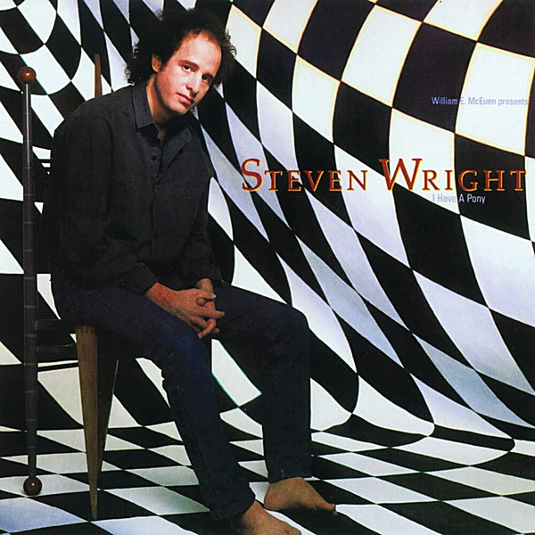

# I Have A Pony

By **Steven Wright**

## Album Data

- **Catalog:** Beets
- **Format:** Digital, Album
- **Album:** I Have A Pony
- **Artist:** Steven Wright
- **Albumartist:** Steven Wright
- **Genre:** Stand-Up
- **MusicBrainz Album Artist ID:** 
- **MusicBrainz Album ID:** 
- **MusicBrainz Release Group ID:** 
- **Year:** 0000
- **Catalog #:** 
- **Label:** 
- **Total Tracks:** 00

## Album Tracks

### Track 00 - 01-Introduction

- **Artist:** Steven Wright
- **Format:** ALAC
- **Genre:** Stand-Up
- **Length:** 4:14
- **MusicBrainz Track ID:** 
- **Title:** 01-Introduction
- **Track:** 00
- **Year:** 0000

### Track 00 - 02-Ants

- **Artist:** Steven Wright
- **Format:** ALAC
- **Genre:** Stand-Up
- **Length:** 4:42
- **MusicBrainz Track ID:** 
- **Title:** 02-Ants
- **Track:** 00
- **Year:** 0000

### Track 00 - 03-Hitchhiking

- **Artist:** Steven Wright
- **Format:** ALAC
- **Genre:** Stand-Up
- **Length:** 2:13
- **MusicBrainz Track ID:** 
- **Title:** 03-Hitchhiking
- **Track:** 00
- **Year:** 0000

### Track 00 - 04-Ice

- **Artist:** Steven Wright
- **Format:** ALAC
- **Genre:** Stand-Up
- **Length:** 2:28
- **MusicBrainz Track ID:** 
- **Title:** 04-Ice
- **Track:** 00
- **Year:** 0000

### Track 00 - 05-Dog Stay

- **Artist:** Steven Wright
- **Format:** ALAC
- **Genre:** Stand-Up
- **Length:** 3:27
- **MusicBrainz Track ID:** 
- **Title:** 05-Dog Stay
- **Track:** 00
- **Year:** 0000

### Track 00 - 06-Rachel

- **Artist:** Steven Wright
- **Format:** ALAC
- **Genre:** Stand-Up
- **Length:** 4:50
- **MusicBrainz Track ID:** 
- **Title:** 06-Rachel
- **Track:** 00
- **Year:** 0000

### Track 00 - 07-7's and Museums

- **Artist:** Steven Wright
- **Format:** ALAC
- **Genre:** Stand-Up
- **Length:** 4:01
- **MusicBrainz Track ID:** 
- **Title:** 07-7's and Museums
- **Track:** 00
- **Year:** 0000

### Track 00 - 08-Water

- **Artist:** Steven Wright
- **Format:** ALAC
- **Genre:** Stand-Up
- **Length:** 3:06
- **MusicBrainz Track ID:** 
- **Title:** 08-Water
- **Track:** 00
- **Year:** 0000

### Track 00 - 09-Jiggs Casey

- **Artist:** Steven Wright
- **Format:** ALAC
- **Genre:** Stand-Up
- **Length:** 3:03
- **MusicBrainz Track ID:** 
- **Title:** 09-Jiggs Casey
- **Track:** 00
- **Year:** 0000

### Track 00 - 10-Cross Country

- **Artist:** Steven Wright
- **Format:** ALAC
- **Genre:** Stand-Up
- **Length:** 2:15
- **MusicBrainz Track ID:** 
- **Title:** 10-Cross Country
- **Track:** 00
- **Year:** 0000

### Track 00 - 11-Book Store

- **Artist:** Steven Wright
- **Format:** ALAC
- **Genre:** Stand-Up
- **Length:** 1:25
- **MusicBrainz Track ID:** 
- **Title:** 11-Book Store
- **Track:** 00
- **Year:** 0000

### Track 00 - 12-Winny

- **Artist:** Steven Wright
- **Format:** ALAC
- **Genre:** Stand-Up
- **Length:** 1:28
- **MusicBrainz Track ID:** 
- **Title:** 12-Winny
- **Track:** 00
- **Year:** 0000

### Track 00 - 13-Apt

- **Artist:** Steven Wright
- **Format:** ALAC
- **Genre:** Stand-Up
- **Length:** 2:08
- **MusicBrainz Track ID:** 
- **Title:** 13-Apt
- **Track:** 00
- **Year:** 0000

### Track 00 - 14-Babies and Skiing

- **Artist:** Steven Wright
- **Format:** ALAC
- **Genre:** Stand-Up
- **Length:** 2:22
- **MusicBrainz Track ID:** 
- **Title:** 14-Babies and Skiing
- **Track:** 00
- **Year:** 0000

### Track 01 - Introduction (Album Version)

- **Artist:** Steven Wright
- **Format:** MP3
- **Genre:** Stand-Up
- **Length:** 4:14
- **MusicBrainz Track ID:** 
- **Title:** Introduction (Album Version)
- **Track:** 01
- **Year:** 2005

### Track 02 - Ants (Album Version)

- **Artist:** Steven Wright
- **Format:** MP3
- **Genre:** Stand-Up
- **Length:** 4:42
- **MusicBrainz Track ID:** 
- **Title:** Ants (Album Version)
- **Track:** 02
- **Year:** 2005

### Track 03 - Hitchhiking (Album Version)

- **Artist:** Steven Wright
- **Format:** MP3
- **Genre:** Stand-Up
- **Length:** 2:13
- **MusicBrainz Track ID:** 
- **Title:** Hitchhiking (Album Version)
- **Track:** 03
- **Year:** 2005

### Track 04 - Ice (Album Version)

- **Artist:** Steven Wright
- **Format:** MP3
- **Genre:** Stand-Up
- **Length:** 2:28
- **MusicBrainz Track ID:** 
- **Title:** Ice (Album Version)
- **Track:** 04
- **Year:** 2005

### Track 05 - Dog Stay (Album Version)

- **Artist:** Steven Wright
- **Format:** MP3
- **Genre:** Stand-Up
- **Length:** 3:27
- **MusicBrainz Track ID:** 
- **Title:** Dog Stay (Album Version)
- **Track:** 05
- **Year:** 2005

### Track 06 - Rachel (Album Version)

- **Artist:** Steven Wright
- **Format:** MP3
- **Genre:** Stand-Up
- **Length:** 4:50
- **MusicBrainz Track ID:** 
- **Title:** Rachel (Album Version)
- **Track:** 06
- **Year:** 2005

### Track 07 - 7's And Museums (Album Version)

- **Artist:** Steven Wright
- **Format:** MP3
- **Genre:** Stand-Up
- **Length:** 4:01
- **MusicBrainz Track ID:** 
- **Title:** 7's And Museums (Album Version)
- **Track:** 07
- **Year:** 2005

### Track 08 - Water (Album Version)

- **Artist:** Steven Wright
- **Format:** MP3
- **Genre:** Stand-Up
- **Length:** 3:06
- **MusicBrainz Track ID:** 
- **Title:** Water (Album Version)
- **Track:** 08
- **Year:** 2005

### Track 09 - Jiggs Casey (Album Version)

- **Artist:** Steven Wright
- **Format:** MP3
- **Genre:** Stand-Up
- **Length:** 3:03
- **MusicBrainz Track ID:** 
- **Title:** Jiggs Casey (Album Version)
- **Track:** 09
- **Year:** 2005

### Track 10 - Cross Country (Album Version)

- **Artist:** Steven Wright
- **Format:** MP3
- **Genre:** Stand-Up
- **Length:** 2:15
- **MusicBrainz Track ID:** 
- **Title:** Cross Country (Album Version)
- **Track:** 10
- **Year:** 2005

### Track 11 - Book Store (Album Version)

- **Artist:** Steven Wright
- **Format:** MP3
- **Genre:** Stand-Up
- **Length:** 1:25
- **MusicBrainz Track ID:** 
- **Title:** Book Store (Album Version)
- **Track:** 11
- **Year:** 2005

### Track 12 - Winny (Album Version)

- **Artist:** Steven Wright
- **Format:** MP3
- **Genre:** Stand-Up
- **Length:** 1:28
- **MusicBrainz Track ID:** 
- **Title:** Winny (Album Version)
- **Track:** 12
- **Year:** 2005

### Track 13 - Apt. (Album Version)

- **Artist:** Steven Wright
- **Format:** MP3
- **Genre:** Stand-Up
- **Length:** 2:08
- **MusicBrainz Track ID:** 
- **Title:** Apt. (Album Version)
- **Track:** 13
- **Year:** 2005

### Track 14 - Babies And Skiing (Album Version)

- **Artist:** Steven Wright
- **Format:** MP3
- **Genre:** Stand-Up
- **Length:** 2:22
- **MusicBrainz Track ID:** 
- **Title:** Babies And Skiing (Album Version)
- **Track:** 14
- **Year:** 2005

## See also

- [Roon: I Have A Pony](../../Roon/Steven_Wright/I_Have_A_Pony.md)
