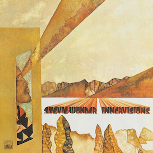

# Innervisions

By **Stevie Wonder**

## Album Data

- **Catalog:** Beets
- **Format:** Digital, Album
- **Album:** Innervisions
- **Artist:** Stevie Wonder
- **Albumartist:** Stevie Wonder
- **Genre:** Soul
- **MusicBrainz Album Artist ID:** [1ee18fb3-18a6-4c7f-8ba0-bc41cdd0462e](https://musicbrainz.org/artist/1ee18fb3-18a6-4c7f-8ba0-bc41cdd0462e)
- **MusicBrainz Album ID:** [0fd0ff67-798e-4c33-b625-8e1c7ed95858](https://musicbrainz.org/release/0fd0ff67-798e-4c33-b625-8e1c7ed95858)
- **MusicBrainz Release Group ID:** [e626b377-74c5-3b97-8f16-8cef5e1c04ea](https://musicbrainz.org/release-group/e626b377-74c5-3b97-8f16-8cef5e1c04ea)
- **Year:** 1973
- **Catalog #:** 
- **Label:** 
- **Total Tracks:** 09

## Album Tracks

### Track 01 - Too High

- **Artist:** Stevie Wonder
- **Format:** ALAC
- **Genre:** Soul
- **Length:** 4:36
- **MusicBrainz Track ID:** [5f7ee91a-aee9-4071-b209-7a699fed2872](https://musicbrainz.org/recording/5f7ee91a-aee9-4071-b209-7a699fed2872)
- **Title:** Too High
- **Track:** 01
- **Year:** 1973

### Track 02 - Visions

- **Artist:** Stevie Wonder
- **Format:** ALAC
- **Genre:** Soul
- **Length:** 5:24
- **MusicBrainz Track ID:** [7efcbd6d-98ba-4f5e-b33b-3494022e741a](https://musicbrainz.org/recording/7efcbd6d-98ba-4f5e-b33b-3494022e741a)
- **Title:** Visions
- **Track:** 02
- **Year:** 1973

### Track 03 - Living for the City

- **Artist:** Stevie Wonder
- **Format:** ALAC
- **Genre:** Soul
- **Length:** 7:24
- **MusicBrainz Track ID:** [6009d911-9c18-4e73-a1c5-ed3b6c230d2e](https://musicbrainz.org/recording/6009d911-9c18-4e73-a1c5-ed3b6c230d2e)
- **Title:** Living for the City
- **Track:** 03
- **Year:** 1973

### Track 04 - Golden Lady

- **Artist:** Stevie Wonder
- **Format:** ALAC
- **Genre:** Soul
- **Length:** 4:47
- **MusicBrainz Track ID:** [c43abbea-03c4-4b16-a1f0-5ea4120a85ad](https://musicbrainz.org/recording/c43abbea-03c4-4b16-a1f0-5ea4120a85ad)
- **Title:** Golden Lady
- **Track:** 04
- **Year:** 1973

### Track 05 - Higher Ground

- **Artist:** Stevie Wonder
- **Format:** ALAC
- **Genre:** Uk Garage
- **Length:** 3:42
- **MusicBrainz Track ID:** [303fa742-e4d4-4044-9fa6-ddd902326438](https://musicbrainz.org/recording/303fa742-e4d4-4044-9fa6-ddd902326438)
- **Title:** Higher Ground
- **Track:** 05
- **Year:** 1973

### Track 06 - Jesus Children of America

- **Artist:** Stevie Wonder
- **Format:** ALAC
- **Genre:** Soul
- **Length:** 4:10
- **MusicBrainz Track ID:** [af2e5da1-bc1b-42ea-b2c2-f67a24914214](https://musicbrainz.org/recording/af2e5da1-bc1b-42ea-b2c2-f67a24914214)
- **Title:** Jesus Children of America
- **Track:** 06
- **Year:** 1973

### Track 07 - All in Love Is Fair

- **Artist:** Stevie Wonder
- **Format:** ALAC
- **Genre:** Soul
- **Length:** 3:42
- **MusicBrainz Track ID:** [2a967438-d35f-4d52-8f32-15c2256c1264](https://musicbrainz.org/recording/2a967438-d35f-4d52-8f32-15c2256c1264)
- **Title:** All in Love Is Fair
- **Track:** 07
- **Year:** 1973

### Track 08 - Don't You Worry 'bout a Thing

- **Artist:** Stevie Wonder
- **Format:** ALAC
- **Genre:** Soul
- **Length:** 4:45
- **MusicBrainz Track ID:** [4488cf1e-f74e-4f4b-93dc-e7c254ae2e95](https://musicbrainz.org/recording/4488cf1e-f74e-4f4b-93dc-e7c254ae2e95)
- **Title:** Don't You Worry 'bout a Thing
- **Track:** 08
- **Year:** 1973

### Track 09 - He's Misstra Know-It-All

- **Artist:** Stevie Wonder
- **Format:** ALAC
- **Genre:** Soul
- **Length:** 5:34
- **MusicBrainz Track ID:** [30ae91cc-2af2-428e-b412-18d612ff4eb9](https://musicbrainz.org/recording/30ae91cc-2af2-428e-b412-18d612ff4eb9)
- **Title:** He's Misstra Know-It-All
- **Track:** 09
- **Year:** 1973

## See also

- [Definitive Collection](Definitive_Collection.md)
- [Roon: Innervisions](../../Roon/Stevie_Wonder/Innervisions.md)
- [Roon: Journey Through The Secret Life Of Plants](../../Roon/Stevie_Wonder/Journey_Through_The_Secret_Life_Of_Plants.md)
- [Vinyl: Songs In The Key Of Life](../../Vinyl/Stevie_Wonder/Songs_In_The_Key_Of_Life.md)
- [Vinyl: ](../../Vinyl/Stevie_Wonder/Stevie_Wonder.md)
- [Vinyl: Stevie Wonder's Journey Through The Secret Life Of Plants](../../Vinyl/Stevie_Wonder/Stevie_Wonders_Journey_Through_The_Secret_Life_Of_Plants.md)
