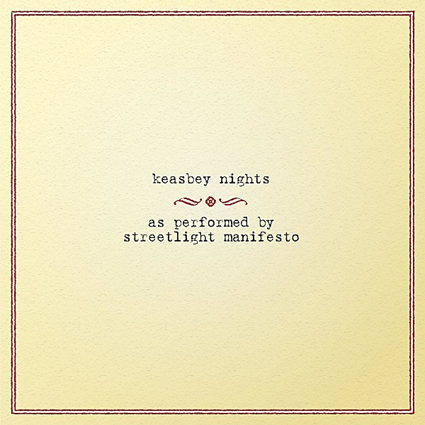

# Keasbey Nights

By **Streetlight Manifesto**

## Album Data

- **Catalog:** Beets
- **Format:** Digital, Album
- **Album:** Keasbey Nights
- **Artist:** Streetlight Manifesto
- **Albumartist:** Streetlight Manifesto
- **Genre:** Ska Punk
- **MusicBrainz Album Artist ID:** [cbc9199f-944b-42e9-a945-627c9fc0ba6e](https://musicbrainz.org/artist/cbc9199f-944b-42e9-a945-627c9fc0ba6e)
- **MusicBrainz Album ID:** [275b722f-d7f9-40ea-be38-286414febeb6](https://musicbrainz.org/release/275b722f-d7f9-40ea-be38-286414febeb6)
- **MusicBrainz Release Group ID:** [5b613390-d042-3f54-a284-298d5e7fa9a2](https://musicbrainz.org/release-group/5b613390-d042-3f54-a284-298d5e7fa9a2)
- **Year:** 2006
- **Catalog #:** VR240
- **Label:** Victory Records
- **Total Tracks:** 14

## Album Tracks

### Track 01 - Dear Sergio

- **Artist:** Streetlight Manifesto
- **Format:** MP3
- **Genre:** Ska Punk
- **Length:** 2:54
- **MusicBrainz Track ID:** [a972abd0-f4f6-4521-b7a7-3f7863d5e967](https://musicbrainz.org/recording/a972abd0-f4f6-4521-b7a7-3f7863d5e967)
- **Title:** Dear Sergio
- **Track:** 01
- **Year:** 2006

### Track 02 - Sick and Sad

- **Artist:** Streetlight Manifesto
- **Format:** MP3
- **Genre:** Ska Punk
- **Length:** 2:17
- **MusicBrainz Track ID:** [80169c3e-9dff-4d86-aee5-4abdfb715c2e](https://musicbrainz.org/recording/80169c3e-9dff-4d86-aee5-4abdfb715c2e)
- **Title:** Sick and Sad
- **Track:** 02
- **Year:** 2006

### Track 03 - Keasbey Nights

- **Artist:** Streetlight Manifesto
- **Format:** MP3
- **Genre:** Ska Punk
- **Length:** 3:00
- **MusicBrainz Track ID:** [d3acd0ad-d153-4daf-9849-6cd5a627bc07](https://musicbrainz.org/recording/d3acd0ad-d153-4daf-9849-6cd5a627bc07)
- **Title:** Keasbey Nights
- **Track:** 03
- **Year:** 2006

### Track 04 - Day In, Day Out

- **Artist:** Streetlight Manifesto
- **Format:** MP3
- **Genre:** Ska Punk
- **Length:** 3:22
- **MusicBrainz Track ID:** [d2fcab61-1ab5-4fc5-94b5-09687410f51a](https://musicbrainz.org/recording/d2fcab61-1ab5-4fc5-94b5-09687410f51a)
- **Title:** Day In, Day Out
- **Track:** 04
- **Year:** 2006

### Track 05 - Walking Away

- **Artist:** Streetlight Manifesto
- **Format:** MP3
- **Genre:** Ska Punk
- **Length:** 4:10
- **MusicBrainz Track ID:** [7b591bce-20a7-4a1e-8d84-ff1b50a2b576](https://musicbrainz.org/recording/7b591bce-20a7-4a1e-8d84-ff1b50a2b576)
- **Title:** Walking Away
- **Track:** 05
- **Year:** 2006

### Track 06 - Giving Up, Giving In

- **Artist:** Streetlight Manifesto
- **Format:** MP3
- **Genre:** Ska Punk
- **Length:** 2:49
- **MusicBrainz Track ID:** [7aad9400-39e1-47fe-8ea7-d6d309c797cc](https://musicbrainz.org/recording/7aad9400-39e1-47fe-8ea7-d6d309c797cc)
- **Title:** Giving Up, Giving In
- **Track:** 06
- **Year:** 2006

### Track 07 - On & On & On

- **Artist:** Streetlight Manifesto
- **Format:** MP3
- **Genre:** Ska Punk
- **Length:** 3:12
- **MusicBrainz Track ID:** [e46a294d-c2d3-41b5-9ad3-f764c57a2676](https://musicbrainz.org/recording/e46a294d-c2d3-41b5-9ad3-f764c57a2676)
- **Title:** On & On & On
- **Track:** 07
- **Year:** 2006

### Track 08 - Riding the Fourth Wave

- **Artist:** Streetlight Manifesto
- **Format:** MP3
- **Genre:** Ska Punk
- **Length:** 2:12
- **MusicBrainz Track ID:** [21a3696c-a467-4945-b011-a8486f167b51](https://musicbrainz.org/recording/21a3696c-a467-4945-b011-a8486f167b51)
- **Title:** Riding the Fourth Wave
- **Track:** 08
- **Year:** 2006

### Track 09 - This One Goes Out To...

- **Artist:** Streetlight Manifesto
- **Format:** MP3
- **Genre:** Ska Punk
- **Length:** 2:34
- **MusicBrainz Track ID:** [88f7f614-826e-486b-93a8-d41e538d0d8f](https://musicbrainz.org/recording/88f7f614-826e-486b-93a8-d41e538d0d8f)
- **Title:** This One Goes Out To...
- **Track:** 09
- **Year:** 2006

### Track 10 - Supernothing

- **Artist:** Streetlight Manifesto
- **Format:** MP3
- **Genre:** Ska Punk
- **Length:** 2:50
- **MusicBrainz Track ID:** [714d54b3-a054-4367-a541-9e700b323802](https://musicbrainz.org/recording/714d54b3-a054-4367-a541-9e700b323802)
- **Title:** Supernothing
- **Track:** 10
- **Year:** 2006

### Track 11 - 9mm and a Three Piece Suit

- **Artist:** Streetlight Manifesto
- **Format:** MP3
- **Genre:** Ska Punk
- **Length:** 1:56
- **MusicBrainz Track ID:** [21fc58ad-72cb-4f5f-bd9f-3e4d7830dea8](https://musicbrainz.org/recording/21fc58ad-72cb-4f5f-bd9f-3e4d7830dea8)
- **Title:** 9mm and a Three Piece Suit
- **Track:** 11
- **Year:** 2006

### Track 12 - Kristina She Don’t Know I Exist

- **Artist:** Streetlight Manifesto
- **Format:** MP3
- **Genre:** Ska Punk
- **Length:** 5:07
- **MusicBrainz Track ID:** [a759c24b-e057-41c1-909c-d0717d623973](https://musicbrainz.org/recording/a759c24b-e057-41c1-909c-d0717d623973)
- **Title:** Kristina She Don’t Know I Exist
- **Track:** 12
- **Year:** 2006

### Track 13 - As the Footsteps Die Out Forever

- **Artist:** Streetlight Manifesto
- **Format:** MP3
- **Genre:** Ska Punk
- **Length:** 3:15
- **MusicBrainz Track ID:** [aef39275-a063-4502-bef7-106bb50650c6](https://musicbrainz.org/recording/aef39275-a063-4502-bef7-106bb50650c6)
- **Title:** As the Footsteps Die Out Forever
- **Track:** 13
- **Year:** 2006

### Track 14 - 1234 1234

- **Artist:** Streetlight Manifesto
- **Format:** MP3
- **Genre:** Ska Punk
- **Length:** 7:10
- **MusicBrainz Track ID:** [8381cde0-278c-4e45-95fb-4e5ddfdad658](https://musicbrainz.org/recording/8381cde0-278c-4e45-95fb-4e5ddfdad658)
- **Title:** 1234 1234
- **Track:** 14
- **Year:** 2006

## See also

- [Vinyl: Keasbey Nights](../../Vinyl/Streetlight_Manifesto/Keasbey_Nights.md)
- [Vinyl: ](../../Vinyl/Streetlight_Manifesto/Streetlight_Manifesto.md)
