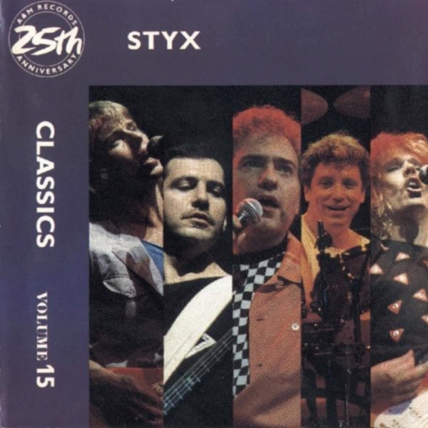

# Classics, Vol. 15

By **Styx**

## Album Data

- **Catalog:** Beets
- **Format:** Digital, Album
- **Album:** Classics, Vol. 15
- **Artist:** Styx
- **Albumartist:** Styx
- **Genre:** Hard Rock
- **MusicBrainz Album Artist ID:** 
- **MusicBrainz Album ID:** 
- **MusicBrainz Release Group ID:** 
- **Year:** 1987
- **Catalog #:** 75021 3734‐2
- **Label:** A&M Records
- **Total Tracks:** 09

## Album Tracks

### Track 01 - Mr. Roboto

- **Artist:** Styx
- **Format:** AAC
- **Genre:** Progressive Rock
- **Length:** 5:34
- **MusicBrainz Track ID:** [1e950eab-884f-4802-b7f7-b2e012acbb85](https://musicbrainz.org/recording/1e950eab-884f-4802-b7f7-b2e012acbb85)
- **Title:** Mr. Roboto
- **Track:** 01
- **Year:** 1990

### Track 02 - Cold War

- **Artist:** Styx
- **Format:** AAC
- **Genre:** Progressive Rock
- **Length:** 4:31
- **MusicBrainz Track ID:** [41caad27-11c9-4779-a9b8-6a1be27c1b9e](https://musicbrainz.org/recording/41caad27-11c9-4779-a9b8-6a1be27c1b9e)
- **Title:** Cold War
- **Track:** 02
- **Year:** 1990

### Track 03 - Don’t Let It End

- **Artist:** Styx
- **Format:** AAC
- **Genre:** Progressive Rock
- **Length:** 5:03
- **MusicBrainz Track ID:** [0c9fa351-a789-45cc-ab2c-e1fe3513c434](https://musicbrainz.org/recording/0c9fa351-a789-45cc-ab2c-e1fe3513c434)
- **Title:** Don’t Let It End
- **Track:** 03
- **Year:** 1990

### Track 04 - High Time

- **Artist:** Styx
- **Format:** AAC
- **Genre:** Progressive Rock
- **Length:** 4:38
- **MusicBrainz Track ID:** [fa9e03b5-7314-464e-bbb0-69e3310ebe87](https://musicbrainz.org/recording/fa9e03b5-7314-464e-bbb0-69e3310ebe87)
- **Title:** High Time
- **Track:** 04
- **Year:** 1990

### Track 05 - Heavy Metal Poisoning

- **Artist:** Styx
- **Format:** AAC
- **Genre:** Progressive Rock
- **Length:** 5:04
- **MusicBrainz Track ID:** [603e3922-b08d-4f5d-8aea-7237b90e219b](https://musicbrainz.org/recording/603e3922-b08d-4f5d-8aea-7237b90e219b)
- **Title:** Heavy Metal Poisoning
- **Track:** 05
- **Year:** 1990

### Track 06 - Just Get Through This Night

- **Artist:** Styx
- **Format:** AAC
- **Genre:** Soft Rock
- **Length:** 6:14
- **MusicBrainz Track ID:** [df542ea6-0207-4b24-bddf-02ebd0cc0894](https://musicbrainz.org/recording/df542ea6-0207-4b24-bddf-02ebd0cc0894)
- **Title:** Just Get Through This Night
- **Track:** 06
- **Year:** 1990

### Track 07 - Double Life

- **Artist:** Styx
- **Format:** AAC
- **Genre:** Progressive Rock
- **Length:** 3:50
- **MusicBrainz Track ID:** [df904859-9865-44c9-bb18-cdfc09394f59](https://musicbrainz.org/recording/df904859-9865-44c9-bb18-cdfc09394f59)
- **Title:** Double Life
- **Track:** 07
- **Year:** 1990

### Track 08 - Haven’t We Been Here Before

- **Artist:** Styx
- **Format:** AAC
- **Genre:** Progressive Rock
- **Length:** 4:12
- **MusicBrainz Track ID:** [225afdb8-fdc1-4991-98ec-bfd2af565e49](https://musicbrainz.org/recording/225afdb8-fdc1-4991-98ec-bfd2af565e49)
- **Title:** Haven’t We Been Here Before
- **Track:** 08
- **Year:** 1990

### Track 09 - Don’t Let It End (reprise)

- **Artist:** Styx
- **Format:** AAC
- **Genre:** Progressive Rock
- **Length:** 2:26
- **MusicBrainz Track ID:** [e208a6bc-a773-46d9-a897-5729117e4c55](https://musicbrainz.org/recording/e208a6bc-a773-46d9-a897-5729117e4c55)
- **Title:** Don’t Let It End (reprise)
- **Track:** 09
- **Year:** 1990

## See also

- [Kilroy Was Here](Kilroy_Was_Here.md)
- [Original Version](Original_Version.md)
- [Styx](Styx.md)
