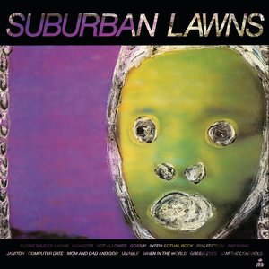

# Suburban Lawns

By **Suburban Lawns**

## Album Data

- **Catalog:** Beets
- **Format:** Digital, Album
- **Album:** Suburban Lawns
- **Artist:** Suburban Lawns
- **Albumartist:** Suburban Lawns
- **Genre:** No Wave
- **MusicBrainz Album Artist ID:** [f2e5a6f8-e72e-46a7-8e2e-34960339220a](https://musicbrainz.org/artist/f2e5a6f8-e72e-46a7-8e2e-34960339220a)
- **MusicBrainz Album ID:** [6a609f5f-2c07-453f-980a-f7ef8c6adf26](https://musicbrainz.org/release/6a609f5f-2c07-453f-980a-f7ef8c6adf26)
- **MusicBrainz Release Group ID:** [84afc3a0-4f81-33cd-930e-6a23b309bb8c](https://musicbrainz.org/release-group/84afc3a0-4f81-33cd-930e-6a23b309bb8c)
- **Year:** 1981
- **Catalog #:** IRS SP70024
- **Label:** I.R.S. Records
- **Total Tracks:** 14

## Album Tracks

### Track 01 - Flying Saucer Safari

- **Artist:** Suburban Lawns
- **Format:** AAC
- **Genre:** New Wave
- **Length:** 2:21
- **MusicBrainz Track ID:** [d36532b2-ce10-416b-a602-1b4d2d5bbb00](https://musicbrainz.org/recording/d36532b2-ce10-416b-a602-1b4d2d5bbb00)
- **Title:** Flying Saucer Safari
- **Track:** 01
- **Year:** 1981

### Track 02 - Pioneers

- **Artist:** Suburban Lawns
- **Format:** AAC
- **Genre:** No Wave
- **Length:** 2:12
- **MusicBrainz Track ID:** [dbb9bfac-3922-4b62-ba33-d426eebefc9a](https://musicbrainz.org/recording/dbb9bfac-3922-4b62-ba33-d426eebefc9a)
- **Title:** Pioneers
- **Track:** 02
- **Year:** 1981

### Track 03 - Not Allowed

- **Artist:** Suburban Lawns
- **Format:** AAC
- **Genre:** No Wave
- **Length:** 2:21
- **MusicBrainz Track ID:** [68e4b3d6-a5db-483a-ada8-18ebbab7361d](https://musicbrainz.org/recording/68e4b3d6-a5db-483a-ada8-18ebbab7361d)
- **Title:** Not Allowed
- **Track:** 03
- **Year:** 1981

### Track 04 - Gossip

- **Artist:** Suburban Lawns
- **Format:** AAC
- **Genre:** Rock
- **Length:** 2:36
- **MusicBrainz Track ID:** [d9486e8c-6e7f-44e6-9f26-26357c805c0c](https://musicbrainz.org/recording/d9486e8c-6e7f-44e6-9f26-26357c805c0c)
- **Title:** Gossip
- **Track:** 04
- **Year:** 1981

### Track 05 - Intellectual Rock

- **Artist:** Suburban Lawns
- **Format:** AAC
- **Genre:** Rock
- **Length:** 2:12
- **MusicBrainz Track ID:** [d4312ea2-45b0-45c0-b5c7-2e61fd07c1cc](https://musicbrainz.org/recording/d4312ea2-45b0-45c0-b5c7-2e61fd07c1cc)
- **Title:** Intellectual Rock
- **Track:** 05
- **Year:** 1981

### Track 06 - Protection

- **Artist:** Suburban Lawns
- **Format:** AAC
- **Genre:** No Wave
- **Length:** 1:58
- **MusicBrainz Track ID:** [1e9b3eaf-d757-4d8d-aa71-64d9d4115f81](https://musicbrainz.org/recording/1e9b3eaf-d757-4d8d-aa71-64d9d4115f81)
- **Title:** Protection
- **Track:** 06
- **Year:** 1981

### Track 07 - Anything

- **Artist:** Suburban Lawns
- **Format:** AAC
- **Genre:** Post-Punk
- **Length:** 1:43
- **MusicBrainz Track ID:** [a98e033e-9f3f-4aec-8a97-7af983a1e59d](https://musicbrainz.org/recording/a98e033e-9f3f-4aec-8a97-7af983a1e59d)
- **Title:** Anything
- **Track:** 07
- **Year:** 1981

### Track 08 - Janitor

- **Artist:** Suburban Lawns
- **Format:** AAC
- **Genre:** No Wave
- **Length:** 2:36
- **MusicBrainz Track ID:** [4ca1544f-fe21-40c7-a258-f8c1edacab19](https://musicbrainz.org/recording/4ca1544f-fe21-40c7-a258-f8c1edacab19)
- **Title:** Janitor
- **Track:** 08
- **Year:** 1981

### Track 09 - Computer Date

- **Artist:** Suburban Lawns
- **Format:** AAC
- **Genre:** Indie Pop
- **Length:** 1:09
- **MusicBrainz Track ID:** [a5a468df-815d-4d2e-885f-b92ab76d8a14](https://musicbrainz.org/recording/a5a468df-815d-4d2e-885f-b92ab76d8a14)
- **Title:** Computer Date
- **Track:** 09
- **Year:** 1981

### Track 10 - Mom and Dad and God

- **Artist:** Suburban Lawns
- **Format:** AAC
- **Genre:** Rock
- **Length:** 2:00
- **MusicBrainz Track ID:** [4df4bfcb-2428-4ddb-9067-8f5c28649cce](https://musicbrainz.org/recording/4df4bfcb-2428-4ddb-9067-8f5c28649cce)
- **Title:** Mom and Dad and God
- **Track:** 10
- **Year:** 1981

### Track 11 - Unable

- **Artist:** Suburban Lawns
- **Format:** AAC
- **Genre:** Rock
- **Length:** 1:38
- **MusicBrainz Track ID:** [590ad072-005c-4bc2-9f12-91e774ef2b5e](https://musicbrainz.org/recording/590ad072-005c-4bc2-9f12-91e774ef2b5e)
- **Title:** Unable
- **Track:** 11
- **Year:** 1981

### Track 12 - When in the World

- **Artist:** Suburban Lawns
- **Format:** AAC
- **Genre:** Rock
- **Length:** 2:51
- **MusicBrainz Track ID:** [5ba3d978-6804-4161-86c8-f40506834bb6](https://musicbrainz.org/recording/5ba3d978-6804-4161-86c8-f40506834bb6)
- **Title:** When in the World
- **Track:** 12
- **Year:** 1981

### Track 13 - Green Eyes

- **Artist:** Suburban Lawns
- **Format:** AAC
- **Genre:** No Wave
- **Length:** 2:59
- **MusicBrainz Track ID:** [3e0f5183-39e2-44fd-a547-6c114a1b92fe](https://musicbrainz.org/recording/3e0f5183-39e2-44fd-a547-6c114a1b92fe)
- **Title:** Green Eyes
- **Track:** 13
- **Year:** 1981

### Track 14 - Jam the Controls

- **Artist:** Suburban Lawns
- **Format:** AAC
- **Genre:** Rock
- **Length:** 1:12
- **MusicBrainz Track ID:** [454a34e6-1f1a-4c3d-8a75-e06277ee056a](https://musicbrainz.org/recording/454a34e6-1f1a-4c3d-8a75-e06277ee056a)
- **Title:** Jam the Controls
- **Track:** 14
- **Year:** 1981

