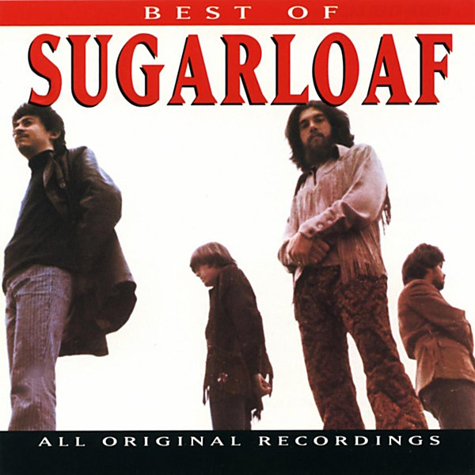

# The Best of Sugarloaf

By **Sugarloaf**

## Album Data

- **Catalog:** Beets
- **Format:** Digital, Album
- **Album:** The Best of Sugarloaf
- **Artist:** Sugarloaf
- **Albumartist:** Sugarloaf
- **Genre:** Progressive Rock
- **MusicBrainz Album Artist ID:** [1abf53af-e312-4857-b2cf-2638a04aeb59](https://musicbrainz.org/artist/1abf53af-e312-4857-b2cf-2638a04aeb59)
- **MusicBrainz Album ID:** [d0456a72-3764-4095-940f-8e9f9847c223](https://musicbrainz.org/release/d0456a72-3764-4095-940f-8e9f9847c223)
- **MusicBrainz Release Group ID:** [c6157ad0-4659-3e42-88c5-84567255aabe](https://musicbrainz.org/release-group/c6157ad0-4659-3e42-88c5-84567255aabe)
- **Year:** 1993
- **Catalog #:** D2-77597
- **Label:** Curb Records
- **Total Tracks:** 09

## Album Tracks

### Track 01 - Green-Eyed Lady

- **Artist:** Sugarloaf
- **Format:** ALAC
- **Genre:** Progressive Rock
- **Length:** 6:50
- **MusicBrainz Track ID:** [890c04c8-4c1e-449d-abf6-272b88f311b3](https://musicbrainz.org/recording/890c04c8-4c1e-449d-abf6-272b88f311b3)
- **Title:** Green-Eyed Lady
- **Track:** 01
- **Year:** 1993

### Track 02 - Tongue-In-Cheek

- **Artist:** Sugarloaf
- **Format:** ALAC
- **Genre:** Rock
- **Length:** 7:37
- **MusicBrainz Track ID:** [d0011d43-96e6-45ba-a145-2c542cdd71fd](https://musicbrainz.org/recording/d0011d43-96e6-45ba-a145-2c542cdd71fd)
- **Title:** Tongue-In-Cheek
- **Track:** 02
- **Year:** 1993

### Track 03 - Bach Doors Man / Chest Fever

- **Artist:** Sugarloaf
- **Format:** ALAC
- **Genre:** Progressive Rock
- **Length:** 9:06
- **MusicBrainz Track ID:** [f6f86417-659c-4092-97f4-b1e1738ecaf9](https://musicbrainz.org/recording/f6f86417-659c-4092-97f4-b1e1738ecaf9)
- **Title:** Bach Doors Man / Chest Fever
- **Track:** 03
- **Year:** 1993

### Track 04 - Don't Call Us, We'll Call You

- **Artist:** Sugarloaf
- **Format:** ALAC
- **Genre:** Rock
- **Length:** 3:25
- **MusicBrainz Track ID:** [392bf204-51fa-49d2-9147-12dcf8dad594](https://musicbrainz.org/recording/392bf204-51fa-49d2-9147-12dcf8dad594)
- **Title:** Don't Call Us, We'll Call You
- **Track:** 04
- **Year:** 1993

### Track 05 - 'round & 'round

- **Artist:** Sugarloaf
- **Format:** ALAC
- **Genre:** Progressive Rock
- **Length:** 3:37
- **MusicBrainz Track ID:** [b4d277fa-6eab-4f57-b692-b89ff65e72e8](https://musicbrainz.org/recording/b4d277fa-6eab-4f57-b692-b89ff65e72e8)
- **Title:** 'round & 'round
- **Track:** 05
- **Year:** 1993

### Track 06 - Myra Myra

- **Artist:** Sugarloaf
- **Format:** ALAC
- **Genre:** Progressive Rock
- **Length:** 5:14
- **MusicBrainz Track ID:** [d24cc8f6-5c27-43c0-91ad-0dd6ce82b365](https://musicbrainz.org/recording/d24cc8f6-5c27-43c0-91ad-0dd6ce82b365)
- **Title:** Myra Myra
- **Track:** 06
- **Year:** 1993

### Track 07 - Wild Child

- **Artist:** Sugarloaf
- **Format:** ALAC
- **Genre:** Progressive Rock
- **Length:** 4:03
- **MusicBrainz Track ID:** [156b69d6-b406-46ed-8140-4ffb65834606](https://musicbrainz.org/recording/156b69d6-b406-46ed-8140-4ffb65834606)
- **Title:** Wild Child
- **Track:** 07
- **Year:** 1993

### Track 08 - Easy Evil

- **Artist:** Sugarloaf
- **Format:** ALAC
- **Genre:** Progressive Rock
- **Length:** 4:01
- **MusicBrainz Track ID:** [10861333-abe2-4e43-8e21-5581b7391975](https://musicbrainz.org/recording/10861333-abe2-4e43-8e21-5581b7391975)
- **Title:** Easy Evil
- **Track:** 08
- **Year:** 1993

### Track 09 - Texas Two Lane

- **Artist:** Sugarloaf
- **Format:** ALAC
- **Genre:** Progressive Rock
- **Length:** 4:11
- **MusicBrainz Track ID:** [e8aa1277-5547-464d-84a0-3729d3a03a08](https://musicbrainz.org/recording/e8aa1277-5547-464d-84a0-3729d3a03a08)
- **Title:** Texas Two Lane
- **Track:** 09
- **Year:** 1993

## See also

- [CD: Best Of Sugarloaf](../../CD/Sugarloaf/Best_Of_Sugarloaf.md)
- [CD: ](../../CD/Sugarloaf/Sugarloaf.md)
- [Roon: Sugarloaf](../../Roon/Sugarloaf/Sugarloaf.md)
