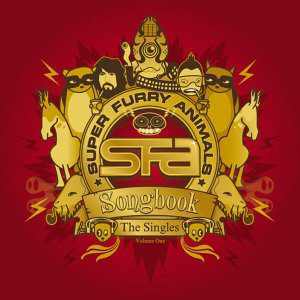

# Songbook

By **Super Furry Animals**

## Album Data

- **Catalog:** Beets
- **Format:** Digital, Album
- **Album:** Songbook
- **Artist:** Super Furry Animals
- **Albumartist:** Super Furry Animals
- **Genre:** Neo-Psychedelia
- **MusicBrainz Album Artist ID:** [c5f5dc27-3059-49c0-ae45-5009a01bb9ec](https://musicbrainz.org/artist/c5f5dc27-3059-49c0-ae45-5009a01bb9ec)
- **MusicBrainz Album ID:** [d08dd84f-97f2-4a72-b65b-fb48c0bb814c](https://musicbrainz.org/release/d08dd84f-97f2-4a72-b65b-fb48c0bb814c)
- **MusicBrainz Release Group ID:** [a37fcfa5-4318-31ac-b10e-d3e977a18958](https://musicbrainz.org/release-group/a37fcfa5-4318-31ac-b10e-d3e977a18958)
- **Year:** 2004
- **Catalog #:** BXL 042CD
- **Label:** XL Recordings
- **Total Tracks:** 21

## Album Tracks

### Track 01 - Something 4 the Weekend

- **Artist:** Super Furry Animals
- **Format:** ALAC
- **Genre:** Britpop
- **Length:** 2:53
- **MusicBrainz Track ID:** [3a0df9c2-01a9-4fee-8ae0-9fa2af212ca8](https://musicbrainz.org/recording/3a0df9c2-01a9-4fee-8ae0-9fa2af212ca8)
- **Title:** Something 4 the Weekend
- **Track:** 01
- **Year:** 2004

### Track 02 - It's Not the End of the World?

- **Artist:** Super Furry Animals
- **Format:** ALAC
- **Genre:** Neo-Psychedelia
- **Length:** 3:29
- **MusicBrainz Track ID:** [6523fb4e-ec5c-43bc-8128-e27106b38a1d](https://musicbrainz.org/recording/6523fb4e-ec5c-43bc-8128-e27106b38a1d)
- **Title:** It's Not the End of the World?
- **Track:** 02
- **Year:** 2004

### Track 03 - Northern Lites

- **Artist:** Super Furry Animals
- **Format:** ALAC
- **Genre:** Indie Rock
- **Length:** 3:31
- **MusicBrainz Track ID:** [2bab5ab4-a772-4a22-b753-2e49ba4e7e6a](https://musicbrainz.org/recording/2bab5ab4-a772-4a22-b753-2e49ba4e7e6a)
- **Title:** Northern Lites
- **Track:** 03
- **Year:** 2004

### Track 04 - Juxtapozed With U

- **Artist:** Super Furry Animals
- **Format:** ALAC
- **Genre:** Alternative Rock
- **Length:** 3:11
- **MusicBrainz Track ID:** [ad3babf1-dcaf-4a93-9e46-bb8d6452c83a](https://musicbrainz.org/recording/ad3babf1-dcaf-4a93-9e46-bb8d6452c83a)
- **Title:** Juxtapozed With U
- **Track:** 04
- **Year:** 2004

### Track 05 - Slow Life

- **Artist:** Super Furry Animals
- **Format:** ALAC
- **Genre:** Indie Rock
- **Length:** 6:59
- **MusicBrainz Track ID:** [416954b4-776f-4b9e-9ff3-082631cf9f13](https://musicbrainz.org/recording/416954b4-776f-4b9e-9ff3-082631cf9f13)
- **Title:** Slow Life
- **Track:** 05
- **Year:** 2004

### Track 06 - Fire in My Heart

- **Artist:** Super Furry Animals
- **Format:** ALAC
- **Genre:** Indie Rock
- **Length:** 2:50
- **MusicBrainz Track ID:** [bff37691-5a86-41a4-9cbe-b0e77bfcb0ed](https://musicbrainz.org/recording/bff37691-5a86-41a4-9cbe-b0e77bfcb0ed)
- **Title:** Fire in My Heart
- **Track:** 06
- **Year:** 2004

### Track 07 - The Man Don't Give a Fuck

- **Artist:** Super Furry Animals
- **Format:** ALAC
- **Genre:** Neo-Psychedelia
- **Length:** 4:45
- **MusicBrainz Track ID:** [d2222f3e-6812-42ea-9d99-f7ac0221f451](https://musicbrainz.org/recording/d2222f3e-6812-42ea-9d99-f7ac0221f451)
- **Title:** The Man Don't Give a Fuck
- **Track:** 07
- **Year:** 2004

### Track 08 - Hermann Loves Pauline

- **Artist:** Super Furry Animals
- **Format:** ALAC
- **Genre:** Britpop
- **Length:** 4:07
- **MusicBrainz Track ID:** [c4dd03de-5d21-40a4-ba60-d64366eec458](https://musicbrainz.org/recording/c4dd03de-5d21-40a4-ba60-d64366eec458)
- **Title:** Hermann Loves Pauline
- **Track:** 08
- **Year:** 2004

### Track 09 - Play It Cool

- **Artist:** Super Furry Animals
- **Format:** ALAC
- **Genre:** Neo-Psychedelia
- **Length:** 3:16
- **MusicBrainz Track ID:** [db0d597e-f8fc-4681-af19-ec8eabf05277](https://musicbrainz.org/recording/db0d597e-f8fc-4681-af19-ec8eabf05277)
- **Title:** Play It Cool
- **Track:** 09
- **Year:** 2004

### Track 10 - Ice Hockey Hair

- **Artist:** Super Furry Animals
- **Format:** ALAC
- **Genre:** Noise Pop
- **Length:** 6:57
- **MusicBrainz Track ID:** [657b0d06-c084-40b1-8f25-ded34fed1531](https://musicbrainz.org/recording/657b0d06-c084-40b1-8f25-ded34fed1531)
- **Title:** Ice Hockey Hair
- **Track:** 10
- **Year:** 2004

### Track 11 - Do or Die

- **Artist:** Super Furry Animals
- **Format:** ALAC
- **Genre:** Post-Britpop
- **Length:** 2:04
- **MusicBrainz Track ID:** [f2fb562b-4941-4ad5-a677-8d66552c0782](https://musicbrainz.org/recording/f2fb562b-4941-4ad5-a677-8d66552c0782)
- **Title:** Do or Die
- **Track:** 11
- **Year:** 2004

### Track 12 - (Drawing) Rings Around the World

- **Artist:** Super Furry Animals
- **Format:** ALAC
- **Genre:** Indie Rock
- **Length:** 3:32
- **MusicBrainz Track ID:** [d0ee5f7b-cf80-4f2d-8170-f288450cdd77](https://musicbrainz.org/recording/d0ee5f7b-cf80-4f2d-8170-f288450cdd77)
- **Title:** (Drawing) Rings Around the World
- **Track:** 12
- **Year:** 2004

### Track 13 - God! Show Me Magic

- **Artist:** Super Furry Animals
- **Format:** ALAC
- **Genre:** Neo-Psychedelia
- **Length:** 1:50
- **MusicBrainz Track ID:** [890f6139-be87-45e8-ac91-647799c76086](https://musicbrainz.org/recording/890f6139-be87-45e8-ac91-647799c76086)
- **Title:** God! Show Me Magic
- **Track:** 13
- **Year:** 2004

### Track 14 - Ysbeidiau Heulog

- **Artist:** Super Furry Animals
- **Format:** ALAC
- **Genre:** Indie Rock
- **Length:** 2:51
- **MusicBrainz Track ID:** [5f992038-d401-4324-892d-0f86003d8afb](https://musicbrainz.org/recording/5f992038-d401-4324-892d-0f86003d8afb)
- **Title:** Ysbeidiau Heulog
- **Track:** 14
- **Year:** 2004

### Track 15 - Demons

- **Artist:** Super Furry Animals
- **Format:** ALAC
- **Genre:** Neo-Psychedelia
- **Length:** 5:13
- **MusicBrainz Track ID:** [9533c806-af90-46dd-9d77-0f1bc65b1c1b](https://musicbrainz.org/recording/9533c806-af90-46dd-9d77-0f1bc65b1c1b)
- **Title:** Demons
- **Track:** 15
- **Year:** 2004

### Track 16 - Golden Retriever

- **Artist:** Super Furry Animals
- **Format:** ALAC
- **Genre:** Indie Rock
- **Length:** 2:27
- **MusicBrainz Track ID:** [04d7671a-068b-4428-a7fd-b13f5035e4b2](https://musicbrainz.org/recording/04d7671a-068b-4428-a7fd-b13f5035e4b2)
- **Title:** Golden Retriever
- **Track:** 16
- **Year:** 2004

### Track 17 - The International Language of Screaming

- **Artist:** Super Furry Animals
- **Format:** ALAC
- **Genre:** Neo-Psychedelia
- **Length:** 2:12
- **MusicBrainz Track ID:** [7edf6a08-c458-4900-84fa-3f0d58ce3720](https://musicbrainz.org/recording/7edf6a08-c458-4900-84fa-3f0d58ce3720)
- **Title:** The International Language of Screaming
- **Track:** 17
- **Year:** 2004

### Track 18 - Hello Sunshine

- **Artist:** Super Furry Animals
- **Format:** ALAC
- **Genre:** Indie Rock
- **Length:** 3:41
- **MusicBrainz Track ID:** [eb10cc69-5404-4004-b3b6-1b8ada4d0073](https://musicbrainz.org/recording/eb10cc69-5404-4004-b3b6-1b8ada4d0073)
- **Title:** Hello Sunshine
- **Track:** 18
- **Year:** 2004

### Track 19 - Hometown Unicorn

- **Artist:** Super Furry Animals
- **Format:** ALAC
- **Genre:** Space Rock
- **Length:** 3:36
- **MusicBrainz Track ID:** [16bdae11-b115-40df-9ac8-0e3f54e2fcbc](https://musicbrainz.org/recording/16bdae11-b115-40df-9ac8-0e3f54e2fcbc)
- **Title:** Hometown Unicorn
- **Track:** 19
- **Year:** 2004

### Track 20 - If You Don't Want Me to Destroy You

- **Artist:** Super Furry Animals
- **Format:** ALAC
- **Genre:** Neo-Psychedelia
- **Length:** 3:17
- **MusicBrainz Track ID:** [e4db61f9-98a1-43ca-81a3-68ed002c0e00](https://musicbrainz.org/recording/e4db61f9-98a1-43ca-81a3-68ed002c0e00)
- **Title:** If You Don't Want Me to Destroy You
- **Track:** 20
- **Year:** 2004

### Track 21 - Blerwytirhwng?

- **Artist:** Super Furry Animals
- **Format:** ALAC
- **Genre:** Alternative Rock
- **Length:** 5:34
- **MusicBrainz Track ID:** [8b3517c6-d184-46e2-b2ab-90978d877039](https://musicbrainz.org/recording/8b3517c6-d184-46e2-b2ab-90978d877039)
- **Title:** Blerwytirhwng?
- **Track:** 21
- **Year:** 2004

## See also

- [Roon: Rings Around the World (20th Anniversary Edition;2021 - Remaster)](../../Roon/Super_Furry_Animals/Rings_Around_the_World_20th_Anniversary_Edition;2021_-_Remaster.md)
