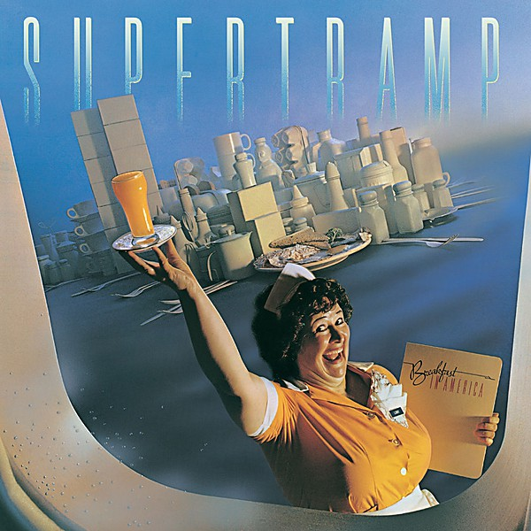

# Breakfast in America

By **Supertramp**

## Album Data

- **Catalog:** Beets
- **Format:** Digital, Album
- **Album:** Breakfast in America
- **Artist:** Supertramp
- **Albumartist:** Supertramp
- **Genre:** Soft Rock
- **MusicBrainz Album Artist ID:** [d2ff6b6b-fc30-48dc-8952-06f9d8fc64f8](https://musicbrainz.org/artist/d2ff6b6b-fc30-48dc-8952-06f9d8fc64f8)
- **MusicBrainz Album ID:** [11f6ec3a-eb74-3ca6-8f7a-5eed896cbf57](https://musicbrainz.org/release/11f6ec3a-eb74-3ca6-8f7a-5eed896cbf57)
- **MusicBrainz Release Group ID:** [d584f7e7-55b4-39a1-87e9-af3b86773132](https://musicbrainz.org/release-group/d584f7e7-55b4-39a1-87e9-af3b86773132)
- **Year:** 1979
- **Catalog #:** 
- **Label:** 
- **Total Tracks:** 15

## Album Tracks

### Track 03 - The Logical Song

- **Artist:** Supertramp
- **Format:** AAC
- **Genre:** Progressive Rock
- **Length:** 4:10
- **MusicBrainz Track ID:** 
- **Title:** The Logical Song
- **Track:** 03
- **Year:** 2001

## See also

- [The Very Best of Supertramp](The_Very_Best_of_Supertramp.md)
- [Roon: Breakfast In America (Deluxe Edition)](../../Roon/Supertramp/Breakfast_In_America_Deluxe_Edition.md)
- [Roon: Crime Of The Century (Deluxe)](../../Roon/Supertramp/Crime_Of_The_Century_Deluxe.md)
- [Roon: Crisis? What Crisis?](../../Roon/Supertramp/Crisis_What_Crisis.md)
- [Roon: The Very Best Of Supertramp](../../Roon/Supertramp/The_Very_Best_Of_Supertramp.md)
