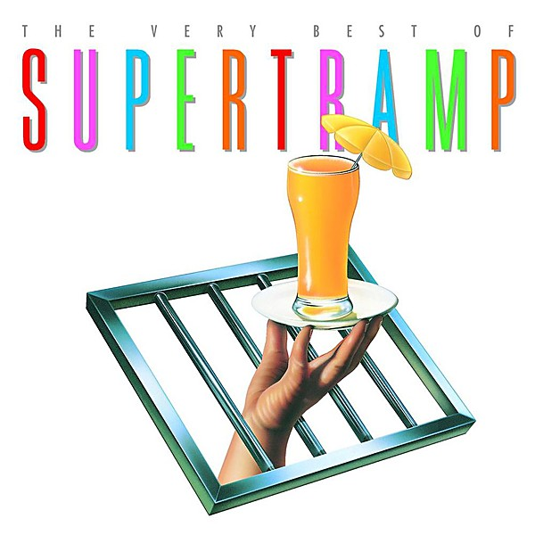

# The Very Best of Supertramp

By **Supertramp**

## Album Data

- **Catalog:** Beets
- **Format:** Digital, Album
- **Album:** The Very Best of Supertramp
- **Artist:** Supertramp
- **Albumartist:** Supertramp
- **Genre:** Progressive Rock
- **MusicBrainz Album Artist ID:** 
- **MusicBrainz Album ID:** 
- **MusicBrainz Release Group ID:** 
- **Year:** 2001
- **Catalog #:** 
- **Label:** 
- **Total Tracks:** 15

## Album Tracks

### Track 03 - The Logical Song

- **Artist:** Supertramp
- **Format:** AAC
- **Genre:** Progressive Rock
- **Length:** 4:10
- **MusicBrainz Track ID:** 
- **Title:** The Logical Song
- **Track:** 03
- **Year:** 2001

## See also

- [Breakfast in America](Breakfast_in_America.md)
- [Roon: Breakfast In America (Deluxe Edition)](../../Roon/Supertramp/Breakfast_In_America_Deluxe_Edition.md)
- [Roon: Crime Of The Century (Deluxe)](../../Roon/Supertramp/Crime_Of_The_Century_Deluxe.md)
- [Roon: Crisis? What Crisis?](../../Roon/Supertramp/Crisis_What_Crisis.md)
- [Roon: The Very Best Of Supertramp](../../Roon/Supertramp/The_Very_Best_Of_Supertramp.md)
