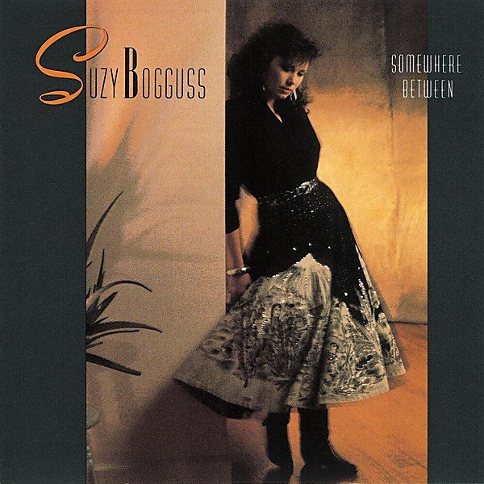

# Somewhere Between

By **Suzy Bogguss**

## Album Data

- **Catalog:** Beets
- **Format:** Digital, Album
- **Album:** Somewhere Between
- **Artist:** Suzy Bogguss
- **Albumartist:** Suzy Bogguss
- **Genre:** Country
- **MusicBrainz Album Artist ID:** [37d4bb9c-422b-4032-abfc-479dfdc64bbd](https://musicbrainz.org/artist/37d4bb9c-422b-4032-abfc-479dfdc64bbd)
- **MusicBrainz Album ID:** [553d01d8-5120-4d14-9d34-fcdfe39546fd](https://musicbrainz.org/release/553d01d8-5120-4d14-9d34-fcdfe39546fd)
- **MusicBrainz Release Group ID:** [6d5ca26a-c776-3aae-a0e0-0664e94cdcfc](https://musicbrainz.org/release-group/6d5ca26a-c776-3aae-a0e0-0664e94cdcfc)
- **Year:** 1989
- **Catalog #:** CDP-7-90237-2
- **Label:** Liberty
- **Total Tracks:** 10

## Album Tracks

### Track 01 - Somewhere Between

- **Artist:** Suzy Bogguss
- **Format:** ALAC
- **Genre:** Country
- **Length:** 3:32
- **MusicBrainz Track ID:** [482a3392-ba9a-4c0d-8122-97465571e332](https://musicbrainz.org/recording/482a3392-ba9a-4c0d-8122-97465571e332)
- **Title:** Somewhere Between
- **Track:** 01
- **Year:** 1989

### Track 02 - Guilty as They Come

- **Artist:** Suzy Bogguss
- **Format:** ALAC
- **Genre:** Country
- **Length:** 3:10
- **MusicBrainz Track ID:** [f3e5c909-5b12-42ea-81eb-68ded64667b4](https://musicbrainz.org/recording/f3e5c909-5b12-42ea-81eb-68ded64667b4)
- **Title:** Guilty as They Come
- **Track:** 02
- **Year:** 1989

### Track 03 - I'm at Home on the Range

- **Artist:** Suzy Bogguss
- **Format:** ALAC
- **Genre:** Country
- **Length:** 3:02
- **MusicBrainz Track ID:** [12455855-f213-4c51-b19b-1927fd6e6de7](https://musicbrainz.org/recording/12455855-f213-4c51-b19b-1927fd6e6de7)
- **Title:** I'm at Home on the Range
- **Track:** 03
- **Year:** 1989

### Track 04 - My Sweet Love Ain't Around

- **Artist:** Suzy Bogguss
- **Format:** ALAC
- **Genre:** Country
- **Length:** 3:14
- **MusicBrainz Track ID:** [7b2e0ee5-c856-4b1f-902e-b0201cc3040f](https://musicbrainz.org/recording/7b2e0ee5-c856-4b1f-902e-b0201cc3040f)
- **Title:** My Sweet Love Ain't Around
- **Track:** 04
- **Year:** 1989

### Track 05 - Handyman's Dream

- **Artist:** Suzy Bogguss
- **Format:** ALAC
- **Genre:** Country
- **Length:** 2:25
- **MusicBrainz Track ID:** [12c063fb-dd54-457b-a42d-7ffce326db31](https://musicbrainz.org/recording/12c063fb-dd54-457b-a42d-7ffce326db31)
- **Title:** Handyman's Dream
- **Track:** 05
- **Year:** 1989

### Track 06 - I Want to Be a Cowboy's Sweetheart

- **Artist:** Suzy Bogguss
- **Format:** ALAC
- **Genre:** Country
- **Length:** 2:55
- **MusicBrainz Track ID:** [9bd6a23c-c647-416f-bb28-cb2e8155ef55](https://musicbrainz.org/recording/9bd6a23c-c647-416f-bb28-cb2e8155ef55)
- **Title:** I Want to Be a Cowboy's Sweetheart
- **Track:** 06
- **Year:** 1989

### Track 07 - Cross My Broken Heart

- **Artist:** Suzy Bogguss
- **Format:** ALAC
- **Genre:** Country
- **Length:** 3:50
- **MusicBrainz Track ID:** [cf73f506-3a4c-42cf-9f51-dc5f81f52b6f](https://musicbrainz.org/recording/cf73f506-3a4c-42cf-9f51-dc5f81f52b6f)
- **Title:** Cross My Broken Heart
- **Track:** 07
- **Year:** 1989

### Track 08 - Take It Like a Man

- **Artist:** Suzy Bogguss
- **Format:** ALAC
- **Genre:** Country
- **Length:** 3:49
- **MusicBrainz Track ID:** [ddccab6d-8406-4c73-ab17-4c26d11f2d02](https://musicbrainz.org/recording/ddccab6d-8406-4c73-ab17-4c26d11f2d02)
- **Title:** Take It Like a Man
- **Track:** 08
- **Year:** 1989

### Track 09 - Hopeless Romantic

- **Artist:** Suzy Bogguss
- **Format:** ALAC
- **Genre:** Country
- **Length:** 3:09
- **MusicBrainz Track ID:** [d6027571-ac18-4bc8-b050-4f4ad1320897](https://musicbrainz.org/recording/d6027571-ac18-4bc8-b050-4f4ad1320897)
- **Title:** Hopeless Romantic
- **Track:** 09
- **Year:** 1989

### Track 10 - Night Rider's Lament

- **Artist:** Suzy Bogguss
- **Format:** ALAC
- **Genre:** Country
- **Length:** 4:02
- **MusicBrainz Track ID:** [9aa747cd-793a-4eb3-985a-5411a490d52c](https://musicbrainz.org/recording/9aa747cd-793a-4eb3-985a-5411a490d52c)
- **Title:** Night Rider's Lament
- **Track:** 10
- **Year:** 1989

## See also

- [Roon: Aces](../../Roon/Suzy_Bogguss/Aces.md)
- [Roon: Somewhere Between](../../Roon/Suzy_Bogguss/Somewhere_Between.md)
