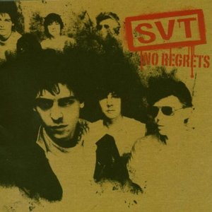

# No Regrets

By **SVT**

## Album Data

- **Catalog:** Beets
- **Format:** Digital, Album
- **Album:** No Regrets
- **Artist:** Svt
- **Albumartist:** SVT
- **Genre:** Power Pop
- **MusicBrainz Album Artist ID:** [2989abc3-b6c8-4f9a-a68e-d488275f97ba](https://musicbrainz.org/artist/2989abc3-b6c8-4f9a-a68e-d488275f97ba)
- **MusicBrainz Album ID:** [c6816dd9-60fb-44ca-8ec8-0dfaacda76a4](https://musicbrainz.org/release/c6816dd9-60fb-44ca-8ec8-0dfaacda76a4)
- **MusicBrainz Release Group ID:** [e783bbc8-5ded-4135-b7e6-21bbb17231ba](https://musicbrainz.org/release-group/e783bbc8-5ded-4135-b7e6-21bbb17231ba)
- **Year:** 2005
- **Catalog #:** 
- **Label:** 
- **Total Tracks:** 15

## Album Tracks

### Track 01 - Bleeding Hearts

- **Artist:** SVT
- **Format:** ALAC
- **Genre:** Power Pop
- **Length:** 4:53
- **MusicBrainz Track ID:** [79eafa46-3300-428a-8d01-d468eb11611a](https://musicbrainz.org/recording/79eafa46-3300-428a-8d01-d468eb11611a)
- **Title:** Bleeding Hearts
- **Track:** 01
- **Year:** 2005

### Track 02 - Waiting for You

- **Artist:** SVT
- **Format:** ALAC
- **Genre:** Power Pop
- **Length:** 2:56
- **MusicBrainz Track ID:** [13676f53-c76d-4a11-9f44-e760b2ecd613](https://musicbrainz.org/recording/13676f53-c76d-4a11-9f44-e760b2ecd613)
- **Title:** Waiting for You
- **Track:** 02
- **Year:** 2005

### Track 03 - Heart of Stone

- **Artist:** SVT
- **Format:** ALAC
- **Genre:** Power Pop
- **Length:** 3:03
- **MusicBrainz Track ID:** [2609982d-0550-49da-bbdb-5fb2944114fe](https://musicbrainz.org/recording/2609982d-0550-49da-bbdb-5fb2944114fe)
- **Title:** Heart of Stone
- **Track:** 03
- **Year:** 2005

### Track 04 - No Regrets

- **Artist:** SVT
- **Format:** ALAC
- **Genre:** Power Pop
- **Length:** 3:28
- **MusicBrainz Track ID:** [875ed965-172c-4c53-9e0d-86b1f8da3d33](https://musicbrainz.org/recording/875ed965-172c-4c53-9e0d-86b1f8da3d33)
- **Title:** No Regrets
- **Track:** 04
- **Year:** 2005

### Track 05 - Money Street

- **Artist:** SVT
- **Format:** ALAC
- **Genre:** Power Pop
- **Length:** 5:26
- **MusicBrainz Track ID:** [9dac06bf-8950-4674-9da9-f8369a1581ce](https://musicbrainz.org/recording/9dac06bf-8950-4674-9da9-f8369a1581ce)
- **Title:** Money Street
- **Track:** 05
- **Year:** 2005

### Track 06 - Love Blind

- **Artist:** SVT
- **Format:** ALAC
- **Genre:** Power Pop
- **Length:** 2:56
- **MusicBrainz Track ID:** [9858797e-89c3-457f-be69-3891e07c61f5](https://musicbrainz.org/recording/9858797e-89c3-457f-be69-3891e07c61f5)
- **Title:** Love Blind
- **Track:** 06
- **Year:** 2005

### Track 07 - North Beach

- **Artist:** SVT
- **Format:** ALAC
- **Genre:** Power Pop
- **Length:** 3:09
- **MusicBrainz Track ID:** [44a3f054-48d5-4fb0-81d5-0831e951e19f](https://musicbrainz.org/recording/44a3f054-48d5-4fb0-81d5-0831e951e19f)
- **Title:** North Beach
- **Track:** 07
- **Year:** 2005

### Track 08 - What I Don't Like

- **Artist:** SVT
- **Format:** ALAC
- **Genre:** Power Pop
- **Length:** 3:25
- **MusicBrainz Track ID:** [9a6523d3-c0b4-4d28-a050-0211c3cf3f13](https://musicbrainz.org/recording/9a6523d3-c0b4-4d28-a050-0211c3cf3f13)
- **Title:** What I Don't Like
- **Track:** 08
- **Year:** 2005

### Track 09 - Can I Tell You a Secret

- **Artist:** SVT
- **Format:** ALAC
- **Genre:** Power Pop
- **Length:** 2:50
- **MusicBrainz Track ID:** [b9a5ffa9-baf0-4e43-a7e3-30caa64e8c0c](https://musicbrainz.org/recording/b9a5ffa9-baf0-4e43-a7e3-30caa64e8c0c)
- **Title:** Can I Tell You a Secret
- **Track:** 09
- **Year:** 2005

### Track 10 - Too Late

- **Artist:** SVT
- **Format:** ALAC
- **Genre:** Power Pop
- **Length:** 5:11
- **MusicBrainz Track ID:** [cf08e320-d910-4587-ad8b-0694a5cecb0c](https://musicbrainz.org/recording/cf08e320-d910-4587-ad8b-0694a5cecb0c)
- **Title:** Too Late
- **Track:** 10
- **Year:** 2005

### Track 11 - You Don't Rock Me

- **Artist:** SVT
- **Format:** ALAC
- **Genre:** Power Pop
- **Length:** 4:39
- **MusicBrainz Track ID:** [920fe76c-b278-4332-8d4c-43743e6c9408](https://musicbrainz.org/recording/920fe76c-b278-4332-8d4c-43743e6c9408)
- **Title:** You Don't Rock Me
- **Track:** 11
- **Year:** 2005

### Track 12 - All I Want

- **Artist:** SVT
- **Format:** ALAC
- **Genre:** Power Pop
- **Length:** 3:57
- **MusicBrainz Track ID:** [2e58b071-e610-4095-a261-63621e5588e3](https://musicbrainz.org/recording/2e58b071-e610-4095-a261-63621e5588e3)
- **Title:** All I Want
- **Track:** 12
- **Year:** 2005

### Track 13 - Phone Calls

- **Artist:** SVT
- **Format:** ALAC
- **Genre:** Power Pop
- **Length:** 3:08
- **MusicBrainz Track ID:** [32ddc6fa-e555-419e-902c-63583e90f84f](https://musicbrainz.org/recording/32ddc6fa-e555-419e-902c-63583e90f84f)
- **Title:** Phone Calls
- **Track:** 13
- **Year:** 2005

### Track 14 - Outside/Inside

- **Artist:** SVT
- **Format:** ALAC
- **Genre:** Power Pop
- **Length:** 2:52
- **MusicBrainz Track ID:** [73209620-8b2f-48aa-a4b6-97c0132fadd4](https://musicbrainz.org/recording/73209620-8b2f-48aa-a4b6-97c0132fadd4)
- **Title:** Outside/Inside
- **Track:** 14
- **Year:** 2005

### Track 15 - Girls

- **Artist:** SVT
- **Format:** ALAC
- **Genre:** Power Pop
- **Length:** 3:22
- **MusicBrainz Track ID:** [2c320911-79ef-4b1e-9f42-03eff516c329](https://musicbrainz.org/recording/2c320911-79ef-4b1e-9f42-03eff516c329)
- **Title:** Girls
- **Track:** 15
- **Year:** 2005

