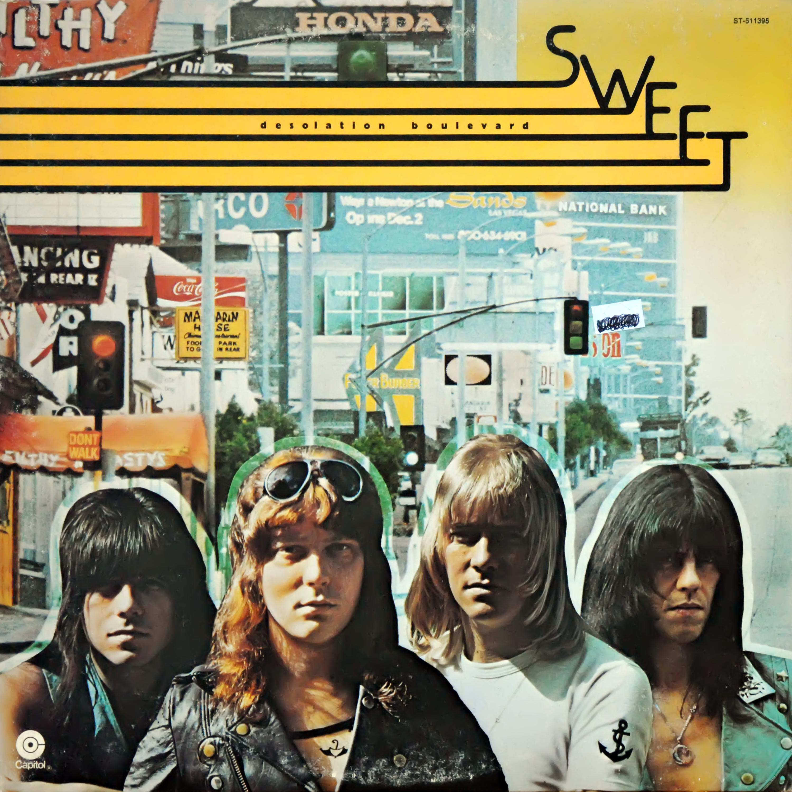

# Desolation Boulevard

By **Sweet**

## Album Data

- **Catalog:** Beets
- **Format:** Digital, Album
- **Album:** Desolation Boulevard
- **Artist:** Sweet
- **Albumartist:** Sweet
- **Genre:** Hard Rock
- **MusicBrainz Album Artist ID:** [dc73bb40-b697-4df9-a2ec-0555bebdba75](https://musicbrainz.org/artist/dc73bb40-b697-4df9-a2ec-0555bebdba75)
- **MusicBrainz Album ID:** [e5dcd60b-a6f4-3d35-8ee8-893ccdb3ce44](https://musicbrainz.org/release/e5dcd60b-a6f4-3d35-8ee8-893ccdb3ce44)
- **MusicBrainz Release Group ID:** [82993041-b4e7-3d33-aa84-cdd20461da53](https://musicbrainz.org/release-group/82993041-b4e7-3d33-aa84-cdd20461da53)
- **Year:** 1988
- **Catalog #:** CDP 7 748452 2
- **Label:** Capitol Records
- **Total Tracks:** 10

## Album Tracks

### Track 01 - Ballroom Blitz

- **Artist:** Sweet
- **Format:** ALAC
- **Genre:** Hard Rock
- **Length:** 4:06
- **MusicBrainz Track ID:** [96d333f9-0248-4dc8-8de9-e3f2ab86c623](https://musicbrainz.org/recording/96d333f9-0248-4dc8-8de9-e3f2ab86c623)
- **Title:** Ballroom Blitz
- **Track:** 01
- **Year:** 1988

### Track 02 - The 6-Teens

- **Artist:** Sweet
- **Format:** ALAC
- **Genre:** Soft Rock
- **Length:** 4:05
- **MusicBrainz Track ID:** [b398fe12-1113-49cd-8297-a26e190f4112](https://musicbrainz.org/recording/b398fe12-1113-49cd-8297-a26e190f4112)
- **Title:** The 6-Teens
- **Track:** 02
- **Year:** 1988

### Track 03 - No You Don’t

- **Artist:** Sweet
- **Format:** ALAC
- **Genre:** Hard Rock
- **Length:** 4:36
- **MusicBrainz Track ID:** [1bed7e11-44e4-49fc-bdb1-6e3b17e4e73c](https://musicbrainz.org/recording/1bed7e11-44e4-49fc-bdb1-6e3b17e4e73c)
- **Title:** No You Don’t
- **Track:** 03
- **Year:** 1988

### Track 04 - A.C.D.C

- **Artist:** Sweet
- **Format:** ALAC
- **Genre:** Hard Rock
- **Length:** 3:28
- **MusicBrainz Track ID:** [e874ee23-9b57-4d3c-a01c-e3db6d30b8df](https://musicbrainz.org/recording/e874ee23-9b57-4d3c-a01c-e3db6d30b8df)
- **Title:** A.C.D.C
- **Track:** 04
- **Year:** 1988

### Track 05 - I Wanna Be Committed

- **Artist:** Sweet
- **Format:** ALAC
- **Genre:** Glam Rock
- **Length:** 3:13
- **MusicBrainz Track ID:** [ee05f27b-5e21-44a4-8bb0-97c703243fbb](https://musicbrainz.org/recording/ee05f27b-5e21-44a4-8bb0-97c703243fbb)
- **Title:** I Wanna Be Committed
- **Track:** 05
- **Year:** 1988

### Track 06 - Sweet F.A.

- **Artist:** Sweet
- **Format:** ALAC
- **Genre:** Heavy Metal
- **Length:** 6:15
- **MusicBrainz Track ID:** [28d74630-eba8-4d77-bf85-75b33f2bbac1](https://musicbrainz.org/recording/28d74630-eba8-4d77-bf85-75b33f2bbac1)
- **Title:** Sweet F.A.
- **Track:** 06
- **Year:** 1988

### Track 07 - Fox on the Run

- **Artist:** Sweet
- **Format:** ALAC
- **Genre:** Hard Rock
- **Length:** 3:27
- **MusicBrainz Track ID:** [cf944524-4d02-44cc-b479-7885ccd136f1](https://musicbrainz.org/recording/cf944524-4d02-44cc-b479-7885ccd136f1)
- **Title:** Fox on the Run
- **Track:** 07
- **Year:** 1988

### Track 08 - Set Me Free

- **Artist:** Sweet
- **Format:** ALAC
- **Genre:** Heavy Metal
- **Length:** 3:59
- **MusicBrainz Track ID:** [317fc688-586e-439f-964a-c56bb000da73](https://musicbrainz.org/recording/317fc688-586e-439f-964a-c56bb000da73)
- **Title:** Set Me Free
- **Track:** 08
- **Year:** 1988

### Track 09 - Into the Night

- **Artist:** Sweet
- **Format:** ALAC
- **Genre:** Heavy Metal
- **Length:** 4:25
- **MusicBrainz Track ID:** [31386420-f529-4701-8f47-36053edbc95b](https://musicbrainz.org/recording/31386420-f529-4701-8f47-36053edbc95b)
- **Title:** Into the Night
- **Track:** 09
- **Year:** 1988

### Track 10 - Solid Gold Brass

- **Artist:** Sweet
- **Format:** ALAC
- **Genre:** Hard Rock
- **Length:** 5:35
- **MusicBrainz Track ID:** [5e3c43be-a4d5-4f68-b193-134f71588d5f](https://musicbrainz.org/recording/5e3c43be-a4d5-4f68-b193-134f71588d5f)
- **Title:** Solid Gold Brass
- **Track:** 10
- **Year:** 1988

## See also

- [CD: Desolation Boulevard](../../CD/Sweet/Desolation_Boulevard.md)
- [CD: ](../../CD/Sweet/Sweet.md)
