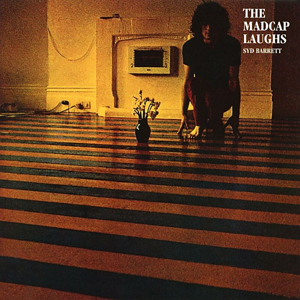

# The Madcap Laughs

By **Syd Barrett**

## Album Data

- **Catalog:** Beets
- **Format:** Digital, Album
- **Album:** The Madcap Laughs
- **Artist:** Syd Barrett
- **Albumartist:** Syd Barrett
- **Genre:** Psychedelic Rock
- **MusicBrainz Album Artist ID:** [12327d75-47d5-45d9-84c2-3760b9210c17](https://musicbrainz.org/artist/12327d75-47d5-45d9-84c2-3760b9210c17)
- **MusicBrainz Album ID:** [6d08771d-b14f-39dd-82b1-c48e88b9997a](https://musicbrainz.org/release/6d08771d-b14f-39dd-82b1-c48e88b9997a)
- **MusicBrainz Release Group ID:** [f8d4bee5-0b74-3bb4-9010-2a454adbfbe7](https://musicbrainz.org/release-group/f8d4bee5-0b74-3bb4-9010-2a454adbfbe7)
- **Year:** 1990
- **Catalog #:** CDP 7 46607 2
- **Label:** Capitol Records
- **Total Tracks:** 13

## Album Tracks

### Track 01 - Terrapin

- **Artist:** Syd Barrett
- **Format:** MP3
- **Genre:** Psychedelic Rock
- **Length:** 5:01
- **MusicBrainz Track ID:** [719aa04c-931f-4efe-b1f3-2779ab9a51ed](https://musicbrainz.org/recording/719aa04c-931f-4efe-b1f3-2779ab9a51ed)
- **Title:** Terrapin
- **Track:** 01
- **Year:** 1990

### Track 02 - No Good Trying

- **Artist:** Syd Barrett
- **Format:** MP3
- **Genre:** Psychedelic Rock
- **Length:** 3:24
- **MusicBrainz Track ID:** [146372ba-19c2-4a3b-a54a-f99b41b298a3](https://musicbrainz.org/recording/146372ba-19c2-4a3b-a54a-f99b41b298a3)
- **Title:** No Good Trying
- **Track:** 02
- **Year:** 1990

### Track 03 - Love You

- **Artist:** Syd Barrett
- **Format:** MP3
- **Genre:** Psychedelic Rock
- **Length:** 2:30
- **MusicBrainz Track ID:** [fcb137eb-2b9c-4776-bb12-e0c6fdaad79b](https://musicbrainz.org/recording/fcb137eb-2b9c-4776-bb12-e0c6fdaad79b)
- **Title:** Love You
- **Track:** 03
- **Year:** 1990

### Track 04 - No Man’s Land

- **Artist:** Syd Barrett
- **Format:** MP3
- **Genre:** Psychedelic Rock
- **Length:** 3:03
- **MusicBrainz Track ID:** [2a515869-4020-4489-a157-da257fe15715](https://musicbrainz.org/recording/2a515869-4020-4489-a157-da257fe15715)
- **Title:** No Man’s Land
- **Track:** 04
- **Year:** 1990

### Track 05 - Dark Globe

- **Artist:** Syd Barrett
- **Format:** MP3
- **Genre:** Psychedelic Rock
- **Length:** 2:01
- **MusicBrainz Track ID:** [056549b0-d82f-43a9-b615-9cdd6d67096d](https://musicbrainz.org/recording/056549b0-d82f-43a9-b615-9cdd6d67096d)
- **Title:** Dark Globe
- **Track:** 05
- **Year:** 1990

### Track 06 - Here I Go

- **Artist:** Syd Barrett
- **Format:** MP3
- **Genre:** Psychedelic Rock
- **Length:** 3:06
- **MusicBrainz Track ID:** [69457639-32bc-4932-a392-0974d8c50194](https://musicbrainz.org/recording/69457639-32bc-4932-a392-0974d8c50194)
- **Title:** Here I Go
- **Track:** 06
- **Year:** 1990

### Track 07 - Octopus

- **Artist:** Syd Barrett
- **Format:** MP3
- **Genre:** Psychedelic Rock
- **Length:** 3:46
- **MusicBrainz Track ID:** [f12d06c7-c21d-47cf-a3a9-331b86f37e60](https://musicbrainz.org/recording/f12d06c7-c21d-47cf-a3a9-331b86f37e60)
- **Title:** Octopus
- **Track:** 07
- **Year:** 1990

### Track 08 - Golden Hair

- **Artist:** Syd Barrett
- **Format:** MP3
- **Genre:** Psychedelic Rock
- **Length:** 1:58
- **MusicBrainz Track ID:** [02b1a31c-fbdd-4155-b829-121df7a762c6](https://musicbrainz.org/recording/02b1a31c-fbdd-4155-b829-121df7a762c6)
- **Title:** Golden Hair
- **Track:** 08
- **Year:** 1990

### Track 09 - Long Gone

- **Artist:** Syd Barrett
- **Format:** MP3
- **Genre:** Psychedelic Rock
- **Length:** 2:52
- **MusicBrainz Track ID:** [c84c0282-a1b3-4eaf-a361-5c0f41ad05d6](https://musicbrainz.org/recording/c84c0282-a1b3-4eaf-a361-5c0f41ad05d6)
- **Title:** Long Gone
- **Track:** 09
- **Year:** 1990

### Track 10 - She Took a Long Cold Look

- **Artist:** Syd Barrett
- **Format:** MP3
- **Genre:** Psychedelic Rock
- **Length:** 1:51
- **MusicBrainz Track ID:** [2cc3be89-b5e0-44de-81cf-12b186d45e0f](https://musicbrainz.org/recording/2cc3be89-b5e0-44de-81cf-12b186d45e0f)
- **Title:** She Took a Long Cold Look
- **Track:** 10
- **Year:** 1990

### Track 11 - Feel

- **Artist:** Syd Barrett
- **Format:** MP3
- **Genre:** Psychedelic Rock
- **Length:** 2:13
- **MusicBrainz Track ID:** [70362286-5a44-4878-b23d-84a12d93aa6f](https://musicbrainz.org/recording/70362286-5a44-4878-b23d-84a12d93aa6f)
- **Title:** Feel
- **Track:** 11
- **Year:** 1990

### Track 12 - If It’s in You

- **Artist:** Syd Barrett
- **Format:** MP3
- **Genre:** Psychedelic Rock
- **Length:** 2:32
- **MusicBrainz Track ID:** [3dc27041-c75e-4488-a6a2-a5293e3a6b00](https://musicbrainz.org/recording/3dc27041-c75e-4488-a6a2-a5293e3a6b00)
- **Title:** If It’s in You
- **Track:** 12
- **Year:** 1990

### Track 13 - Late Night

- **Artist:** Syd Barrett
- **Format:** MP3
- **Genre:** Psychedelic Rock
- **Length:** 3:11
- **MusicBrainz Track ID:** [09a1dbde-adba-454b-927a-571e660d48c7](https://musicbrainz.org/recording/09a1dbde-adba-454b-927a-571e660d48c7)
- **Title:** Late Night
- **Track:** 13
- **Year:** 1990

## See also

- [Vinyl: ](../../Vinyl/Syd_Barrett/Syd_Barrett.md)
- [Vinyl: The Madcap Laughs](../../Vinyl/Syd_Barrett/The_Madcap_Laughs.md)
