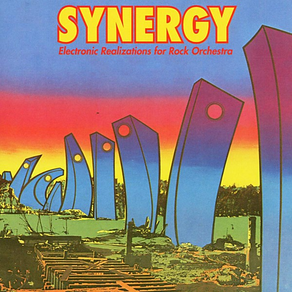

# Electronic Realizations for Rock Orchestra

By **Synergy**

## Album Data

- **Catalog:** Beets
- **Format:** Digital, Album
- **Album:** Electronic Realizations for Rock Orchestra
- **Artist:** Synergy
- **Albumartist:** Synergy
- **Genre:** Electronic
- **MusicBrainz Album Artist ID:** [510d5eee-01d0-453b-9a1a-ba1c1e109489](https://musicbrainz.org/artist/510d5eee-01d0-453b-9a1a-ba1c1e109489)
- **MusicBrainz Album ID:** [b7e782e9-14ad-382e-bb08-033ae11e0cfa](https://musicbrainz.org/release/b7e782e9-14ad-382e-bb08-033ae11e0cfa)
- **MusicBrainz Release Group ID:** [3bb261a0-3441-3952-9ff0-9cdd68abe075](https://musicbrainz.org/release-group/3bb261a0-3441-3952-9ff0-9cdd68abe075)
- **Year:** 1986
- **Catalog #:** 
- **Label:** 
- **Total Tracks:** 05

## Album Tracks

### Track 01 - Legacy

- **Artist:** Synergy
- **Format:** AAC
- **Genre:** Hip Hop
- **Length:** 10:20
- **MusicBrainz Track ID:** [755ad42c-71d8-428d-807d-4f77d44a5c28](https://musicbrainz.org/recording/755ad42c-71d8-428d-807d-4f77d44a5c28)
- **Title:** Legacy
- **Track:** 01
- **Year:** 1986

### Track 02 - Slaughter on Tenth Avenue

- **Artist:** Synergy
- **Format:** AAC
- **Genre:** Progressive Rock
- **Length:** 12:04
- **MusicBrainz Track ID:** [cd6c98d5-71c5-40c0-b1a7-63f92c4e98c0](https://musicbrainz.org/recording/cd6c98d5-71c5-40c0-b1a7-63f92c4e98c0)
- **Title:** Slaughter on Tenth Avenue
- **Track:** 02
- **Year:** 1986

### Track 03 - Synergy

- **Artist:** Synergy
- **Format:** AAC
- **Genre:** Trance
- **Length:** 5:32
- **MusicBrainz Track ID:** [39430dc3-274b-464b-8ae3-dbadac5f26e4](https://musicbrainz.org/recording/39430dc3-274b-464b-8ae3-dbadac5f26e4)
- **Title:** Synergy
- **Track:** 03
- **Year:** 1986

### Track 04 - Relay Breakdown

- **Artist:** Synergy
- **Format:** AAC
- **Genre:** Progressive Rock
- **Length:** 6:30
- **MusicBrainz Track ID:** [eccd9569-3857-477c-b621-904ea3e4ae9e](https://musicbrainz.org/recording/eccd9569-3857-477c-b621-904ea3e4ae9e)
- **Title:** Relay Breakdown
- **Track:** 04
- **Year:** 1986

### Track 05 - Warriors

- **Artist:** Synergy
- **Format:** AAC
- **Genre:** Progressive Rock
- **Length:** 13:13
- **MusicBrainz Track ID:** [e5170246-0276-4b1c-886a-9498326c545a](https://musicbrainz.org/recording/e5170246-0276-4b1c-886a-9498326c545a)
- **Title:** Warriors
- **Track:** 05
- **Year:** 1986

