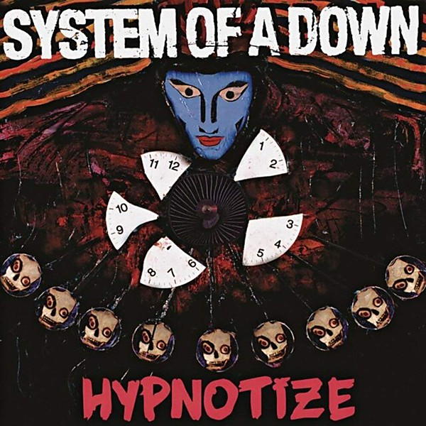

# Hypnotize

By **System Of A Down**

## Album Data

- **Catalog:** Beets
- **Format:** Digital, Album
- **Album:** Hypnotize
- **Artist:** System Of A Down
- **Albumartist:** System Of A Down
- **Genre:** Nu Metal
- **MusicBrainz Album Artist ID:** 
- **MusicBrainz Album ID:** 
- **MusicBrainz Release Group ID:** 
- **Year:** 0000
- **Catalog #:** CK 94161
- **Label:** American Recordings
- **Total Tracks:** 11

## Album Tracks

### Track 01 - Soldier Side (intro)

- **Artist:** System of a Down
- **Format:** ALAC
- **Genre:** Nu Metal
- **Length:** 1:03
- **MusicBrainz Track ID:** [f7fbba8c-516b-4a31-9c65-7cbe887af82a](https://musicbrainz.org/recording/f7fbba8c-516b-4a31-9c65-7cbe887af82a)
- **Title:** Soldier Side (intro)
- **Track:** 01
- **Year:** 2005

### Track 02 - B.Y.O.B.

- **Artist:** System of a Down
- **Format:** ALAC
- **Genre:** Nu Metal
- **Length:** 4:15
- **MusicBrainz Track ID:** [70f8b96e-4c77-412a-84ca-fd5b12ebcca8](https://musicbrainz.org/recording/70f8b96e-4c77-412a-84ca-fd5b12ebcca8)
- **Title:** B.Y.O.B.
- **Track:** 02
- **Year:** 2005

### Track 03 - Revenga

- **Artist:** System of a Down
- **Format:** ALAC
- **Genre:** Nu Metal
- **Length:** 3:48
- **MusicBrainz Track ID:** [473d94c4-89fd-48ac-8ef6-21cc8b275ebf](https://musicbrainz.org/recording/473d94c4-89fd-48ac-8ef6-21cc8b275ebf)
- **Title:** Revenga
- **Track:** 03
- **Year:** 2005

### Track 04 - Cigaro

- **Artist:** System of a Down
- **Format:** ALAC
- **Genre:** Nu Metal
- **Length:** 2:11
- **MusicBrainz Track ID:** [007de677-3174-4520-86c0-d35ffc3069f1](https://musicbrainz.org/recording/007de677-3174-4520-86c0-d35ffc3069f1)
- **Title:** Cigaro
- **Track:** 04
- **Year:** 2005

### Track 05 - Radio/Video

- **Artist:** System of a Down
- **Format:** ALAC
- **Genre:** Nu Metal
- **Length:** 4:09
- **MusicBrainz Track ID:** [e10280e8-bdb1-48f5-8f7a-3b56fb53d2e9](https://musicbrainz.org/recording/e10280e8-bdb1-48f5-8f7a-3b56fb53d2e9)
- **Title:** Radio/Video
- **Track:** 05
- **Year:** 2005

### Track 06 - This Cocaine Makes Me Feel Like I’m on This Song

- **Artist:** System of a Down
- **Format:** ALAC
- **Genre:** Alternative Metal
- **Length:** 2:08
- **MusicBrainz Track ID:** [cde48ae4-146c-46d9-8863-9aa818de3164](https://musicbrainz.org/recording/cde48ae4-146c-46d9-8863-9aa818de3164)
- **Title:** This Cocaine Makes Me Feel Like I’m on This Song
- **Track:** 06
- **Year:** 2005

### Track 07 - Violent Pornography

- **Artist:** System of a Down
- **Format:** ALAC
- **Genre:** Nu Metal
- **Length:** 3:31
- **MusicBrainz Track ID:** [11c08976-7b43-4fa3-a666-038ab99e8771](https://musicbrainz.org/recording/11c08976-7b43-4fa3-a666-038ab99e8771)
- **Title:** Violent Pornography
- **Track:** 07
- **Year:** 2005

### Track 08 - Question!

- **Artist:** System of a Down
- **Format:** ALAC
- **Genre:** Progressive Metal
- **Length:** 3:20
- **MusicBrainz Track ID:** [5756d15b-0f3c-4468-9918-0883a7c5366c](https://musicbrainz.org/recording/5756d15b-0f3c-4468-9918-0883a7c5366c)
- **Title:** Question!
- **Track:** 08
- **Year:** 2005

### Track 09 - Sad Statue

- **Artist:** System of a Down
- **Format:** ALAC
- **Genre:** Nu Metal
- **Length:** 3:25
- **MusicBrainz Track ID:** [89e858c2-aec4-4efe-b103-9cc95e79a89f](https://musicbrainz.org/recording/89e858c2-aec4-4efe-b103-9cc95e79a89f)
- **Title:** Sad Statue
- **Track:** 09
- **Year:** 2005

### Track 10 - Old School Hollywood

- **Artist:** System of a Down
- **Format:** ALAC
- **Genre:** Nu Metal
- **Length:** 2:56
- **MusicBrainz Track ID:** [7eba5df9-1e1d-4eff-8f66-8ba96b8943fa](https://musicbrainz.org/recording/7eba5df9-1e1d-4eff-8f66-8ba96b8943fa)
- **Title:** Old School Hollywood
- **Track:** 10
- **Year:** 2005

### Track 11 - Lost in Hollywood

- **Artist:** System of a Down
- **Format:** ALAC
- **Genre:** Nu Metal
- **Length:** 5:20
- **MusicBrainz Track ID:** [cc369189-f0e3-4c39-b8ea-13c3d13ceeaa](https://musicbrainz.org/recording/cc369189-f0e3-4c39-b8ea-13c3d13ceeaa)
- **Title:** Lost in Hollywood
- **Track:** 11
- **Year:** 2005

## See also

- [Mezmerize](Mezmerize.md)
- [Toxicity](Toxicity.md)
