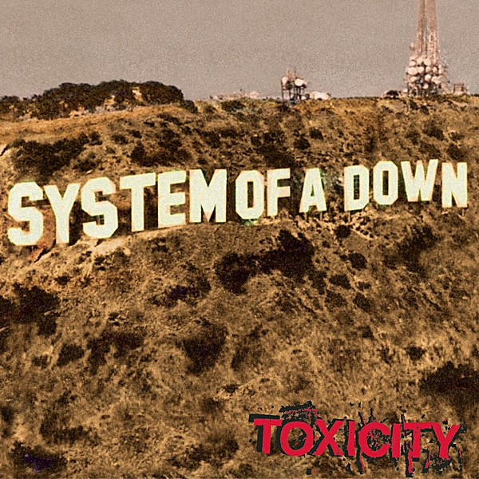

# Toxicity

By **System of a Down**

## Album Data

- **Catalog:** Beets
- **Format:** Digital, Album
- **Album:** Toxicity
- **Artist:** System Of A Down
- **Albumartist:** System of a Down
- **Genre:** Nu Metal
- **MusicBrainz Album Artist ID:** [cc0b7089-c08d-4c10-b6b0-873582c17fd6](https://musicbrainz.org/artist/cc0b7089-c08d-4c10-b6b0-873582c17fd6)
- **MusicBrainz Album ID:** [f8a44d0f-8241-3bdd-9988-413f28606650](https://musicbrainz.org/release/f8a44d0f-8241-3bdd-9988-413f28606650)
- **MusicBrainz Release Group ID:** [f50fbcb4-bfcd-3784-b4c9-44f4793e66b2](https://musicbrainz.org/release-group/f50fbcb4-bfcd-3784-b4c9-44f4793e66b2)
- **Year:** 2001
- **Catalog #:** CK 62240
- **Label:** American Recordings
- **Total Tracks:** 14

## Album Tracks

### Track 01 - Prison Song

- **Artist:** System of a Down
- **Format:** ALAC
- **Genre:** Nu Metal
- **Length:** 3:21
- **MusicBrainz Track ID:** [5f920e62-f2cc-4a89-a8a9-463d1c63ada7](https://musicbrainz.org/recording/5f920e62-f2cc-4a89-a8a9-463d1c63ada7)
- **Title:** Prison Song
- **Track:** 01
- **Year:** 2001

### Track 02 - Needles

- **Artist:** System of a Down
- **Format:** ALAC
- **Genre:** Nu Metal
- **Length:** 3:13
- **MusicBrainz Track ID:** [6dcf3da6-a951-4df4-8ff1-1e72d728fceb](https://musicbrainz.org/recording/6dcf3da6-a951-4df4-8ff1-1e72d728fceb)
- **Title:** Needles
- **Track:** 02
- **Year:** 2001

### Track 03 - Deer Dance

- **Artist:** System of a Down
- **Format:** ALAC
- **Genre:** Nu Metal
- **Length:** 2:55
- **MusicBrainz Track ID:** [763234a4-c6a0-455b-be7b-980dde8ee88f](https://musicbrainz.org/recording/763234a4-c6a0-455b-be7b-980dde8ee88f)
- **Title:** Deer Dance
- **Track:** 03
- **Year:** 2001

### Track 04 - Jet Pilot

- **Artist:** System of a Down
- **Format:** ALAC
- **Genre:** Nu Metal
- **Length:** 2:06
- **MusicBrainz Track ID:** [238d9ca8-1b8f-4ff1-acae-c57d0ef770ab](https://musicbrainz.org/recording/238d9ca8-1b8f-4ff1-acae-c57d0ef770ab)
- **Title:** Jet Pilot
- **Track:** 04
- **Year:** 2001

### Track 05 - X

- **Artist:** System of a Down
- **Format:** ALAC
- **Genre:** Nu Metal
- **Length:** 1:58
- **MusicBrainz Track ID:** [2b4fd6db-f5c2-4ac9-8e91-8ca81c75f4b5](https://musicbrainz.org/recording/2b4fd6db-f5c2-4ac9-8e91-8ca81c75f4b5)
- **Title:** X
- **Track:** 05
- **Year:** 2001

### Track 06 - Chop Suey!

- **Artist:** System of a Down
- **Format:** ALAC
- **Genre:** Nu Metal
- **Length:** 3:30
- **MusicBrainz Track ID:** [46c7368a-013a-47b6-97cc-e55e7ab25213](https://musicbrainz.org/recording/46c7368a-013a-47b6-97cc-e55e7ab25213)
- **Title:** Chop Suey!
- **Track:** 06
- **Year:** 2001

### Track 07 - Bounce

- **Artist:** System of a Down
- **Format:** ALAC
- **Genre:** Nu Metal
- **Length:** 1:54
- **MusicBrainz Track ID:** [95e11ea1-b750-4224-a2ad-41d38cae5ea5](https://musicbrainz.org/recording/95e11ea1-b750-4224-a2ad-41d38cae5ea5)
- **Title:** Bounce
- **Track:** 07
- **Year:** 2001

### Track 08 - Forest

- **Artist:** System of a Down
- **Format:** ALAC
- **Genre:** Nu Metal
- **Length:** 4:00
- **MusicBrainz Track ID:** [ebf2bd09-7dba-4a34-88c4-8dd618d14c94](https://musicbrainz.org/recording/ebf2bd09-7dba-4a34-88c4-8dd618d14c94)
- **Title:** Forest
- **Track:** 08
- **Year:** 2001

### Track 09 - ATWA

- **Artist:** System of a Down
- **Format:** ALAC
- **Genre:** Nu Metal
- **Length:** 2:56
- **MusicBrainz Track ID:** [cf8d54e9-7db0-40e9-8d51-342268447e51](https://musicbrainz.org/recording/cf8d54e9-7db0-40e9-8d51-342268447e51)
- **Title:** ATWA
- **Track:** 09
- **Year:** 2001

### Track 10 - Science

- **Artist:** System of a Down
- **Format:** ALAC
- **Genre:** Nu Metal
- **Length:** 2:43
- **MusicBrainz Track ID:** [94822599-d120-4cd9-9124-92eb21153871](https://musicbrainz.org/recording/94822599-d120-4cd9-9124-92eb21153871)
- **Title:** Science
- **Track:** 10
- **Year:** 2001

### Track 11 - Shimmy

- **Artist:** System of a Down
- **Format:** ALAC
- **Genre:** Nu Metal
- **Length:** 1:51
- **MusicBrainz Track ID:** [668b2928-dbc8-401a-9b2d-6fe546dcd441](https://musicbrainz.org/recording/668b2928-dbc8-401a-9b2d-6fe546dcd441)
- **Title:** Shimmy
- **Track:** 11
- **Year:** 2001

### Track 12 - Toxicity

- **Artist:** System of a Down
- **Format:** ALAC
- **Genre:** Nu Metal
- **Length:** 3:39
- **MusicBrainz Track ID:** [4e1083c3-b577-48e9-9a56-7bbbcbb1d6e7](https://musicbrainz.org/recording/4e1083c3-b577-48e9-9a56-7bbbcbb1d6e7)
- **Title:** Toxicity
- **Track:** 12
- **Year:** 2001

### Track 13 - Psycho

- **Artist:** System of a Down
- **Format:** ALAC
- **Genre:** Nu Metal
- **Length:** 3:45
- **MusicBrainz Track ID:** [4c59edfb-8d1f-4206-b855-3f1ad2de2cfc](https://musicbrainz.org/recording/4c59edfb-8d1f-4206-b855-3f1ad2de2cfc)
- **Title:** Psycho
- **Track:** 13
- **Year:** 2001

### Track 14 - Aerials / Arto

- **Artist:** System of a Down
- **Format:** ALAC
- **Genre:** Alternative Metal
- **Length:** 6:11
- **MusicBrainz Track ID:** [7d7e7931-5509-4884-ab83-d7beee976bca](https://musicbrainz.org/recording/7d7e7931-5509-4884-ab83-d7beee976bca)
- **Title:** Aerials / Arto
- **Track:** 14
- **Year:** 2001

## See also

- [Hypnotize](Hypnotize.md)
- [Mezmerize](Mezmerize.md)
