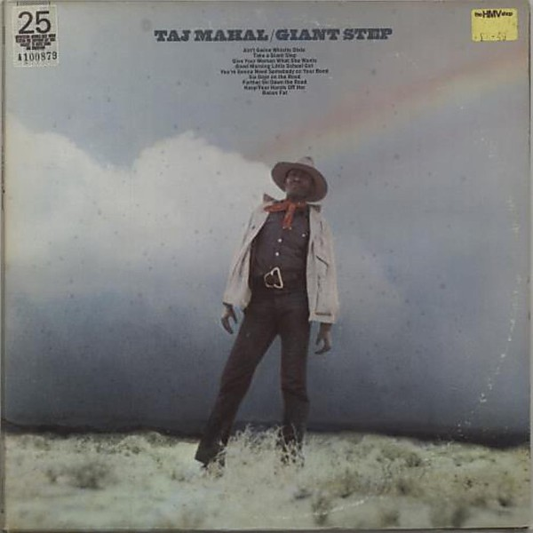

# Giant Step / De Ole Folks at Home

By **Taj Mahal**

## Album Data

- **Catalog:** Beets
- **Format:** Digital, Album
- **Album:** Giant Step / De Ole Folks at Home
- **Artist:** Taj Mahal
- **Albumartist:** Taj Mahal
- **Genre:** Rock
- **MusicBrainz Album Artist ID:** [4f48167c-29b8-4bde-a749-6803ce0a3922](https://musicbrainz.org/artist/4f48167c-29b8-4bde-a749-6803ce0a3922)
- **MusicBrainz Album ID:** [e35dc704-11a7-3f86-9116-6067a0d3e3fc](https://musicbrainz.org/release/e35dc704-11a7-3f86-9116-6067a0d3e3fc)
- **MusicBrainz Release Group ID:** [b529a184-72bc-3381-95e3-1147bed9b822](https://musicbrainz.org/release-group/b529a184-72bc-3381-95e3-1147bed9b822)
- **Year:** 1989
- **Catalog #:** CGK 18
- **Label:** Columbia
- **Total Tracks:** 22

## Album Tracks

### Track 01 - Ain’t Gwine Whistle Dixie Anymo’

- **Artist:** Taj Mahal
- **Format:** ALAC
- **Genre:** Rock
- **Length:** 1:01
- **MusicBrainz Track ID:** [69533a87-a1e9-403b-a882-7560024228bb](https://musicbrainz.org/recording/69533a87-a1e9-403b-a882-7560024228bb)
- **Title:** Ain’t Gwine Whistle Dixie Anymo’
- **Track:** 01
- **Year:** 1989

### Track 02 - Take a Giant Step

- **Artist:** Taj Mahal
- **Format:** ALAC
- **Genre:** Blues
- **Length:** 4:15
- **MusicBrainz Track ID:** [75c9c23c-f7ff-401f-bfa8-106a65e62be6](https://musicbrainz.org/recording/75c9c23c-f7ff-401f-bfa8-106a65e62be6)
- **Title:** Take a Giant Step
- **Track:** 02
- **Year:** 1989

### Track 03 - Give Your Woman What She Wants

- **Artist:** Taj Mahal
- **Format:** ALAC
- **Genre:** Soft Rock
- **Length:** 2:27
- **MusicBrainz Track ID:** [2b757743-f5cd-4ce3-83b2-6962d18c3416](https://musicbrainz.org/recording/2b757743-f5cd-4ce3-83b2-6962d18c3416)
- **Title:** Give Your Woman What She Wants
- **Track:** 03
- **Year:** 1989

### Track 04 - Good Morning Little School Girl

- **Artist:** Taj Mahal
- **Format:** ALAC
- **Genre:** Blues
- **Length:** 3:41
- **MusicBrainz Track ID:** [333a6a10-cee4-423b-9e2c-1b2a32073b5c](https://musicbrainz.org/recording/333a6a10-cee4-423b-9e2c-1b2a32073b5c)
- **Title:** Good Morning Little School Girl
- **Track:** 04
- **Year:** 1989

### Track 05 - You’re Gonna Need Somebody on Your Bond

- **Artist:** Taj Mahal
- **Format:** ALAC
- **Genre:** Rock
- **Length:** 4:53
- **MusicBrainz Track ID:** [9aa4b55a-42e9-4f57-8998-e09540f6f772](https://musicbrainz.org/recording/9aa4b55a-42e9-4f57-8998-e09540f6f772)
- **Title:** You’re Gonna Need Somebody on Your Bond
- **Track:** 05
- **Year:** 1989

### Track 06 - Six Days on the Road

- **Artist:** Taj Mahal
- **Format:** ALAC
- **Genre:** Soul
- **Length:** 3:00
- **MusicBrainz Track ID:** [c7ca71cf-1599-458d-a1fd-199fddf877ef](https://musicbrainz.org/recording/c7ca71cf-1599-458d-a1fd-199fddf877ef)
- **Title:** Six Days on the Road
- **Track:** 06
- **Year:** 1989

### Track 07 - Farther On Down the Road (You Will Accompany Me)

- **Artist:** Taj Mahal
- **Format:** ALAC
- **Genre:** Rock
- **Length:** 4:37
- **MusicBrainz Track ID:** [5f236e75-4e11-4596-b1dd-262fbf2b4f94](https://musicbrainz.org/recording/5f236e75-4e11-4596-b1dd-262fbf2b4f94)
- **Title:** Farther On Down the Road (You Will Accompany Me)
- **Track:** 07
- **Year:** 1989

### Track 08 - Keep Your Hands Off Her

- **Artist:** Taj Mahal
- **Format:** ALAC
- **Genre:** Rock
- **Length:** 2:15
- **MusicBrainz Track ID:** [259ca883-02b2-4ae7-b164-a362ce653185](https://musicbrainz.org/recording/259ca883-02b2-4ae7-b164-a362ce653185)
- **Title:** Keep Your Hands Off Her
- **Track:** 08
- **Year:** 1989

### Track 09 - Bacon Fat

- **Artist:** Taj Mahal
- **Format:** ALAC
- **Genre:** Soul
- **Length:** 6:46
- **MusicBrainz Track ID:** [2c41c550-5975-4685-94c8-f260a7cf62f4](https://musicbrainz.org/recording/2c41c550-5975-4685-94c8-f260a7cf62f4)
- **Title:** Bacon Fat
- **Track:** 09
- **Year:** 1989

### Track 10 - Linin’ Track

- **Artist:** Taj Mahal
- **Format:** ALAC
- **Genre:** Rock
- **Length:** 1:39
- **MusicBrainz Track ID:** [9da1d8d5-2672-4c08-aa6f-f616663a371f](https://musicbrainz.org/recording/9da1d8d5-2672-4c08-aa6f-f616663a371f)
- **Title:** Linin’ Track
- **Track:** 10
- **Year:** 1989

### Track 11 - Country Blues #1

- **Artist:** Taj Mahal
- **Format:** ALAC
- **Genre:** Americana
- **Length:** 2:36
- **MusicBrainz Track ID:** [f82257d1-65e6-464b-8e1e-9fbd6a8f5ae5](https://musicbrainz.org/recording/f82257d1-65e6-464b-8e1e-9fbd6a8f5ae5)
- **Title:** Country Blues #1
- **Track:** 11
- **Year:** 1989

### Track 12 - Wild Ox Moan

- **Artist:** Taj Mahal
- **Format:** ALAC
- **Genre:** Rock
- **Length:** 2:45
- **MusicBrainz Track ID:** [8b7b9c09-eebc-438b-96cd-1ed577ef1b67](https://musicbrainz.org/recording/8b7b9c09-eebc-438b-96cd-1ed577ef1b67)
- **Title:** Wild Ox Moan
- **Track:** 12
- **Year:** 1989

### Track 13 - Light Rain Blues

- **Artist:** Taj Mahal
- **Format:** ALAC
- **Genre:** Rock
- **Length:** 3:19
- **MusicBrainz Track ID:** [1c020906-9aa7-45cc-9c02-4ba327c885b8](https://musicbrainz.org/recording/1c020906-9aa7-45cc-9c02-4ba327c885b8)
- **Title:** Light Rain Blues
- **Track:** 13
- **Year:** 1989

### Track 14 - A Little Soulful Tune

- **Artist:** Taj Mahal
- **Format:** ALAC
- **Genre:** Rock
- **Length:** 2:37
- **MusicBrainz Track ID:** [2034b63d-eb34-4c33-9ace-eeb9a3f20549](https://musicbrainz.org/recording/2034b63d-eb34-4c33-9ace-eeb9a3f20549)
- **Title:** A Little Soulful Tune
- **Track:** 14
- **Year:** 1989

### Track 15 - Candy Man

- **Artist:** Taj Mahal
- **Format:** ALAC
- **Genre:** Rock
- **Length:** 2:54
- **MusicBrainz Track ID:** [3f45a128-b0ae-4835-bba1-97f25da8af6e](https://musicbrainz.org/recording/3f45a128-b0ae-4835-bba1-97f25da8af6e)
- **Title:** Candy Man
- **Track:** 15
- **Year:** 1989

### Track 16 - Cluck Old Hen

- **Artist:** Taj Mahal
- **Format:** ALAC
- **Genre:** Rock
- **Length:** 2:30
- **MusicBrainz Track ID:** [43a1a46d-074b-4e7b-ab05-9598efa9864b](https://musicbrainz.org/recording/43a1a46d-074b-4e7b-ab05-9598efa9864b)
- **Title:** Cluck Old Hen
- **Track:** 16
- **Year:** 1989

### Track 17 - Colored Aristocracy

- **Artist:** Taj Mahal
- **Format:** ALAC
- **Genre:** Bluegrass
- **Length:** 2:01
- **MusicBrainz Track ID:** [e96c54fe-a5b9-4f9b-b052-a544f5b39000](https://musicbrainz.org/recording/e96c54fe-a5b9-4f9b-b052-a544f5b39000)
- **Title:** Colored Aristocracy
- **Track:** 17
- **Year:** 1989

### Track 18 - Blind Boy Rag

- **Artist:** Taj Mahal
- **Format:** ALAC
- **Genre:** Rock
- **Length:** 4:08
- **MusicBrainz Track ID:** [e9a302a2-a4ff-4983-9314-d56501c9b802](https://musicbrainz.org/recording/e9a302a2-a4ff-4983-9314-d56501c9b802)
- **Title:** Blind Boy Rag
- **Track:** 18
- **Year:** 1989

### Track 19 - Stagger Lee

- **Artist:** Taj Mahal
- **Format:** ALAC
- **Genre:** Blues
- **Length:** 3:19
- **MusicBrainz Track ID:** [11647cf7-29a3-4112-aeec-e2ad04d59371](https://musicbrainz.org/recording/11647cf7-29a3-4112-aeec-e2ad04d59371)
- **Title:** Stagger Lee
- **Track:** 19
- **Year:** 1989

### Track 20 - Cajun Tune

- **Artist:** Taj Mahal
- **Format:** ALAC
- **Genre:** Americana
- **Length:** 1:54
- **MusicBrainz Track ID:** [98e45d62-939e-4c41-b5c2-b3e31ad46c0b](https://musicbrainz.org/recording/98e45d62-939e-4c41-b5c2-b3e31ad46c0b)
- **Title:** Cajun Tune
- **Track:** 20
- **Year:** 1989

### Track 21 - Fishin’ Blues

- **Artist:** Taj Mahal
- **Format:** ALAC
- **Genre:** Rock
- **Length:** 3:04
- **MusicBrainz Track ID:** [cabd6921-25d4-4f05-b685-768b81a74d0f](https://musicbrainz.org/recording/cabd6921-25d4-4f05-b685-768b81a74d0f)
- **Title:** Fishin’ Blues
- **Track:** 21
- **Year:** 1989

### Track 22 - Annie’s Lover

- **Artist:** Taj Mahal
- **Format:** ALAC
- **Genre:** Rock
- **Length:** 3:34
- **MusicBrainz Track ID:** [735ecb33-2ccc-4d38-870e-162b3ce9a060](https://musicbrainz.org/recording/735ecb33-2ccc-4d38-870e-162b3ce9a060)
- **Title:** Annie’s Lover
- **Track:** 22
- **Year:** 1989

