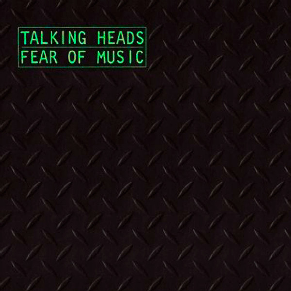

# Fear of Music

By **Talking Heads**

## Album Data

- **Catalog:** Beets
- **Format:** Digital, Album
- **Album:** Fear of Music
- **Artist:** Talking Heads
- **Albumartist:** Talking Heads
- **Genre:** Art Punk
- **MusicBrainz Album Artist ID:** [a94a7155-c79d-4409-9fcf-220cb0e4dc3a](https://musicbrainz.org/artist/a94a7155-c79d-4409-9fcf-220cb0e4dc3a)
- **MusicBrainz Album ID:** [6dbb4030-34c5-3de1-bf95-100eb0028e47](https://musicbrainz.org/release/6dbb4030-34c5-3de1-bf95-100eb0028e47)
- **MusicBrainz Release Group ID:** [f378dcb1-841b-3be1-9d96-779036562de1](https://musicbrainz.org/release-group/f378dcb1-841b-3be1-9d96-779036562de1)
- **Year:** 1979
- **Catalog #:** 9 25305-2
- **Label:** Sire Records
- **Total Tracks:** 09

## Album Tracks

### Track 01 - And She Was

- **Artist:** Talking Heads
- **Format:** MP3
- **Genre:** Post-Punk
- **Length:** 3:39
- **MusicBrainz Track ID:** [f21c3ce5-6c95-4df8-b333-baeb77e4c98f](https://musicbrainz.org/recording/f21c3ce5-6c95-4df8-b333-baeb77e4c98f)
- **Title:** And She Was
- **Track:** 01
- **Year:** 1985

### Track 02 - Give Me Back My Name

- **Artist:** Talking Heads
- **Format:** MP3
- **Genre:** Post-Punk
- **Length:** 3:21
- **MusicBrainz Track ID:** [b2c5a8ee-b37f-4f5c-91bb-915c9588bf44](https://musicbrainz.org/recording/b2c5a8ee-b37f-4f5c-91bb-915c9588bf44)
- **Title:** Give Me Back My Name
- **Track:** 02
- **Year:** 1985

### Track 03 - Creatures of Love

- **Artist:** Talking Heads
- **Format:** MP3
- **Genre:** Post-Punk
- **Length:** 4:16
- **MusicBrainz Track ID:** [2cb669bc-8583-468f-a842-2ea1d624c5fc](https://musicbrainz.org/recording/2cb669bc-8583-468f-a842-2ea1d624c5fc)
- **Title:** Creatures of Love
- **Track:** 03
- **Year:** 1985

### Track 04 - The Lady Don’t Mind

- **Artist:** Talking Heads
- **Format:** MP3
- **Genre:** Dance-Rock
- **Length:** 3:58
- **MusicBrainz Track ID:** [8d7c1612-5bf2-4054-88be-5b5bf17dae0e](https://musicbrainz.org/recording/8d7c1612-5bf2-4054-88be-5b5bf17dae0e)
- **Title:** The Lady Don’t Mind
- **Track:** 04
- **Year:** 1985

### Track 05 - Perfect World

- **Artist:** Talking Heads
- **Format:** MP3
- **Genre:** Uk Garage
- **Length:** 4:27
- **MusicBrainz Track ID:** [09174e45-b7fb-489b-a605-526937ffbf31](https://musicbrainz.org/recording/09174e45-b7fb-489b-a605-526937ffbf31)
- **Title:** Perfect World
- **Track:** 05
- **Year:** 1985

### Track 06 - Stay Up Late

- **Artist:** Talking Heads
- **Format:** MP3
- **Genre:** Post-Punk
- **Length:** 3:53
- **MusicBrainz Track ID:** [bda155a8-a8e3-4fdc-938f-655f2a23cd29](https://musicbrainz.org/recording/bda155a8-a8e3-4fdc-938f-655f2a23cd29)
- **Title:** Stay Up Late
- **Track:** 06
- **Year:** 1985

### Track 07 - Walk It Down

- **Artist:** Talking Heads
- **Format:** MP3
- **Genre:** Post-Punk
- **Length:** 4:44
- **MusicBrainz Track ID:** [20f037a7-659e-401f-ab6a-0a5d670fb2b7](https://musicbrainz.org/recording/20f037a7-659e-401f-ab6a-0a5d670fb2b7)
- **Title:** Walk It Down
- **Track:** 07
- **Year:** 1985

### Track 08 - Television Man

- **Artist:** Talking Heads
- **Format:** MP3
- **Genre:** Indie Rock
- **Length:** 6:11
- **MusicBrainz Track ID:** [1b408e3f-c0b2-4038-b8b1-08a488356d62](https://musicbrainz.org/recording/1b408e3f-c0b2-4038-b8b1-08a488356d62)
- **Title:** Television Man
- **Track:** 08
- **Year:** 1985

### Track 09 - Road to Nowhere

- **Artist:** Talking Heads
- **Format:** MP3
- **Genre:** Post-Punk
- **Length:** 4:19
- **MusicBrainz Track ID:** [345b6c01-f0f7-4f91-ad2f-7a272d25d2d9](https://musicbrainz.org/recording/345b6c01-f0f7-4f91-ad2f-7a272d25d2d9)
- **Title:** Road to Nowhere
- **Track:** 09
- **Year:** 1985

## See also

- [Chronology](Chronology.md)
- [Little Creatures](Little_Creatures.md)
- [More Songs About Buildings and Food](More_Songs_About_Buildings_and_Food.md)
- [Naked](Naked.md)
- [Remain in Light](Remain_in_Light.md)
- [Speaking in Tongues](Speaking_in_Tongues.md)
- [Talking Heads](Talking_Heads.md)
- [The Name of This Band Is Talking Heads](The_Name_of_This_Band_Is_Talking_Heads.md)
- [Roon: Fear of Music (Deluxe Version)](../../Roon/Talking_Heads/Fear_of_Music_Deluxe_Version.md)
- [Roon: Little Creatures (Deluxe Version)](../../Roon/Talking_Heads/Little_Creatures_Deluxe_Version.md)
- [Roon: More Songs About Buildings and Food](../../Roon/Talking_Heads/More_Songs_About_Buildings_and_Food.md)
- [Roon: Naked](../../Roon/Talking_Heads/Naked.md)
- [Roon: Remain In Light](../../Roon/Talking_Heads/Remain_In_Light.md)
- [Roon: Speaking in Tongues](../../Roon/Talking_Heads/Speaking_in_Tongues.md)
- [Roon: Stop Making Sense (Special New Edition) (Live)](../../Roon/Talking_Heads/Stop_Making_Sense_Special_New_Edition_Live.md)
- [Roon: Talking Heads](../../Roon/Talking_Heads/Talking_Heads-_77.md)
- [Roon: The Name of This Band Is Talking Heads (Expanded 2004 Remaster)](../../Roon/Talking_Heads/The_Name_of_This_Band_Is_Talking_Heads_Expanded_2004_Remaster.md)
- [Vinyl: Fear Of Music](../../Vinyl/Talking_Heads/Fear_Of_Music.md)
- [Vinyl: More Songs About Buildings And Food](../../Vinyl/Talking_Heads/More_Songs_About_Buildings_And_Food.md)
- [Vinyl: Speaking In Tongues](../../Vinyl/Talking_Heads/Speaking_In_Tongues.md)
- [Vinyl: ](../../Vinyl/Talking_Heads/Talking_Heads.md)
- [Vinyl: The Name Of This Band Is Talking Heads](../../Vinyl/Talking_Heads/The_Name_Of_This_Band_Is_Talking_Heads.md)
