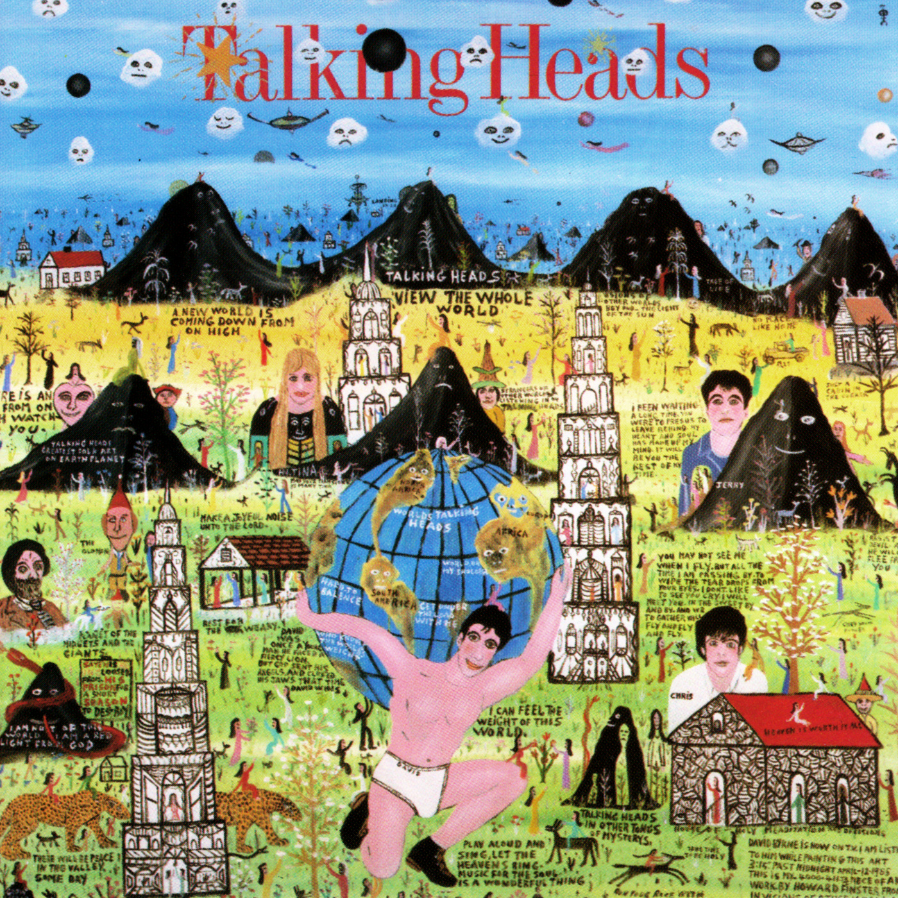

# Little Creatures

By **Talking Heads**

## Album Data

- **Catalog:** Beets
- **Format:** Digital, Album
- **Album:** Little Creatures
- **Artist:** Talking Heads
- **Albumartist:** Talking Heads
- **Genre:** Dance-Rock
- **MusicBrainz Album Artist ID:** [a94a7155-c79d-4409-9fcf-220cb0e4dc3a](https://musicbrainz.org/artist/a94a7155-c79d-4409-9fcf-220cb0e4dc3a)
- **MusicBrainz Album ID:** [8fb19947-f5d0-49c1-856a-09fba9d19626](https://musicbrainz.org/release/8fb19947-f5d0-49c1-856a-09fba9d19626)
- **MusicBrainz Release Group ID:** [8d8aadcd-fcd6-3e0f-b17e-3ec2d88e65d3](https://musicbrainz.org/release-group/8d8aadcd-fcd6-3e0f-b17e-3ec2d88e65d3)
- **Year:** 1985
- **Catalog #:** 7599-27425-2
- **Label:** Sire Records
- **Total Tracks:** 11

## Album Tracks

### Track 01 - Thank You for Sending Me an Angel

- **Artist:** Talking Heads
- **Format:** MP3
- **Genre:** Post-Punk
- **Length:** 2:11
- **MusicBrainz Track ID:** [6ed2ad39-fcb0-41f3-8477-cac4ed7d5793](https://musicbrainz.org/recording/6ed2ad39-fcb0-41f3-8477-cac4ed7d5793)
- **Title:** Thank You for Sending Me an Angel
- **Track:** 01
- **Year:** 1990

### Track 02 - With Our Love

- **Artist:** Talking Heads
- **Format:** MP3
- **Genre:** Post-Punk
- **Length:** 3:31
- **MusicBrainz Track ID:** [0a51e0db-58a3-46a7-a107-0e440f15d814](https://musicbrainz.org/recording/0a51e0db-58a3-46a7-a107-0e440f15d814)
- **Title:** With Our Love
- **Track:** 02
- **Year:** 1990

### Track 03 - The Good Thing

- **Artist:** Talking Heads
- **Format:** MP3
- **Genre:** Post-Punk
- **Length:** 3:03
- **MusicBrainz Track ID:** [d15e8090-3625-4dcf-a299-4d6440aae140](https://musicbrainz.org/recording/d15e8090-3625-4dcf-a299-4d6440aae140)
- **Title:** The Good Thing
- **Track:** 03
- **Year:** 1990

### Track 04 - Warning Sign

- **Artist:** Talking Heads
- **Format:** MP3
- **Genre:** Post-Punk
- **Length:** 3:54
- **MusicBrainz Track ID:** [58df4954-0442-424a-af0f-6de3af470b57](https://musicbrainz.org/recording/58df4954-0442-424a-af0f-6de3af470b57)
- **Title:** Warning Sign
- **Track:** 04
- **Year:** 1990

### Track 05 - The Girls Want to Be With the Girls

- **Artist:** Talking Heads
- **Format:** MP3
- **Genre:** Uk Garage
- **Length:** 2:38
- **MusicBrainz Track ID:** [7d5105c8-7d83-4e17-b25c-1f25b4f59c46](https://musicbrainz.org/recording/7d5105c8-7d83-4e17-b25c-1f25b4f59c46)
- **Title:** The Girls Want to Be With the Girls
- **Track:** 05
- **Year:** 1990

### Track 06 - Found a Job

- **Artist:** Talking Heads
- **Format:** MP3
- **Genre:** Uk Garage
- **Length:** 4:58
- **MusicBrainz Track ID:** [41b43ac5-7446-45a5-8fa9-6d4bd8a853c8](https://musicbrainz.org/recording/41b43ac5-7446-45a5-8fa9-6d4bd8a853c8)
- **Title:** Found a Job
- **Track:** 06
- **Year:** 1990

### Track 07 - Artists Only

- **Artist:** Talking Heads
- **Format:** MP3
- **Genre:** Post-Punk
- **Length:** 3:35
- **MusicBrainz Track ID:** [a54d5e88-d97c-40ef-89ce-c4924cef66d9](https://musicbrainz.org/recording/a54d5e88-d97c-40ef-89ce-c4924cef66d9)
- **Title:** Artists Only
- **Track:** 07
- **Year:** 1990

### Track 08 - I’m Not in Love

- **Artist:** Talking Heads
- **Format:** MP3
- **Genre:** Post-Punk
- **Length:** 4:35
- **MusicBrainz Track ID:** [4f416526-f7cc-4265-83ff-9bc9dec2ff51](https://musicbrainz.org/recording/4f416526-f7cc-4265-83ff-9bc9dec2ff51)
- **Title:** I’m Not in Love
- **Track:** 08
- **Year:** 1990

### Track 09 - Stay Hungry

- **Artist:** Talking Heads
- **Format:** MP3
- **Genre:** Post-Punk
- **Length:** 2:39
- **MusicBrainz Track ID:** [be713f63-340b-460b-966f-0c880ed9c947](https://musicbrainz.org/recording/be713f63-340b-460b-966f-0c880ed9c947)
- **Title:** Stay Hungry
- **Track:** 09
- **Year:** 1990

### Track 10 - Take Me to the River

- **Artist:** Talking Heads
- **Format:** MP3
- **Genre:** Post-Punk
- **Length:** 5:03
- **MusicBrainz Track ID:** [61e70efb-8028-4f9b-9e90-210c69859669](https://musicbrainz.org/recording/61e70efb-8028-4f9b-9e90-210c69859669)
- **Title:** Take Me to the River
- **Track:** 10
- **Year:** 1990

### Track 11 - The Big Country

- **Artist:** Talking Heads
- **Format:** MP3
- **Genre:** Post-Punk
- **Length:** 5:31
- **MusicBrainz Track ID:** [86621e78-b65b-4bf6-9158-e97725ab3ffa](https://musicbrainz.org/recording/86621e78-b65b-4bf6-9158-e97725ab3ffa)
- **Title:** The Big Country
- **Track:** 11
- **Year:** 1990

## See also

- [Chronology](Chronology.md)
- [Fear of Music](Fear_of_Music.md)
- [More Songs About Buildings and Food](More_Songs_About_Buildings_and_Food.md)
- [Naked](Naked.md)
- [Remain in Light](Remain_in_Light.md)
- [Speaking in Tongues](Speaking_in_Tongues.md)
- [Talking Heads](Talking_Heads.md)
- [The Name of This Band Is Talking Heads](The_Name_of_This_Band_Is_Talking_Heads.md)
- [Roon: Fear of Music (Deluxe Version)](../../Roon/Talking_Heads/Fear_of_Music_Deluxe_Version.md)
- [Roon: Little Creatures (Deluxe Version)](../../Roon/Talking_Heads/Little_Creatures_Deluxe_Version.md)
- [Roon: More Songs About Buildings and Food](../../Roon/Talking_Heads/More_Songs_About_Buildings_and_Food.md)
- [Roon: Naked](../../Roon/Talking_Heads/Naked.md)
- [Roon: Remain In Light](../../Roon/Talking_Heads/Remain_In_Light.md)
- [Roon: Speaking in Tongues](../../Roon/Talking_Heads/Speaking_in_Tongues.md)
- [Roon: Stop Making Sense (Special New Edition) (Live)](../../Roon/Talking_Heads/Stop_Making_Sense_Special_New_Edition_Live.md)
- [Roon: Talking Heads](../../Roon/Talking_Heads/Talking_Heads-_77.md)
- [Roon: The Name of This Band Is Talking Heads (Expanded 2004 Remaster)](../../Roon/Talking_Heads/The_Name_of_This_Band_Is_Talking_Heads_Expanded_2004_Remaster.md)
- [Vinyl: Fear Of Music](../../Vinyl/Talking_Heads/Fear_Of_Music.md)
- [Vinyl: More Songs About Buildings And Food](../../Vinyl/Talking_Heads/More_Songs_About_Buildings_And_Food.md)
- [Vinyl: Speaking In Tongues](../../Vinyl/Talking_Heads/Speaking_In_Tongues.md)
- [Vinyl: ](../../Vinyl/Talking_Heads/Talking_Heads.md)
- [Vinyl: The Name Of This Band Is Talking Heads](../../Vinyl/Talking_Heads/The_Name_Of_This_Band_Is_Talking_Heads.md)
