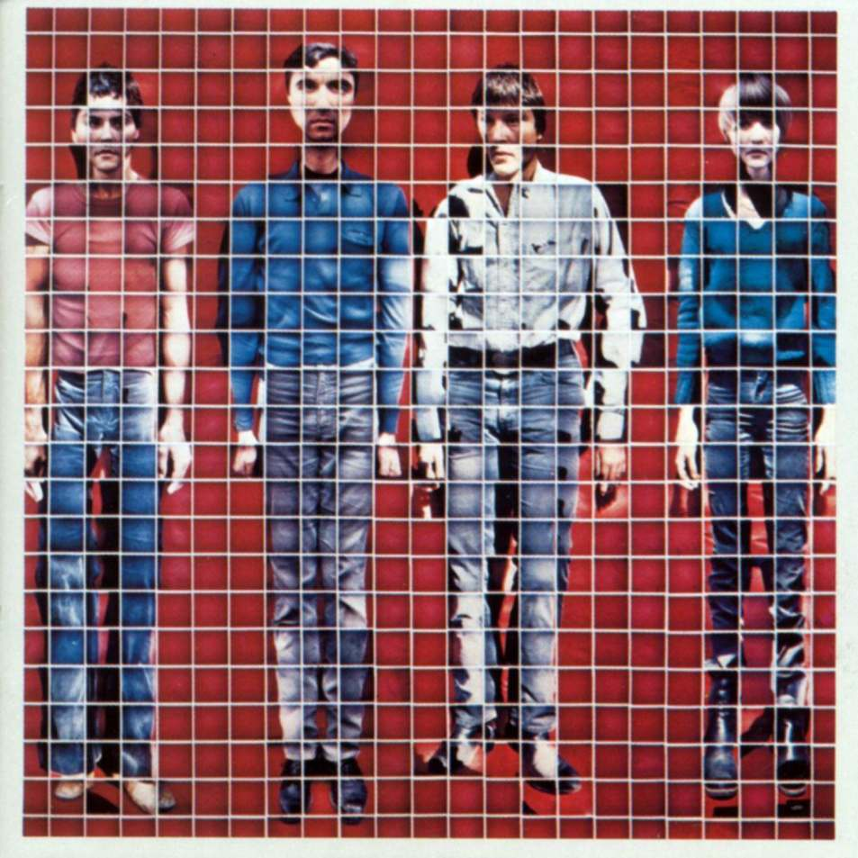

# More Songs About Buildings and Food

By **Talking Heads**

## Album Data

- **Catalog:** Beets
- **Format:** Digital, Album
- **Album:** More Songs About Buildings and Food
- **Artist:** Talking Heads
- **Albumartist:** Talking Heads
- **Genre:** Post-Punk
- **MusicBrainz Album Artist ID:** [a94a7155-c79d-4409-9fcf-220cb0e4dc3a](https://musicbrainz.org/artist/a94a7155-c79d-4409-9fcf-220cb0e4dc3a)
- **MusicBrainz Album ID:** [ccc44241-d2e5-392c-af81-695d2c9a89c4](https://musicbrainz.org/release/ccc44241-d2e5-392c-af81-695d2c9a89c4)
- **MusicBrainz Release Group ID:** [2cecb2c0-cac3-3c55-8083-577308746230](https://musicbrainz.org/release-group/2cecb2c0-cac3-3c55-8083-577308746230)
- **Year:** 1990
- **Catalog #:** 
- **Label:** EMI United Kingdom
- **Total Tracks:** 12

## Album Tracks

### Track 01 - Blind

- **Artist:** Talking Heads
- **Format:** MP3
- **Genre:** Punk Rock
- **Length:** 4:59
- **MusicBrainz Track ID:** [f5f472e4-9b59-49c7-a666-e7f5bef52c01](https://musicbrainz.org/recording/f5f472e4-9b59-49c7-a666-e7f5bef52c01)
- **Title:** Blind
- **Track:** 01
- **Year:** 2006

### Track 02 - Mr. Jones

- **Artist:** Talking Heads
- **Format:** MP3
- **Genre:** Salsa
- **Length:** 4:20
- **MusicBrainz Track ID:** [3f4700f3-c35d-4291-96e4-52e5847c6f1a](https://musicbrainz.org/recording/3f4700f3-c35d-4291-96e4-52e5847c6f1a)
- **Title:** Mr. Jones
- **Track:** 02
- **Year:** 2006

### Track 03 - Totally Nude

- **Artist:** Talking Heads
- **Format:** MP3
- **Genre:** Post-Punk
- **Length:** 4:11
- **MusicBrainz Track ID:** [081ae855-28f0-4f2e-a53a-67361097c64d](https://musicbrainz.org/recording/081ae855-28f0-4f2e-a53a-67361097c64d)
- **Title:** Totally Nude
- **Track:** 03
- **Year:** 2006

### Track 04 - Ruby Dear

- **Artist:** Talking Heads
- **Format:** MP3
- **Genre:** New Wave
- **Length:** 3:50
- **MusicBrainz Track ID:** [b9dfed30-caca-4162-9863-7b92ebedc89d](https://musicbrainz.org/recording/b9dfed30-caca-4162-9863-7b92ebedc89d)
- **Title:** Ruby Dear
- **Track:** 04
- **Year:** 2006

### Track 05 - (Nothing but) Flowers

- **Artist:** Talking Heads
- **Format:** MP3
- **Genre:** Post-Punk
- **Length:** 5:32
- **MusicBrainz Track ID:** [480665d8-6a9f-40bf-81ba-7c2a3607463a](https://musicbrainz.org/recording/480665d8-6a9f-40bf-81ba-7c2a3607463a)
- **Title:** (Nothing but) Flowers
- **Track:** 05
- **Year:** 2006

### Track 06 - The Democratic Circus

- **Artist:** Talking Heads
- **Format:** MP3
- **Genre:** Post-Punk
- **Length:** 5:03
- **MusicBrainz Track ID:** [18cfec34-6048-41e8-86ef-a99b4feb8dc6](https://musicbrainz.org/recording/18cfec34-6048-41e8-86ef-a99b4feb8dc6)
- **Title:** The Democratic Circus
- **Track:** 06
- **Year:** 2006

### Track 07 - The Facts of Life

- **Artist:** Talking Heads
- **Format:** MP3
- **Genre:** Post-Punk
- **Length:** 6:27
- **MusicBrainz Track ID:** [c938976d-7850-4cdf-994c-e5cf1897e8ad](https://musicbrainz.org/recording/c938976d-7850-4cdf-994c-e5cf1897e8ad)
- **Title:** The Facts of Life
- **Track:** 07
- **Year:** 2006

### Track 08 - Mommy Daddy You and I

- **Artist:** Talking Heads
- **Format:** MP3
- **Genre:** New Wave
- **Length:** 3:58
- **MusicBrainz Track ID:** [5bb9b75d-70b3-4704-87f6-49942f632d43](https://musicbrainz.org/recording/5bb9b75d-70b3-4704-87f6-49942f632d43)
- **Title:** Mommy Daddy You and I
- **Track:** 08
- **Year:** 2006

### Track 09 - Big Daddy

- **Artist:** Talking Heads
- **Format:** MP3
- **Genre:** Post-Punk
- **Length:** 5:37
- **MusicBrainz Track ID:** [1413f99f-90fa-4afa-b6d5-e82b25bf4697](https://musicbrainz.org/recording/1413f99f-90fa-4afa-b6d5-e82b25bf4697)
- **Title:** Big Daddy
- **Track:** 09
- **Year:** 2006

### Track 10 - Bill

- **Artist:** Talking Heads
- **Format:** MP3
- **Genre:** New Wave
- **Length:** 3:23
- **MusicBrainz Track ID:** [1b2c4d42-808d-4484-bd96-ac36f516f1f0](https://musicbrainz.org/recording/1b2c4d42-808d-4484-bd96-ac36f516f1f0)
- **Title:** Bill
- **Track:** 10
- **Year:** 2006

### Track 11 - Cool Water

- **Artist:** Talking Heads
- **Format:** MP3
- **Genre:** New Wave
- **Length:** 5:16
- **MusicBrainz Track ID:** [0b65e9ee-b62d-4e22-aeb1-f55067c17c29](https://musicbrainz.org/recording/0b65e9ee-b62d-4e22-aeb1-f55067c17c29)
- **Title:** Cool Water
- **Track:** 11
- **Year:** 2006

### Track 12 - Sax and Violins

- **Artist:** Talking Heads
- **Format:** MP3
- **Genre:** New Wave
- **Length:** 5:15
- **MusicBrainz Track ID:** [5ebff6e6-4f5c-453c-8edd-8a5d6576414e](https://musicbrainz.org/recording/5ebff6e6-4f5c-453c-8edd-8a5d6576414e)
- **Title:** Sax and Violins
- **Track:** 12
- **Year:** 2006

## See also

- [Chronology](Chronology.md)
- [Fear of Music](Fear_of_Music.md)
- [Little Creatures](Little_Creatures.md)
- [Naked](Naked.md)
- [Remain in Light](Remain_in_Light.md)
- [Speaking in Tongues](Speaking_in_Tongues.md)
- [Talking Heads](Talking_Heads.md)
- [The Name of This Band Is Talking Heads](The_Name_of_This_Band_Is_Talking_Heads.md)
- [Roon: Fear of Music (Deluxe Version)](../../Roon/Talking_Heads/Fear_of_Music_Deluxe_Version.md)
- [Roon: Little Creatures (Deluxe Version)](../../Roon/Talking_Heads/Little_Creatures_Deluxe_Version.md)
- [Roon: More Songs About Buildings and Food](../../Roon/Talking_Heads/More_Songs_About_Buildings_and_Food.md)
- [Roon: Naked](../../Roon/Talking_Heads/Naked.md)
- [Roon: Remain In Light](../../Roon/Talking_Heads/Remain_In_Light.md)
- [Roon: Speaking in Tongues](../../Roon/Talking_Heads/Speaking_in_Tongues.md)
- [Roon: Stop Making Sense (Special New Edition) (Live)](../../Roon/Talking_Heads/Stop_Making_Sense_Special_New_Edition_Live.md)
- [Roon: Talking Heads](../../Roon/Talking_Heads/Talking_Heads-_77.md)
- [Roon: The Name of This Band Is Talking Heads (Expanded 2004 Remaster)](../../Roon/Talking_Heads/The_Name_of_This_Band_Is_Talking_Heads_Expanded_2004_Remaster.md)
- [Vinyl: Fear Of Music](../../Vinyl/Talking_Heads/Fear_Of_Music.md)
- [Vinyl: More Songs About Buildings And Food](../../Vinyl/Talking_Heads/More_Songs_About_Buildings_And_Food.md)
- [Vinyl: Speaking In Tongues](../../Vinyl/Talking_Heads/Speaking_In_Tongues.md)
- [Vinyl: ](../../Vinyl/Talking_Heads/Talking_Heads.md)
- [Vinyl: The Name Of This Band Is Talking Heads](../../Vinyl/Talking_Heads/The_Name_Of_This_Band_Is_Talking_Heads.md)
