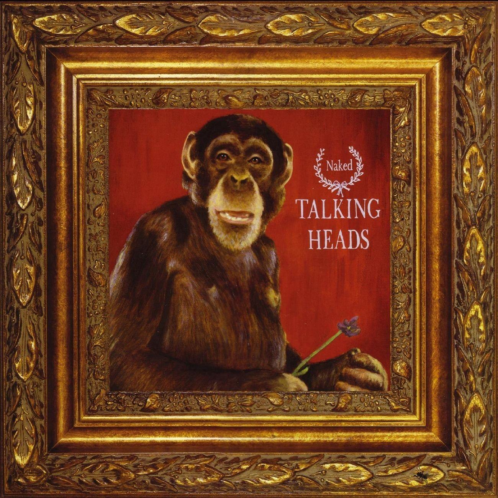

# Naked

By **Talking Heads**

## Album Data

- **Catalog:** Beets
- **Format:** Digital, Album
- **Album:** Naked
- **Artist:** Talking Heads
- **Albumartist:** Talking Heads
- **Genre:** Post-Punk
- **MusicBrainz Album Artist ID:** [a94a7155-c79d-4409-9fcf-220cb0e4dc3a](https://musicbrainz.org/artist/a94a7155-c79d-4409-9fcf-220cb0e4dc3a)
- **MusicBrainz Album ID:** [41b5bdfb-a78c-4e17-b87a-780ff6eb078f](https://musicbrainz.org/release/41b5bdfb-a78c-4e17-b87a-780ff6eb078f)
- **MusicBrainz Release Group ID:** [0dcd717b-d652-3da5-99bd-f32c5fd42a7d](https://musicbrainz.org/release-group/0dcd717b-d652-3da5-99bd-f32c5fd42a7d)
- **Year:** 2006
- **Catalog #:** 7599-26095-2
- **Label:** Sire Records
- **Total Tracks:** 08

## Album Tracks

### Track 01 - Born Under Punches (The Heat Goes On)

- **Artist:** Talking Heads
- **Format:** MP3
- **Genre:** Post-Punk
- **Length:** 5:48
- **MusicBrainz Track ID:** [7c4afcd9-f12f-4ce3-8ba7-7612ecf7716e](https://musicbrainz.org/recording/7c4afcd9-f12f-4ce3-8ba7-7612ecf7716e)
- **Title:** Born Under Punches (The Heat Goes On)
- **Track:** 01
- **Year:** 1984

### Track 02 - Crosseyed and Painless

- **Artist:** Talking Heads
- **Format:** MP3
- **Genre:** Post-Punk
- **Length:** 4:46
- **MusicBrainz Track ID:** [1152b51b-9df7-4137-b085-74d1019c84a3](https://musicbrainz.org/recording/1152b51b-9df7-4137-b085-74d1019c84a3)
- **Title:** Crosseyed and Painless
- **Track:** 02
- **Year:** 1984

### Track 03 - The Great Curve

- **Artist:** Talking Heads
- **Format:** MP3
- **Genre:** Post-Punk
- **Length:** 6:28
- **MusicBrainz Track ID:** [15f6840a-655d-4863-a34b-7a22c82092c8](https://musicbrainz.org/recording/15f6840a-655d-4863-a34b-7a22c82092c8)
- **Title:** The Great Curve
- **Track:** 03
- **Year:** 1984

### Track 04 - Once in a Lifetime

- **Artist:** Talking Heads
- **Format:** MP3
- **Genre:** Post-Punk
- **Length:** 4:17
- **MusicBrainz Track ID:** [7ce86631-ab98-4814-b2e0-ec13f8a4d658](https://musicbrainz.org/recording/7ce86631-ab98-4814-b2e0-ec13f8a4d658)
- **Title:** Once in a Lifetime
- **Track:** 04
- **Year:** 1984

### Track 05 - Houses in Motion

- **Artist:** Talking Heads
- **Format:** MP3
- **Genre:** Post-Punk
- **Length:** 4:32
- **MusicBrainz Track ID:** [6fb50f0f-fd5d-4a34-ac59-0b43b9cf2ded](https://musicbrainz.org/recording/6fb50f0f-fd5d-4a34-ac59-0b43b9cf2ded)
- **Title:** Houses in Motion
- **Track:** 05
- **Year:** 1984

### Track 06 - Seen and Not Seen

- **Artist:** Talking Heads
- **Format:** MP3
- **Genre:** Post-Punk
- **Length:** 3:24
- **MusicBrainz Track ID:** [b56f20e5-462c-475a-a7b4-1ddf75607115](https://musicbrainz.org/recording/b56f20e5-462c-475a-a7b4-1ddf75607115)
- **Title:** Seen and Not Seen
- **Track:** 06
- **Year:** 1984

### Track 07 - Listening Wind

- **Artist:** Talking Heads
- **Format:** MP3
- **Genre:** Post-Punk
- **Length:** 4:44
- **MusicBrainz Track ID:** [46717bff-51ff-47f5-b878-73f631c86b24](https://musicbrainz.org/recording/46717bff-51ff-47f5-b878-73f631c86b24)
- **Title:** Listening Wind
- **Track:** 07
- **Year:** 1984

### Track 08 - The Overload

- **Artist:** Talking Heads
- **Format:** MP3
- **Genre:** Gothic Rock
- **Length:** 5:51
- **MusicBrainz Track ID:** [bb08a876-e88a-470e-8472-351ac82534c6](https://musicbrainz.org/recording/bb08a876-e88a-470e-8472-351ac82534c6)
- **Title:** The Overload
- **Track:** 08
- **Year:** 1984

## See also

- [Chronology](Chronology.md)
- [Fear of Music](Fear_of_Music.md)
- [Little Creatures](Little_Creatures.md)
- [More Songs About Buildings and Food](More_Songs_About_Buildings_and_Food.md)
- [Remain in Light](Remain_in_Light.md)
- [Speaking in Tongues](Speaking_in_Tongues.md)
- [Talking Heads](Talking_Heads.md)
- [The Name of This Band Is Talking Heads](The_Name_of_This_Band_Is_Talking_Heads.md)
- [Roon: Fear of Music (Deluxe Version)](../../Roon/Talking_Heads/Fear_of_Music_Deluxe_Version.md)
- [Roon: Little Creatures (Deluxe Version)](../../Roon/Talking_Heads/Little_Creatures_Deluxe_Version.md)
- [Roon: More Songs About Buildings and Food](../../Roon/Talking_Heads/More_Songs_About_Buildings_and_Food.md)
- [Roon: Naked](../../Roon/Talking_Heads/Naked.md)
- [Roon: Remain In Light](../../Roon/Talking_Heads/Remain_In_Light.md)
- [Roon: Speaking in Tongues](../../Roon/Talking_Heads/Speaking_in_Tongues.md)
- [Roon: Stop Making Sense (Special New Edition) (Live)](../../Roon/Talking_Heads/Stop_Making_Sense_Special_New_Edition_Live.md)
- [Roon: Talking Heads](../../Roon/Talking_Heads/Talking_Heads-_77.md)
- [Roon: The Name of This Band Is Talking Heads (Expanded 2004 Remaster)](../../Roon/Talking_Heads/The_Name_of_This_Band_Is_Talking_Heads_Expanded_2004_Remaster.md)
- [Vinyl: Fear Of Music](../../Vinyl/Talking_Heads/Fear_Of_Music.md)
- [Vinyl: More Songs About Buildings And Food](../../Vinyl/Talking_Heads/More_Songs_About_Buildings_And_Food.md)
- [Vinyl: Speaking In Tongues](../../Vinyl/Talking_Heads/Speaking_In_Tongues.md)
- [Vinyl: ](../../Vinyl/Talking_Heads/Talking_Heads.md)
- [Vinyl: The Name Of This Band Is Talking Heads](../../Vinyl/Talking_Heads/The_Name_Of_This_Band_Is_Talking_Heads.md)
