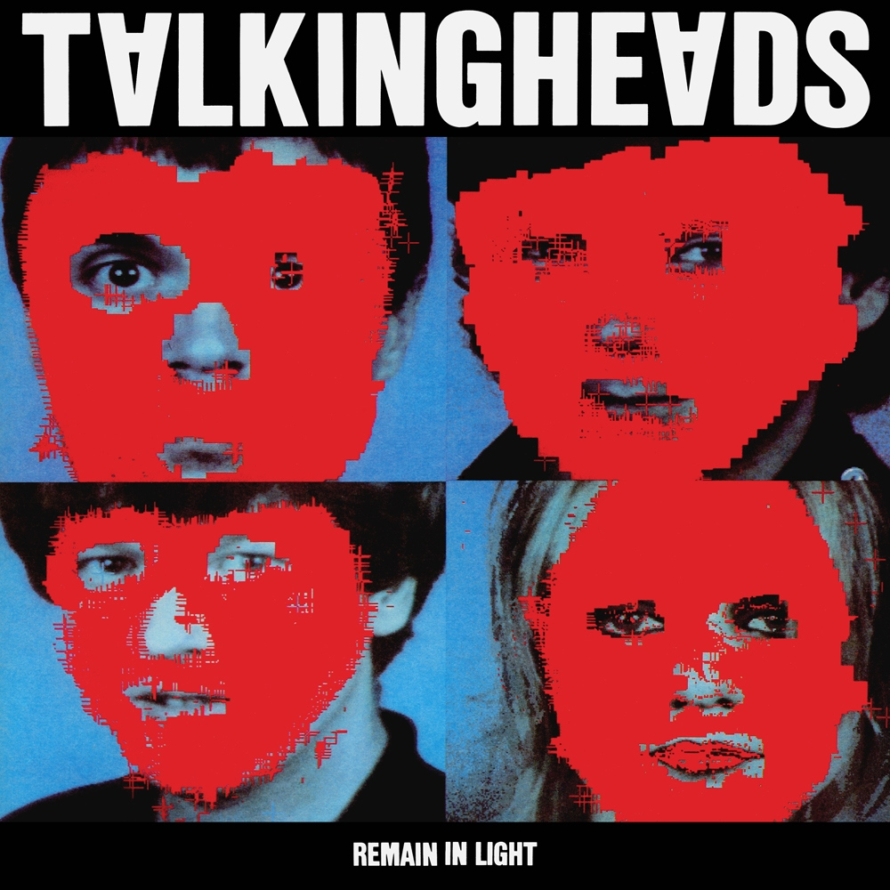

# Remain in Light

By **Talking Heads**

## Album Data

- **Catalog:** Beets
- **Format:** Digital, Album
- **Album:** Remain in Light
- **Artist:** Talking Heads
- **Albumartist:** Talking Heads
- **Genre:** Post-Punk
- **MusicBrainz Album Artist ID:** [a94a7155-c79d-4409-9fcf-220cb0e4dc3a](https://musicbrainz.org/artist/a94a7155-c79d-4409-9fcf-220cb0e4dc3a)
- **MusicBrainz Album ID:** [e77048de-139b-3fd3-977b-d86993e0e1b2](https://musicbrainz.org/release/e77048de-139b-3fd3-977b-d86993e0e1b2)
- **MusicBrainz Release Group ID:** [f6b1b900-6108-32f0-abbd-2855af9151eb](https://musicbrainz.org/release-group/f6b1b900-6108-32f0-abbd-2855af9151eb)
- **Year:** 1984
- **Catalog #:** 9 23883-2
- **Label:** Sire Records
- **Total Tracks:** 09

## Album Tracks

### Track 01 - Burning Down the House

- **Artist:** Talking Heads
- **Format:** MP3
- **Genre:** Post-Punk
- **Length:** 4:03
- **MusicBrainz Track ID:** [37c0c12a-da96-4cb6-af68-b6aba7b7b473](https://musicbrainz.org/recording/37c0c12a-da96-4cb6-af68-b6aba7b7b473)
- **Title:** Burning Down the House
- **Track:** 01
- **Year:** 1983

### Track 02 - Making Flippy Floppy

- **Artist:** Talking Heads
- **Format:** MP3
- **Genre:** Uk Garage
- **Length:** 5:53
- **MusicBrainz Track ID:** [647d07c9-9e63-4e6d-ae8d-513f57ce8b9a](https://musicbrainz.org/recording/647d07c9-9e63-4e6d-ae8d-513f57ce8b9a)
- **Title:** Making Flippy Floppy
- **Track:** 02
- **Year:** 1983

### Track 03 - Girlfriend Is Better

- **Artist:** Talking Heads
- **Format:** MP3
- **Genre:** Post-Punk
- **Length:** 5:45
- **MusicBrainz Track ID:** [25b96c49-abbc-42f9-8b69-dc347fab3a42](https://musicbrainz.org/recording/25b96c49-abbc-42f9-8b69-dc347fab3a42)
- **Title:** Girlfriend Is Better
- **Track:** 03
- **Year:** 1983

### Track 04 - Slippery People

- **Artist:** Talking Heads
- **Format:** MP3
- **Genre:** Post-Punk
- **Length:** 5:06
- **MusicBrainz Track ID:** [bd17f13f-1f3c-4ddd-8aef-fb37ea2b7e3d](https://musicbrainz.org/recording/bd17f13f-1f3c-4ddd-8aef-fb37ea2b7e3d)
- **Title:** Slippery People
- **Track:** 04
- **Year:** 1983

### Track 05 - I Get Wild/Wild Gravity

- **Artist:** Talking Heads
- **Format:** MP3
- **Genre:** Post-Punk
- **Length:** 5:18
- **MusicBrainz Track ID:** [18669100-e7cf-4605-8b7b-3a6fed818cfa](https://musicbrainz.org/recording/18669100-e7cf-4605-8b7b-3a6fed818cfa)
- **Title:** I Get Wild/Wild Gravity
- **Track:** 05
- **Year:** 1983

### Track 06 - Swamp

- **Artist:** Talking Heads
- **Format:** MP3
- **Genre:** Post-Punk
- **Length:** 5:11
- **MusicBrainz Track ID:** [0ec047a0-96bd-46b9-9020-1537f48fd39f](https://musicbrainz.org/recording/0ec047a0-96bd-46b9-9020-1537f48fd39f)
- **Title:** Swamp
- **Track:** 06
- **Year:** 1983

### Track 07 - Moon Rocks

- **Artist:** Talking Heads
- **Format:** MP3
- **Genre:** Uk Garage
- **Length:** 5:46
- **MusicBrainz Track ID:** [a7fc620e-84fd-4171-aa96-5bed574b4f60](https://musicbrainz.org/recording/a7fc620e-84fd-4171-aa96-5bed574b4f60)
- **Title:** Moon Rocks
- **Track:** 07
- **Year:** 1983

### Track 08 - Pull Up the Roots

- **Artist:** Talking Heads
- **Format:** MP3
- **Genre:** Uk Garage
- **Length:** 5:09
- **MusicBrainz Track ID:** [a3302beb-a7ca-45da-8dd4-d5df3b07b67e](https://musicbrainz.org/recording/a3302beb-a7ca-45da-8dd4-d5df3b07b67e)
- **Title:** Pull Up the Roots
- **Track:** 08
- **Year:** 1983

### Track 09 - This Must Be the Place (Naive Melody)

- **Artist:** Talking Heads
- **Format:** MP3
- **Genre:** Post-Punk
- **Length:** 4:54
- **MusicBrainz Track ID:** [7dcec16f-7691-4042-9f09-616bac2666e8](https://musicbrainz.org/recording/7dcec16f-7691-4042-9f09-616bac2666e8)
- **Title:** This Must Be the Place (Naive Melody)
- **Track:** 09
- **Year:** 1983

## See also

- [Chronology](Chronology.md)
- [Fear of Music](Fear_of_Music.md)
- [Little Creatures](Little_Creatures.md)
- [More Songs About Buildings and Food](More_Songs_About_Buildings_and_Food.md)
- [Naked](Naked.md)
- [Speaking in Tongues](Speaking_in_Tongues.md)
- [Talking Heads](Talking_Heads.md)
- [The Name of This Band Is Talking Heads](The_Name_of_This_Band_Is_Talking_Heads.md)
- [Roon: Fear of Music (Deluxe Version)](../../Roon/Talking_Heads/Fear_of_Music_Deluxe_Version.md)
- [Roon: Little Creatures (Deluxe Version)](../../Roon/Talking_Heads/Little_Creatures_Deluxe_Version.md)
- [Roon: More Songs About Buildings and Food](../../Roon/Talking_Heads/More_Songs_About_Buildings_and_Food.md)
- [Roon: Naked](../../Roon/Talking_Heads/Naked.md)
- [Roon: Remain In Light](../../Roon/Talking_Heads/Remain_In_Light.md)
- [Roon: Speaking in Tongues](../../Roon/Talking_Heads/Speaking_in_Tongues.md)
- [Roon: Stop Making Sense (Special New Edition) (Live)](../../Roon/Talking_Heads/Stop_Making_Sense_Special_New_Edition_Live.md)
- [Roon: Talking Heads](../../Roon/Talking_Heads/Talking_Heads-_77.md)
- [Roon: The Name of This Band Is Talking Heads (Expanded 2004 Remaster)](../../Roon/Talking_Heads/The_Name_of_This_Band_Is_Talking_Heads_Expanded_2004_Remaster.md)
- [Vinyl: Fear Of Music](../../Vinyl/Talking_Heads/Fear_Of_Music.md)
- [Vinyl: More Songs About Buildings And Food](../../Vinyl/Talking_Heads/More_Songs_About_Buildings_And_Food.md)
- [Vinyl: Speaking In Tongues](../../Vinyl/Talking_Heads/Speaking_In_Tongues.md)
- [Vinyl: ](../../Vinyl/Talking_Heads/Talking_Heads.md)
- [Vinyl: The Name Of This Band Is Talking Heads](../../Vinyl/Talking_Heads/The_Name_Of_This_Band_Is_Talking_Heads.md)
