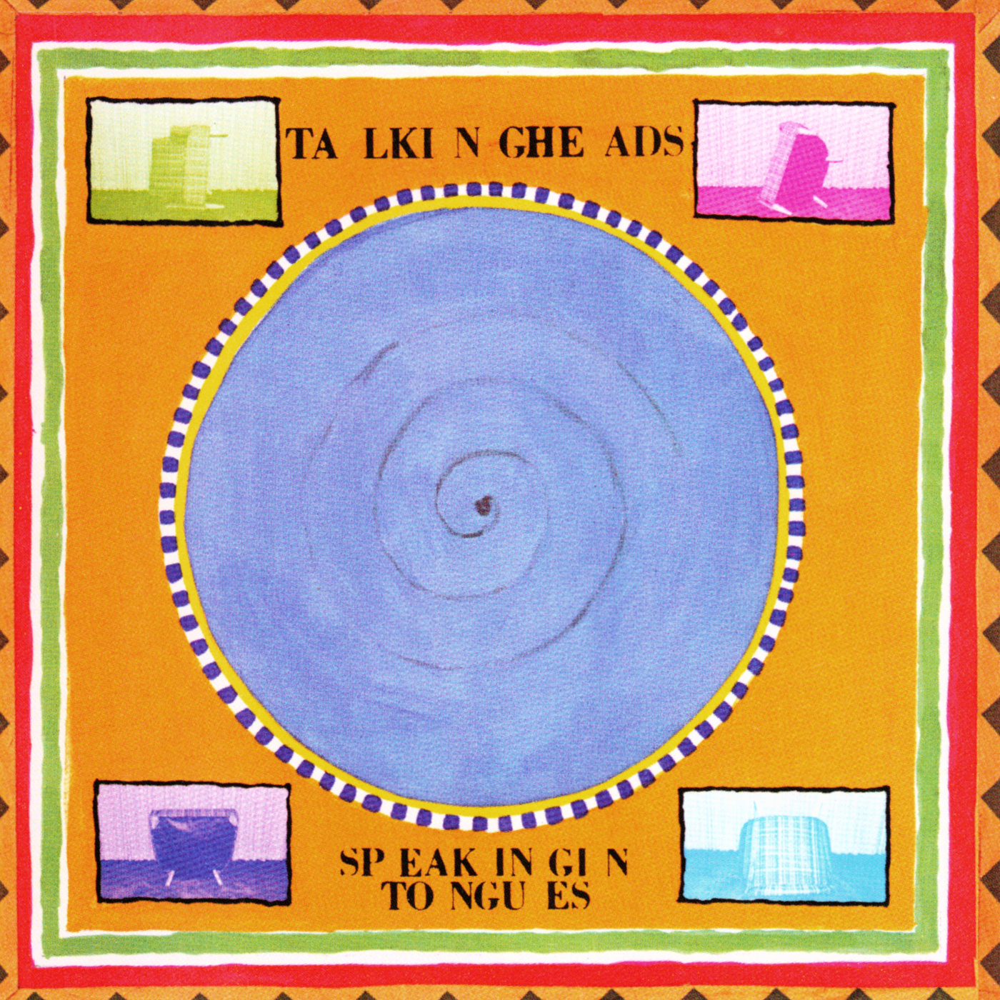

# Speaking in Tongues

By **Talking Heads**

## Album Data

- **Catalog:** Beets
- **Format:** Digital, Album
- **Album:** Speaking in Tongues
- **Artist:** Talking Heads
- **Albumartist:** Talking Heads
- **Genre:** Post-Punk
- **MusicBrainz Album Artist ID:** [a94a7155-c79d-4409-9fcf-220cb0e4dc3a](https://musicbrainz.org/artist/a94a7155-c79d-4409-9fcf-220cb0e4dc3a)
- **MusicBrainz Album ID:** [1932169a-607a-46c4-a611-3a8479c1b885](https://musicbrainz.org/release/1932169a-607a-46c4-a611-3a8479c1b885)
- **MusicBrainz Release Group ID:** [8a7a9db3-f87b-37d5-96a6-67485a8792e6](https://musicbrainz.org/release-group/8a7a9db3-f87b-37d5-96a6-67485a8792e6)
- **Year:** 1983
- **Catalog #:** M5 6036
- **Label:** Sire Records
- **Total Tracks:** 11

## Album Tracks

### Track 01 - Uh‐Oh, Love Comes to Town

- **Artist:** Talking Heads
- **Format:** MP3
- **Genre:** Post-Punk
- **Length:** 2:49
- **MusicBrainz Track ID:** [70906525-ffe6-43a2-8234-5f91fb7c4a6a](https://musicbrainz.org/recording/70906525-ffe6-43a2-8234-5f91fb7c4a6a)
- **Title:** Uh‐Oh, Love Comes to Town
- **Track:** 01
- **Year:** 1977

### Track 02 - New Feeling

- **Artist:** Talking Heads
- **Format:** MP3
- **Genre:** Post-Punk
- **Length:** 3:08
- **MusicBrainz Track ID:** [73b0f1e4-4e23-4d37-8050-4add501a34ac](https://musicbrainz.org/recording/73b0f1e4-4e23-4d37-8050-4add501a34ac)
- **Title:** New Feeling
- **Track:** 02
- **Year:** 1977

### Track 03 - Tentative Decisions

- **Artist:** Talking Heads
- **Format:** MP3
- **Genre:** Art Punk
- **Length:** 3:07
- **MusicBrainz Track ID:** [b544f960-f3be-4004-a80f-708e4ba86d7e](https://musicbrainz.org/recording/b544f960-f3be-4004-a80f-708e4ba86d7e)
- **Title:** Tentative Decisions
- **Track:** 03
- **Year:** 1977

### Track 04 - Happy Day

- **Artist:** Talking Heads
- **Format:** MP3
- **Genre:** New Wave
- **Length:** 3:55
- **MusicBrainz Track ID:** [0b5625ee-16c5-4963-bd34-fde86834316c](https://musicbrainz.org/recording/0b5625ee-16c5-4963-bd34-fde86834316c)
- **Title:** Happy Day
- **Track:** 04
- **Year:** 1977

### Track 05 - Who Is It?

- **Artist:** Talking Heads
- **Format:** MP3
- **Genre:** Art Punk
- **Length:** 1:44
- **MusicBrainz Track ID:** [ce818aca-5ac7-4f7e-9951-826e2f93d3da](https://musicbrainz.org/recording/ce818aca-5ac7-4f7e-9951-826e2f93d3da)
- **Title:** Who Is It?
- **Track:** 05
- **Year:** 1977

### Track 06 - No Compassion

- **Artist:** Talking Heads
- **Format:** MP3
- **Genre:** Post-Punk
- **Length:** 4:50
- **MusicBrainz Track ID:** [ca1ff042-d45e-4cae-b64a-f9089e10add8](https://musicbrainz.org/recording/ca1ff042-d45e-4cae-b64a-f9089e10add8)
- **Title:** No Compassion
- **Track:** 06
- **Year:** 1977

### Track 07 - The Book I Read

- **Artist:** Talking Heads
- **Format:** MP3
- **Genre:** Post-Punk
- **Length:** 4:09
- **MusicBrainz Track ID:** [37b36f38-5cda-46ab-b873-e8828224bea1](https://musicbrainz.org/recording/37b36f38-5cda-46ab-b873-e8828224bea1)
- **Title:** The Book I Read
- **Track:** 07
- **Year:** 1977

### Track 08 - Don’t Worry About the Government

- **Artist:** Talking Heads
- **Format:** MP3
- **Genre:** Art Punk
- **Length:** 3:01
- **MusicBrainz Track ID:** [ec39d906-6959-43e9-ac9f-637f13eb4741](https://musicbrainz.org/recording/ec39d906-6959-43e9-ac9f-637f13eb4741)
- **Title:** Don’t Worry About the Government
- **Track:** 08
- **Year:** 1977

### Track 09 - First Week/Last Week…Carefree

- **Artist:** Talking Heads
- **Format:** MP3
- **Genre:** Art Punk
- **Length:** 3:20
- **MusicBrainz Track ID:** [4eabad68-fa78-43d2-898e-416e36837016](https://musicbrainz.org/recording/4eabad68-fa78-43d2-898e-416e36837016)
- **Title:** First Week/Last Week…Carefree
- **Track:** 09
- **Year:** 1977

### Track 10 - Psycho Killer

- **Artist:** Talking Heads
- **Format:** MP3
- **Genre:** Post-Punk
- **Length:** 4:20
- **MusicBrainz Track ID:** [e66ea0ae-72e9-4471-a3ab-964b6c25696b](https://musicbrainz.org/recording/e66ea0ae-72e9-4471-a3ab-964b6c25696b)
- **Title:** Psycho Killer
- **Track:** 10
- **Year:** 1977

### Track 11 - Pulled Up

- **Artist:** Talking Heads
- **Format:** MP3
- **Genre:** Post-Punk
- **Length:** 4:29
- **MusicBrainz Track ID:** [6cac1aee-9804-454e-8828-c4c72e8493e4](https://musicbrainz.org/recording/6cac1aee-9804-454e-8828-c4c72e8493e4)
- **Title:** Pulled Up
- **Track:** 11
- **Year:** 1977

## See also

- [Chronology](Chronology.md)
- [Fear of Music](Fear_of_Music.md)
- [Little Creatures](Little_Creatures.md)
- [More Songs About Buildings and Food](More_Songs_About_Buildings_and_Food.md)
- [Naked](Naked.md)
- [Remain in Light](Remain_in_Light.md)
- [Talking Heads](Talking_Heads.md)
- [The Name of This Band Is Talking Heads](The_Name_of_This_Band_Is_Talking_Heads.md)
- [Roon: Fear of Music (Deluxe Version)](../../Roon/Talking_Heads/Fear_of_Music_Deluxe_Version.md)
- [Roon: Little Creatures (Deluxe Version)](../../Roon/Talking_Heads/Little_Creatures_Deluxe_Version.md)
- [Roon: More Songs About Buildings and Food](../../Roon/Talking_Heads/More_Songs_About_Buildings_and_Food.md)
- [Roon: Naked](../../Roon/Talking_Heads/Naked.md)
- [Roon: Remain In Light](../../Roon/Talking_Heads/Remain_In_Light.md)
- [Roon: Speaking in Tongues](../../Roon/Talking_Heads/Speaking_in_Tongues.md)
- [Roon: Stop Making Sense (Special New Edition) (Live)](../../Roon/Talking_Heads/Stop_Making_Sense_Special_New_Edition_Live.md)
- [Roon: Talking Heads](../../Roon/Talking_Heads/Talking_Heads-_77.md)
- [Roon: The Name of This Band Is Talking Heads (Expanded 2004 Remaster)](../../Roon/Talking_Heads/The_Name_of_This_Band_Is_Talking_Heads_Expanded_2004_Remaster.md)
- [Vinyl: Fear Of Music](../../Vinyl/Talking_Heads/Fear_Of_Music.md)
- [Vinyl: More Songs About Buildings And Food](../../Vinyl/Talking_Heads/More_Songs_About_Buildings_And_Food.md)
- [Vinyl: Speaking In Tongues](../../Vinyl/Talking_Heads/Speaking_In_Tongues.md)
- [Vinyl: ](../../Vinyl/Talking_Heads/Talking_Heads.md)
- [Vinyl: The Name Of This Band Is Talking Heads](../../Vinyl/Talking_Heads/The_Name_Of_This_Band_Is_Talking_Heads.md)
