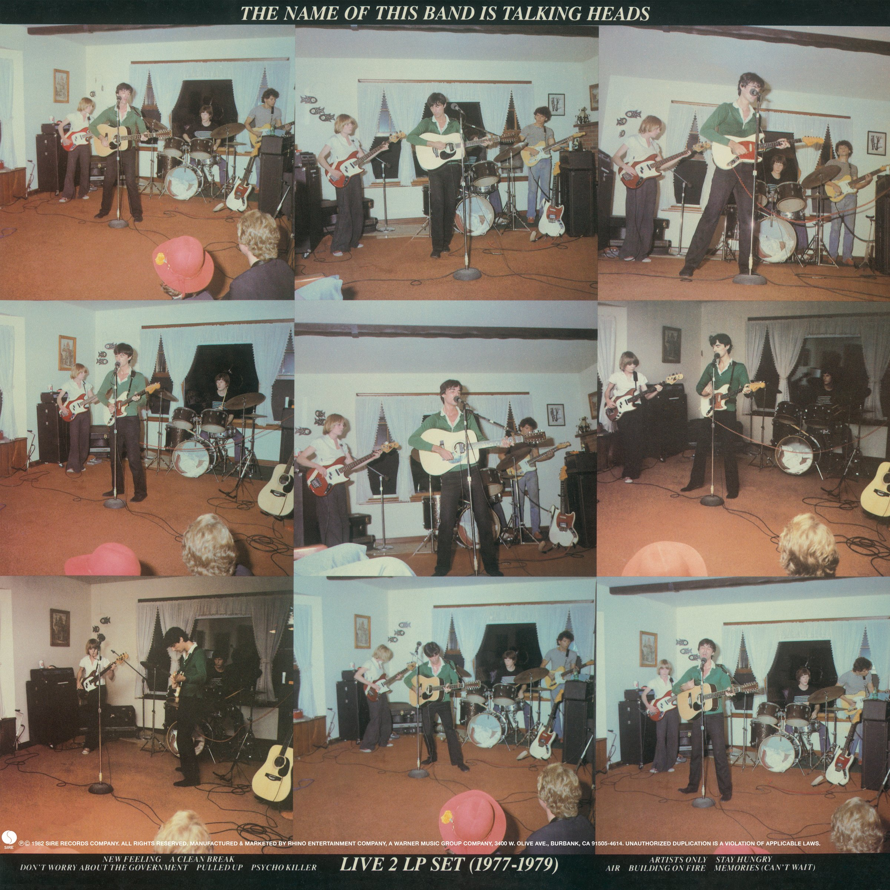

# The Name of This Band Is Talking Heads

By **Talking Heads**

## Album Data

- **Catalog:** Beets
- **Format:** Digital, Album
- **Album:** The Name of This Band Is Talking Heads
- **Artist:** Talking Heads
- **Albumartist:** Talking Heads
- **Genre:** Uk Garage
- **MusicBrainz Album Artist ID:** [a94a7155-c79d-4409-9fcf-220cb0e4dc3a](https://musicbrainz.org/artist/a94a7155-c79d-4409-9fcf-220cb0e4dc3a)
- **MusicBrainz Album ID:** [4cb22563-9b4c-3e9f-8db5-7c0763e4807f](https://musicbrainz.org/release/4cb22563-9b4c-3e9f-8db5-7c0763e4807f)
- **MusicBrainz Release Group ID:** [57a420f1-2b62-3b43-a1a8-cf7874d4b40d](https://musicbrainz.org/release-group/57a420f1-2b62-3b43-a1a8-cf7874d4b40d)
- **Year:** 2004
- **Catalog #:** R2 76489
- **Label:** Rhino
- **Total Tracks:** 33

## Album Tracks

### Track 01 - New Feeling

- **Artist:** Talking Heads
- **Format:** MP3
- **Genre:** Post-Punk
- **Length:** 3:10
- **MusicBrainz Track ID:** [8b0e514e-9fc7-481f-9563-9ed6fe8897f9](https://musicbrainz.org/recording/8b0e514e-9fc7-481f-9563-9ed6fe8897f9)
- **Title:** New Feeling
- **Track:** 01
- **Year:** 2004

### Track 02 - A Clean Break (Let’s Work)

- **Artist:** Talking Heads
- **Format:** MP3
- **Genre:** Uk Garage
- **Length:** 4:56
- **MusicBrainz Track ID:** [4457b80f-bf82-4464-b839-22c6e1ba85e9](https://musicbrainz.org/recording/4457b80f-bf82-4464-b839-22c6e1ba85e9)
- **Title:** A Clean Break (Let’s Work)
- **Track:** 02
- **Year:** 2004

### Track 03 - Don’t Worry About the Government

- **Artist:** Talking Heads
- **Format:** MP3
- **Genre:** Uk Garage
- **Length:** 3:07
- **MusicBrainz Track ID:** [2aed6e6f-382a-425f-89b2-cd231c1b349c](https://musicbrainz.org/recording/2aed6e6f-382a-425f-89b2-cd231c1b349c)
- **Title:** Don’t Worry About the Government
- **Track:** 03
- **Year:** 2004

### Track 04 - Pulled Up

- **Artist:** Talking Heads
- **Format:** MP3
- **Genre:** Post-Punk
- **Length:** 4:08
- **MusicBrainz Track ID:** [ff495b19-2df7-4b68-aed6-ff7930c187aa](https://musicbrainz.org/recording/ff495b19-2df7-4b68-aed6-ff7930c187aa)
- **Title:** Pulled Up
- **Track:** 04
- **Year:** 2004

### Track 05 - Psycho Killer

- **Artist:** Talking Heads
- **Format:** MP3
- **Genre:** Post-Punk
- **Length:** 5:30
- **MusicBrainz Track ID:** [641b11c9-2126-4db7-b06a-25068245e199](https://musicbrainz.org/recording/641b11c9-2126-4db7-b06a-25068245e199)
- **Title:** Psycho Killer
- **Track:** 05
- **Year:** 2004

### Track 06 - Who Is It?

- **Artist:** Talking Heads
- **Format:** MP3
- **Genre:** Art Punk
- **Length:** 1:42
- **MusicBrainz Track ID:** [08f96b1c-90cc-4bba-9a55-4c01c1aea4b6](https://musicbrainz.org/recording/08f96b1c-90cc-4bba-9a55-4c01c1aea4b6)
- **Title:** Who Is It?
- **Track:** 06
- **Year:** 2004

### Track 07 - The Book I Read

- **Artist:** Talking Heads
- **Format:** MP3
- **Genre:** Post-Punk
- **Length:** 4:24
- **MusicBrainz Track ID:** [b8e78a83-1a2f-471e-a14d-4364d04c77fd](https://musicbrainz.org/recording/b8e78a83-1a2f-471e-a14d-4364d04c77fd)
- **Title:** The Book I Read
- **Track:** 07
- **Year:** 2004

### Track 08 - The Big Country

- **Artist:** Talking Heads
- **Format:** MP3
- **Genre:** Post-Punk
- **Length:** 5:10
- **MusicBrainz Track ID:** [db01235f-550d-49e5-899b-0115ee7f2844](https://musicbrainz.org/recording/db01235f-550d-49e5-899b-0115ee7f2844)
- **Title:** The Big Country
- **Track:** 08
- **Year:** 2004

### Track 09 - I’m Not in Love

- **Artist:** Talking Heads
- **Format:** MP3
- **Genre:** Uk Garage
- **Length:** 4:57
- **MusicBrainz Track ID:** [29fd3769-3594-4557-970f-364fc38017b1](https://musicbrainz.org/recording/29fd3769-3594-4557-970f-364fc38017b1)
- **Title:** I’m Not in Love
- **Track:** 09
- **Year:** 2004

### Track 10 - The Girls Want to Be With the Girls

- **Artist:** Talking Heads
- **Format:** MP3
- **Genre:** Uk Garage
- **Length:** 3:44
- **MusicBrainz Track ID:** [1260d688-4d61-4d0c-836f-3831ed23917b](https://musicbrainz.org/recording/1260d688-4d61-4d0c-836f-3831ed23917b)
- **Title:** The Girls Want to Be With the Girls
- **Track:** 10
- **Year:** 2004

### Track 11 - Electricity (Drugs)

- **Artist:** Talking Heads
- **Format:** MP3
- **Genre:** Post-Punk
- **Length:** 3:28
- **MusicBrainz Track ID:** [33f746e9-8b69-41a7-843d-5c75dcb5b332](https://musicbrainz.org/recording/33f746e9-8b69-41a7-843d-5c75dcb5b332)
- **Title:** Electricity (Drugs)
- **Track:** 11
- **Year:** 2004

### Track 12 - Found a Job

- **Artist:** Talking Heads
- **Format:** MP3
- **Genre:** Uk Garage
- **Length:** 5:35
- **MusicBrainz Track ID:** [ac45b152-e0a6-4a72-9c4e-9d98acc620bd](https://musicbrainz.org/recording/ac45b152-e0a6-4a72-9c4e-9d98acc620bd)
- **Title:** Found a Job
- **Track:** 12
- **Year:** 2004

### Track 13 - Mind

- **Artist:** Talking Heads
- **Format:** MP3
- **Genre:** Post-Punk
- **Length:** 4:55
- **MusicBrainz Track ID:** [6233bb03-b3b1-499c-8eec-2a8bda330693](https://musicbrainz.org/recording/6233bb03-b3b1-499c-8eec-2a8bda330693)
- **Title:** Mind
- **Track:** 13
- **Year:** 2004

### Track 14 - Artists Only

- **Artist:** Talking Heads
- **Format:** MP3
- **Genre:** Post-Punk
- **Length:** 3:50
- **MusicBrainz Track ID:** [29e3d5d4-4531-4ad8-8857-4a5ed60fc86f](https://musicbrainz.org/recording/29e3d5d4-4531-4ad8-8857-4a5ed60fc86f)
- **Title:** Artists Only
- **Track:** 14
- **Year:** 2004

### Track 15 - Stay Hungry

- **Artist:** Talking Heads
- **Format:** MP3
- **Genre:** Post-Punk
- **Length:** 4:05
- **MusicBrainz Track ID:** [dbf83377-fb0e-4e45-a389-97714c19a4a7](https://musicbrainz.org/recording/dbf83377-fb0e-4e45-a389-97714c19a4a7)
- **Title:** Stay Hungry
- **Track:** 15
- **Year:** 2004

### Track 16 - Air

- **Artist:** Talking Heads
- **Format:** MP3
- **Genre:** Post-Punk
- **Length:** 4:01
- **MusicBrainz Track ID:** [b663867a-791b-47a1-b7e5-6f777dadf149](https://musicbrainz.org/recording/b663867a-791b-47a1-b7e5-6f777dadf149)
- **Title:** Air
- **Track:** 16
- **Year:** 2004

### Track 17 - Love → Building on Fire

- **Artist:** Talking Heads
- **Format:** MP3
- **Genre:** Post-Punk
- **Length:** 3:47
- **MusicBrainz Track ID:** [d34fbd66-1f68-4dd5-90c6-78f29269c6df](https://musicbrainz.org/recording/d34fbd66-1f68-4dd5-90c6-78f29269c6df)
- **Title:** Love → Building on Fire
- **Track:** 17
- **Year:** 2004

### Track 18 - Memories (Can’t Wait)

- **Artist:** Talking Heads
- **Format:** MP3
- **Genre:** Uk Garage
- **Length:** 3:43
- **MusicBrainz Track ID:** [d901d21c-9864-4bcd-a7d6-851c8060138e](https://musicbrainz.org/recording/d901d21c-9864-4bcd-a7d6-851c8060138e)
- **Title:** Memories (Can’t Wait)
- **Track:** 18
- **Year:** 2004

### Track 19 - Heaven

- **Artist:** Talking Heads
- **Format:** MP3
- **Genre:** Post-Punk
- **Length:** 4:31
- **MusicBrainz Track ID:** [5336a56a-e00e-4758-b14f-949078153d7d](https://musicbrainz.org/recording/5336a56a-e00e-4758-b14f-949078153d7d)
- **Title:** Heaven
- **Track:** 19
- **Year:** 2004

### Track 20 - Psycho Killer

- **Artist:** Talking Heads
- **Format:** MP3
- **Genre:** Post-Punk
- **Length:** 5:34
- **MusicBrainz Track ID:** [812744d3-7cc6-4981-8dc4-0be7d72783f6](https://musicbrainz.org/recording/812744d3-7cc6-4981-8dc4-0be7d72783f6)
- **Title:** Psycho Killer
- **Track:** 20
- **Year:** 2004

### Track 21 - Warning Sign

- **Artist:** Talking Heads
- **Format:** MP3
- **Genre:** Post-Punk
- **Length:** 5:40
- **MusicBrainz Track ID:** [889747cd-130d-40c5-aed1-e669bcbce1f9](https://musicbrainz.org/recording/889747cd-130d-40c5-aed1-e669bcbce1f9)
- **Title:** Warning Sign
- **Track:** 21
- **Year:** 2004

### Track 22 - Stay Hungry

- **Artist:** Talking Heads
- **Format:** MP3
- **Genre:** Post-Punk
- **Length:** 3:56
- **MusicBrainz Track ID:** [e08ecd61-f245-418e-9f85-b8ec7fcb93b3](https://musicbrainz.org/recording/e08ecd61-f245-418e-9f85-b8ec7fcb93b3)
- **Title:** Stay Hungry
- **Track:** 22
- **Year:** 2004

### Track 23 - Cities

- **Artist:** Talking Heads
- **Format:** MP3
- **Genre:** Uk Garage
- **Length:** 5:00
- **MusicBrainz Track ID:** [8b5f9f0d-7076-4901-b084-cfaf0eef7202](https://musicbrainz.org/recording/8b5f9f0d-7076-4901-b084-cfaf0eef7202)
- **Title:** Cities
- **Track:** 23
- **Year:** 2004

### Track 24 - I Zimbra

- **Artist:** Talking Heads
- **Format:** MP3
- **Genre:** Post-Punk
- **Length:** 3:30
- **MusicBrainz Track ID:** [93839387-3a50-467f-a0e6-cbf0557356f2](https://musicbrainz.org/recording/93839387-3a50-467f-a0e6-cbf0557356f2)
- **Title:** I Zimbra
- **Track:** 24
- **Year:** 2004

### Track 25 - Drugs (Electricity)

- **Artist:** Talking Heads
- **Format:** MP3
- **Genre:** Post-Punk
- **Length:** 4:41
- **MusicBrainz Track ID:** [ce1f0d56-8da5-4f10-ab2f-4c170ca0f8f2](https://musicbrainz.org/recording/ce1f0d56-8da5-4f10-ab2f-4c170ca0f8f2)
- **Title:** Drugs (Electricity)
- **Track:** 25
- **Year:** 2004

### Track 26 - Once in a Lifetime

- **Artist:** Talking Heads
- **Format:** MP3
- **Genre:** Post-Punk
- **Length:** 5:57
- **MusicBrainz Track ID:** [21cc5cb4-381d-4116-884f-f06ccf64763f](https://musicbrainz.org/recording/21cc5cb4-381d-4116-884f-f06ccf64763f)
- **Title:** Once in a Lifetime
- **Track:** 26
- **Year:** 2004

### Track 27 - Animals

- **Artist:** Talking Heads
- **Format:** MP3
- **Genre:** Post-Punk
- **Length:** 4:05
- **MusicBrainz Track ID:** [1824db4b-8e23-4322-9c54-33fee5e295c4](https://musicbrainz.org/recording/1824db4b-8e23-4322-9c54-33fee5e295c4)
- **Title:** Animals
- **Track:** 27
- **Year:** 2004

### Track 28 - Houses in Motion

- **Artist:** Talking Heads
- **Format:** MP3
- **Genre:** Post-Punk
- **Length:** 6:54
- **MusicBrainz Track ID:** [26ce88a2-703c-48ae-b68b-ca98315df7e6](https://musicbrainz.org/recording/26ce88a2-703c-48ae-b68b-ca98315df7e6)
- **Title:** Houses in Motion
- **Track:** 28
- **Year:** 2004

### Track 29 - Born Under Punches (The Heat Goes On)

- **Artist:** Talking Heads
- **Format:** MP3
- **Genre:** Post-Punk
- **Length:** 8:24
- **MusicBrainz Track ID:** [f62f437c-3cc5-4af5-96e9-b0c99e423ee1](https://musicbrainz.org/recording/f62f437c-3cc5-4af5-96e9-b0c99e423ee1)
- **Title:** Born Under Punches (The Heat Goes On)
- **Track:** 29
- **Year:** 2004

### Track 30 - Crosseyed and Painless

- **Artist:** Talking Heads
- **Format:** MP3
- **Genre:** Post-Punk
- **Length:** 5:58
- **MusicBrainz Track ID:** [d2439c8d-9941-472d-adbf-4dc8d9d10905](https://musicbrainz.org/recording/d2439c8d-9941-472d-adbf-4dc8d9d10905)
- **Title:** Crosseyed and Painless
- **Track:** 30
- **Year:** 2004

### Track 31 - Life During Wartime

- **Artist:** Talking Heads
- **Format:** MP3
- **Genre:** Post-Punk
- **Length:** 4:54
- **MusicBrainz Track ID:** [26804acd-eb9d-4296-b4da-8e0afb005b18](https://musicbrainz.org/recording/26804acd-eb9d-4296-b4da-8e0afb005b18)
- **Title:** Life During Wartime
- **Track:** 31
- **Year:** 2004

### Track 32 - Take Me to the River

- **Artist:** Talking Heads
- **Format:** MP3
- **Genre:** Post-Punk
- **Length:** 6:33
- **MusicBrainz Track ID:** [49271643-62c5-4bee-83af-d17fd4aa2573](https://musicbrainz.org/recording/49271643-62c5-4bee-83af-d17fd4aa2573)
- **Title:** Take Me to the River
- **Track:** 32
- **Year:** 2004

### Track 33 - The Great Curve

- **Artist:** Talking Heads
- **Format:** MP3
- **Genre:** Post-Punk
- **Length:** 6:40
- **MusicBrainz Track ID:** [d13c1999-3e5e-4c75-ab44-a68af8543958](https://musicbrainz.org/recording/d13c1999-3e5e-4c75-ab44-a68af8543958)
- **Title:** The Great Curve
- **Track:** 33
- **Year:** 2004

## See also

- [Chronology](Chronology.md)
- [Fear of Music](Fear_of_Music.md)
- [Little Creatures](Little_Creatures.md)
- [More Songs About Buildings and Food](More_Songs_About_Buildings_and_Food.md)
- [Naked](Naked.md)
- [Remain in Light](Remain_in_Light.md)
- [Speaking in Tongues](Speaking_in_Tongues.md)
- [Talking Heads](Talking_Heads.md)
- [Roon: Fear of Music (Deluxe Version)](../../Roon/Talking_Heads/Fear_of_Music_Deluxe_Version.md)
- [Roon: Little Creatures (Deluxe Version)](../../Roon/Talking_Heads/Little_Creatures_Deluxe_Version.md)
- [Roon: More Songs About Buildings and Food](../../Roon/Talking_Heads/More_Songs_About_Buildings_and_Food.md)
- [Roon: Naked](../../Roon/Talking_Heads/Naked.md)
- [Roon: Remain In Light](../../Roon/Talking_Heads/Remain_In_Light.md)
- [Roon: Speaking in Tongues](../../Roon/Talking_Heads/Speaking_in_Tongues.md)
- [Roon: Stop Making Sense (Special New Edition) (Live)](../../Roon/Talking_Heads/Stop_Making_Sense_Special_New_Edition_Live.md)
- [Roon: Talking Heads](../../Roon/Talking_Heads/Talking_Heads-_77.md)
- [Roon: The Name of This Band Is Talking Heads (Expanded 2004 Remaster)](../../Roon/Talking_Heads/The_Name_of_This_Band_Is_Talking_Heads_Expanded_2004_Remaster.md)
- [Vinyl: Fear Of Music](../../Vinyl/Talking_Heads/Fear_Of_Music.md)
- [Vinyl: More Songs About Buildings And Food](../../Vinyl/Talking_Heads/More_Songs_About_Buildings_And_Food.md)
- [Vinyl: Speaking In Tongues](../../Vinyl/Talking_Heads/Speaking_In_Tongues.md)
- [Vinyl: ](../../Vinyl/Talking_Heads/Talking_Heads.md)
- [Vinyl: The Name Of This Band Is Talking Heads](../../Vinyl/Talking_Heads/The_Name_Of_This_Band_Is_Talking_Heads.md)
