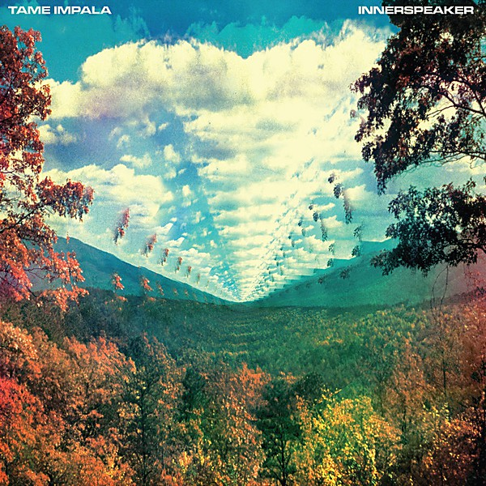

# InnerSpeaker

By **Tame Impala**

## Album Data

- **Catalog:** Beets
- **Format:** Digital, Album
- **Album:** InnerSpeaker
- **Artist:** Tame Impala
- **Albumartist:** Tame Impala
- **Genre:** Neo-Psychedelia
- **MusicBrainz Album Artist ID:** [63aa26c3-d59b-4da4-84ac-716b54f1ef4d](https://musicbrainz.org/artist/63aa26c3-d59b-4da4-84ac-716b54f1ef4d)
- **MusicBrainz Album ID:** [764c4a0f-254d-440f-9eaa-56aefa5a6434](https://musicbrainz.org/release/764c4a0f-254d-440f-9eaa-56aefa5a6434)
- **MusicBrainz Release Group ID:** [0cfdeff7-4aa7-4df4-918d-88c9421cc512](https://musicbrainz.org/release-group/0cfdeff7-4aa7-4df4-918d-88c9421cc512)
- **Year:** 2018
- **Catalog #:** [none]
- **Label:** Universal Music Australia
- **Total Tracks:** 11

## Album Tracks

### Track 01 - It Is Not Meant to Be

- **Artist:** Tame Impala
- **Format:** MP3
- **Genre:** Indie Rock
- **Length:** 5:21
- **MusicBrainz Track ID:** [32f7093f-b29c-4626-aceb-2270e1db9d77](https://musicbrainz.org/recording/32f7093f-b29c-4626-aceb-2270e1db9d77)
- **Title:** It Is Not Meant to Be
- **Track:** 01
- **Year:** 2018

### Track 02 - Desire Be Desire Go

- **Artist:** Tame Impala
- **Format:** MP3
- **Genre:** Indie Rock
- **Length:** 4:26
- **MusicBrainz Track ID:** [3368975e-1af1-43f1-99e8-3b4d82a00823](https://musicbrainz.org/recording/3368975e-1af1-43f1-99e8-3b4d82a00823)
- **Title:** Desire Be Desire Go
- **Track:** 02
- **Year:** 2018

### Track 03 - Alter Ego

- **Artist:** Tame Impala
- **Format:** MP3
- **Genre:** Neo-Psychedelia
- **Length:** 4:47
- **MusicBrainz Track ID:** [7a7f8825-532a-4586-93e4-8edfe3c958de](https://musicbrainz.org/recording/7a7f8825-532a-4586-93e4-8edfe3c958de)
- **Title:** Alter Ego
- **Track:** 03
- **Year:** 2018

### Track 04 - Lucidity

- **Artist:** Tame Impala
- **Format:** MP3
- **Genre:** Neo-Psychedelia
- **Length:** 4:31
- **MusicBrainz Track ID:** [4ca701d7-a55a-4b24-933a-303e8d4e01d5](https://musicbrainz.org/recording/4ca701d7-a55a-4b24-933a-303e8d4e01d5)
- **Title:** Lucidity
- **Track:** 04
- **Year:** 2018

### Track 05 - Why Won’t You Make Up Your Mind?

- **Artist:** Tame Impala
- **Format:** MP3
- **Genre:** Neo-Psychedelia
- **Length:** 3:19
- **MusicBrainz Track ID:** [db644461-3d63-4b80-9a95-435ccef31243](https://musicbrainz.org/recording/db644461-3d63-4b80-9a95-435ccef31243)
- **Title:** Why Won’t You Make Up Your Mind?
- **Track:** 05
- **Year:** 2018

### Track 06 - Solitude Is Bliss

- **Artist:** Tame Impala
- **Format:** MP3
- **Genre:** Indie Rock
- **Length:** 3:55
- **MusicBrainz Track ID:** [4d4525cb-1c7b-4b38-b859-758443c0727a](https://musicbrainz.org/recording/4d4525cb-1c7b-4b38-b859-758443c0727a)
- **Title:** Solitude Is Bliss
- **Track:** 06
- **Year:** 2018

### Track 07 - Jeremy’s Storm

- **Artist:** Tame Impala
- **Format:** MP3
- **Genre:** Neo-Psychedelia
- **Length:** 5:28
- **MusicBrainz Track ID:** [5354f80a-9e4b-4641-a049-323c366464a2](https://musicbrainz.org/recording/5354f80a-9e4b-4641-a049-323c366464a2)
- **Title:** Jeremy’s Storm
- **Track:** 07
- **Year:** 2018

### Track 08 - Expectation

- **Artist:** Tame Impala
- **Format:** MP3
- **Genre:** Neo-Psychedelia
- **Length:** 6:02
- **MusicBrainz Track ID:** [fff0f746-1095-458b-8975-15901cbb8c7d](https://musicbrainz.org/recording/fff0f746-1095-458b-8975-15901cbb8c7d)
- **Title:** Expectation
- **Track:** 08
- **Year:** 2018

### Track 09 - The Bold Arrow of Time

- **Artist:** Tame Impala
- **Format:** MP3
- **Genre:** Stoner Rock
- **Length:** 3:48
- **MusicBrainz Track ID:** [919f7476-c4fb-4ec5-9e00-c4f21746d336](https://musicbrainz.org/recording/919f7476-c4fb-4ec5-9e00-c4f21746d336)
- **Title:** The Bold Arrow of Time
- **Track:** 09
- **Year:** 2018

### Track 10 - Runway Houses City Clouds

- **Artist:** Tame Impala
- **Format:** MP3
- **Genre:** Indie Rock
- **Length:** 7:15
- **MusicBrainz Track ID:** [041ee6fd-12c0-4f34-a4a0-77425410bdc5](https://musicbrainz.org/recording/041ee6fd-12c0-4f34-a4a0-77425410bdc5)
- **Title:** Runway Houses City Clouds
- **Track:** 10
- **Year:** 2018

### Track 11 - I Don’t Really Mind

- **Artist:** Tame Impala
- **Format:** MP3
- **Genre:** Psychedelic Rock
- **Length:** 3:45
- **MusicBrainz Track ID:** [54f6ce65-45cd-4145-ab9a-a505eb3580a4](https://musicbrainz.org/recording/54f6ce65-45cd-4145-ab9a-a505eb3580a4)
- **Title:** I Don’t Really Mind
- **Track:** 11
- **Year:** 2018

## See also

- [Roon: Currents](../../Roon/Tame_Impala/Currents.md)
- [Roon: InnerSpeaker](../../Roon/Tame_Impala/InnerSpeaker.md)
- [Roon: Lonerism](../../Roon/Tame_Impala/Lonerism.md)
- [Roon: The Slow Rush](../../Roon/Tame_Impala/The_Slow_Rush.md)
- [Vinyl: Innerspeaker](../../Vinyl/Tame_Impala/Innerspeaker.md)
- [Vinyl: ](../../Vinyl/Tame_Impala/Tame_Impala.md)
