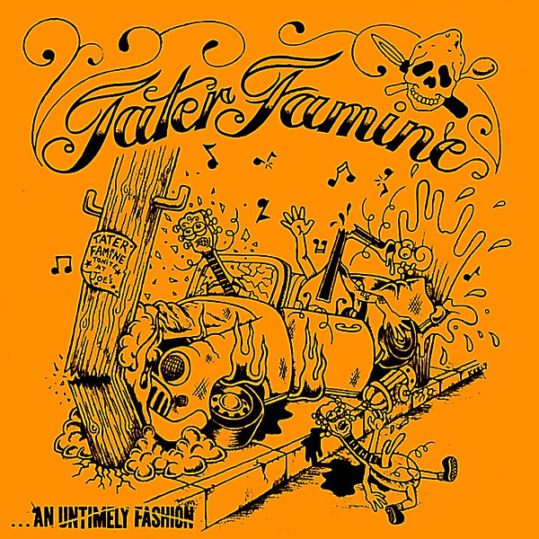

# An Untimely Fashion

By **Tater Famine**

## Album Data

- **Catalog:** Beets
- **Format:** Digital, Album
- **Album:** An Untimely Fashion
- **Artist:** Tater Famine
- **Albumartist:** Tater Famine
- **Genre:** Rockabilly
- **MusicBrainz Album Artist ID:** 
- **MusicBrainz Album ID:** 
- **MusicBrainz Release Group ID:** 
- **Year:** 2008
- **Catalog #:** 
- **Label:** 
- **Total Tracks:** 12

## Album Tracks

### Track 01 - Man In Shadows

- **Artist:** Tater Famine
- **Format:** ALAC
- **Genre:** Rockabilly
- **Length:** 3:32
- **MusicBrainz Track ID:** 
- **Title:** Man In Shadows
- **Track:** 01
- **Year:** 2008

### Track 02 - Memwars of Strateegery

- **Artist:** Tater Famine
- **Format:** ALAC
- **Genre:** Rockabilly
- **Length:** 2:49
- **MusicBrainz Track ID:** 
- **Title:** Memwars of Strateegery
- **Track:** 02
- **Year:** 2008

### Track 03 - Built On You

- **Artist:** Tater Famine
- **Format:** ALAC
- **Genre:** Rockabilly
- **Length:** 3:21
- **MusicBrainz Track ID:** 
- **Title:** Built On You
- **Track:** 03
- **Year:** 2008

### Track 04 - Pourin' Down

- **Artist:** Tater Famine
- **Format:** ALAC
- **Genre:** Rockabilly
- **Length:** 4:16
- **MusicBrainz Track ID:** 
- **Title:** Pourin' Down
- **Track:** 04
- **Year:** 2008

### Track 05 - Little Devils

- **Artist:** Tater Famine
- **Format:** ALAC
- **Genre:** Rockabilly
- **Length:** 3:57
- **MusicBrainz Track ID:** 
- **Title:** Little Devils
- **Track:** 05
- **Year:** 2008

### Track 06 - Mama

- **Artist:** Tater Famine
- **Format:** ALAC
- **Genre:** Rockabilly
- **Length:** 3:25
- **MusicBrainz Track ID:** 
- **Title:** Mama
- **Track:** 06
- **Year:** 2008

### Track 07 - The Write Off

- **Artist:** Tater Famine
- **Format:** ALAC
- **Genre:** Rockabilly
- **Length:** 2:42
- **MusicBrainz Track ID:** 
- **Title:** The Write Off
- **Track:** 07
- **Year:** 2008

### Track 08 - Say It Straight

- **Artist:** Tater Famine
- **Format:** ALAC
- **Genre:** Rockabilly
- **Length:** 3:33
- **MusicBrainz Track ID:** 
- **Title:** Say It Straight
- **Track:** 08
- **Year:** 2008

### Track 09 - Spare Change

- **Artist:** Tater Famine
- **Format:** ALAC
- **Genre:** Rockabilly
- **Length:** 3:38
- **MusicBrainz Track ID:** 
- **Title:** Spare Change
- **Track:** 09
- **Year:** 2008

### Track 10 - Lost Boys

- **Artist:** Tater Famine
- **Format:** ALAC
- **Genre:** Rockabilly
- **Length:** 3:14
- **MusicBrainz Track ID:** 
- **Title:** Lost Boys
- **Track:** 10
- **Year:** 2008

### Track 11 - Hot Air Balloon Race

- **Artist:** Tater Famine
- **Format:** ALAC
- **Genre:** Rockabilly
- **Length:** 4:12
- **MusicBrainz Track ID:** 
- **Title:** Hot Air Balloon Race
- **Track:** 11
- **Year:** 2008

### Track 12 - Sweet Mary

- **Artist:** Tater Famine
- **Format:** ALAC
- **Genre:** Rockabilly
- **Length:** 5:37
- **MusicBrainz Track ID:** 
- **Title:** Sweet Mary
- **Track:** 12
- **Year:** 2008

