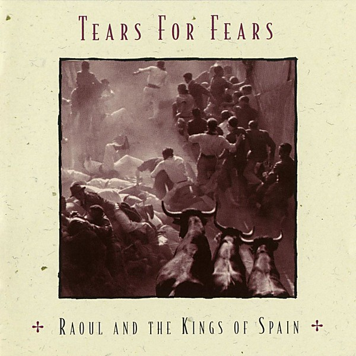

# Raoul and the Kings of Spain

By **Tears for Fears**

## Album Data

- **Catalog:** Beets
- **Format:** Digital, Album
- **Album:** Raoul and the Kings of Spain
- **Artist:** Tears For Fears
- **Albumartist:** Tears for Fears
- **Genre:** Progressive Rock
- **MusicBrainz Album Artist ID:** [7c7f9c94-dee8-4903-892b-6cf44652e2de](https://musicbrainz.org/artist/7c7f9c94-dee8-4903-892b-6cf44652e2de)
- **MusicBrainz Album ID:** [0d9d8008-f451-3ac3-bb01-181bfaf43862](https://musicbrainz.org/release/0d9d8008-f451-3ac3-bb01-181bfaf43862)
- **MusicBrainz Release Group ID:** [dd7b9d70-7df7-31af-a147-10c6cd2ecc53](https://musicbrainz.org/release-group/dd7b9d70-7df7-31af-a147-10c6cd2ecc53)
- **Year:** 1995
- **Catalog #:** 
- **Label:** 
- **Total Tracks:** 00

## Album Tracks

### Track 00 - Shout

- **Artist:** Tears for Fears
- **Format:** AAC
- **Genre:** Synthpop
- **Length:** 4:05
- **MusicBrainz Track ID:** 
- **Title:** Shout
- **Track:** 00
- **Year:** 1985

### Track 01 - Shout

- **Artist:** Tears For Fears
- **Format:** ALAC
- **Genre:** Synthpop
- **Length:** 6:33
- **MusicBrainz Track ID:** 
- **Title:** Shout
- **Track:** 01
- **Year:** 1985

### Track 02 - The Working Hour

- **Artist:** Tears For Fears
- **Format:** ALAC
- **Genre:** New Wave
- **Length:** 6:31
- **MusicBrainz Track ID:** 
- **Title:** The Working Hour
- **Track:** 02
- **Year:** 1985

### Track 03 - Everybody Wants To Rule The World

- **Artist:** Tears For Fears
- **Format:** ALAC
- **Genre:** New Wave
- **Length:** 4:11
- **MusicBrainz Track ID:** 
- **Title:** Everybody Wants To Rule The World
- **Track:** 03
- **Year:** 1985

### Track 04 - Mothers Talk

- **Artist:** Tears For Fears
- **Format:** ALAC
- **Genre:** Synthpop
- **Length:** 5:06
- **MusicBrainz Track ID:** 
- **Title:** Mothers Talk
- **Track:** 04
- **Year:** 1985

### Track 05 - I Believe

- **Artist:** Tears For Fears
- **Format:** ALAC
- **Genre:** New Wave
- **Length:** 4:54
- **MusicBrainz Track ID:** 
- **Title:** I Believe
- **Track:** 05
- **Year:** 1985

### Track 06 - Broken

- **Artist:** Tears For Fears
- **Format:** ALAC
- **Genre:** Synthpop
- **Length:** 2:38
- **MusicBrainz Track ID:** 
- **Title:** Broken
- **Track:** 06
- **Year:** 1985

### Track 07 - Head Over Heals / Broken [Live]

- **Artist:** Tears For Fears
- **Format:** ALAC
- **Genre:** New Wave
- **Length:** 5:02
- **MusicBrainz Track ID:** 
- **Title:** Head Over Heals / Broken [Live]
- **Track:** 07
- **Year:** 1985

### Track 08 - Listen

- **Artist:** Tears For Fears
- **Format:** ALAC
- **Genre:** Synthpop
- **Length:** 6:54
- **MusicBrainz Track ID:** 
- **Title:** Listen
- **Track:** 08
- **Year:** 1985

### Track 09 - The Big Chair

- **Artist:** Tears For Fears
- **Format:** ALAC
- **Genre:** New Wave
- **Length:** 3:21
- **MusicBrainz Track ID:** 
- **Title:** The Big Chair
- **Track:** 09
- **Year:** 1985

### Track 10 - Empire Building

- **Artist:** Tears For Fears
- **Format:** ALAC
- **Genre:** New Wave
- **Length:** 2:52
- **MusicBrainz Track ID:** 
- **Title:** Empire Building
- **Track:** 10
- **Year:** 1985

### Track 11 - The Marauders

- **Artist:** Tears For Fears
- **Format:** ALAC
- **Genre:** New Wave
- **Length:** 4:16
- **MusicBrainz Track ID:** 
- **Title:** The Marauders
- **Track:** 11
- **Year:** 1985

### Track 12 - Broken Revisited

- **Artist:** Tears For Fears
- **Format:** ALAC
- **Genre:** New Wave
- **Length:** 5:16
- **MusicBrainz Track ID:** 
- **Title:** Broken Revisited
- **Track:** 12
- **Year:** 1985

### Track 13 - The Conflict

- **Artist:** Tears For Fears
- **Format:** ALAC
- **Genre:** New Wave
- **Length:** 4:05
- **MusicBrainz Track ID:** 
- **Title:** The Conflict
- **Track:** 13
- **Year:** 1985

### Track 14 - Mothers Talk [U.S. Remix]

- **Artist:** Tears For Fears
- **Format:** ALAC
- **Genre:** New Wave
- **Length:** 4:13
- **MusicBrainz Track ID:** 
- **Title:** Mothers Talk [U.S. Remix]
- **Track:** 14
- **Year:** 1985

### Track 15 - Shout [U.S. Remix]

- **Artist:** Tears For Fears
- **Format:** ALAC
- **Genre:** Synthpop
- **Length:** 8:02
- **MusicBrainz Track ID:** 
- **Title:** Shout [U.S. Remix]
- **Track:** 15
- **Year:** 1984

## See also

- [Songs from the Big Chair](Songs_from_the_Big_Chair.md)
- [The Hurting](The_Hurting.md)
- [The Seeds of Love](The_Seeds_of_Love.md)
