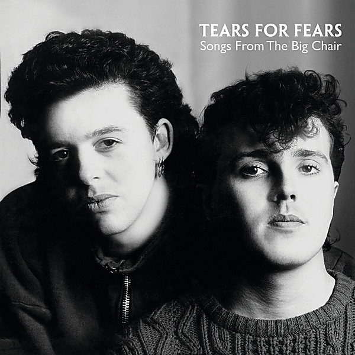

# Songs from the Big Chair

By **Tears For Fears**

## Album Data

- **Catalog:** Beets
- **Format:** Digital, Album
- **Album:** Songs from the Big Chair
- **Artist:** Tears For Fears
- **Albumartist:** Tears For Fears
- **Genre:** Synthpop
- **MusicBrainz Album Artist ID:** 
- **MusicBrainz Album ID:** 
- **MusicBrainz Release Group ID:** 
- **Year:** 1985
- **Catalog #:** 
- **Label:** 
- **Total Tracks:** 14

## Album Tracks

### Track 01 - The Hurting

- **Artist:** Tears for Fears
- **Format:** ALAC
- **Genre:** Synthpop
- **Length:** 4:19
- **MusicBrainz Track ID:** [7872762c-ca6e-4a90-b1ef-4e6df425ac82](https://musicbrainz.org/recording/7872762c-ca6e-4a90-b1ef-4e6df425ac82)
- **Title:** The Hurting
- **Track:** 01
- **Year:** 2000

### Track 02 - Mad World

- **Artist:** Tears for Fears
- **Format:** ALAC
- **Genre:** Synthpop
- **Length:** 3:35
- **MusicBrainz Track ID:** [5f2aabea-b214-4567-a8a9-89ed787b0001](https://musicbrainz.org/recording/5f2aabea-b214-4567-a8a9-89ed787b0001)
- **Title:** Mad World
- **Track:** 02
- **Year:** 2000

### Track 03 - Pale Shelter

- **Artist:** Tears for Fears
- **Format:** ALAC
- **Genre:** Synthpop
- **Length:** 4:34
- **MusicBrainz Track ID:** [8f0cbccd-fb9a-4776-95b2-f445042e325b](https://musicbrainz.org/recording/8f0cbccd-fb9a-4776-95b2-f445042e325b)
- **Title:** Pale Shelter
- **Track:** 03
- **Year:** 2000

### Track 04 - Ideas as Opiates

- **Artist:** Tears for Fears
- **Format:** ALAC
- **Genre:** Synthpop
- **Length:** 3:45
- **MusicBrainz Track ID:** [2f5fddee-1a6c-4663-9e21-76a0febb9f9e](https://musicbrainz.org/recording/2f5fddee-1a6c-4663-9e21-76a0febb9f9e)
- **Title:** Ideas as Opiates
- **Track:** 04
- **Year:** 2000

### Track 05 - Memories Fade

- **Artist:** Tears for Fears
- **Format:** ALAC
- **Genre:** Synthpop
- **Length:** 5:06
- **MusicBrainz Track ID:** [fe621abf-17e2-49e6-a2a8-f33875c3a3ce](https://musicbrainz.org/recording/fe621abf-17e2-49e6-a2a8-f33875c3a3ce)
- **Title:** Memories Fade
- **Track:** 05
- **Year:** 2000

### Track 06 - Suffer the Children

- **Artist:** Tears for Fears
- **Format:** ALAC
- **Genre:** Synthpop
- **Length:** 3:52
- **MusicBrainz Track ID:** [abc64884-1bc8-4e36-aa17-b2a70f1e06a3](https://musicbrainz.org/recording/abc64884-1bc8-4e36-aa17-b2a70f1e06a3)
- **Title:** Suffer the Children
- **Track:** 06
- **Year:** 2000

### Track 07 - Watch Me Bleed

- **Artist:** Tears for Fears
- **Format:** ALAC
- **Genre:** Synthpop
- **Length:** 4:17
- **MusicBrainz Track ID:** [f7a67daf-6df1-4112-87bf-4b590213c6b6](https://musicbrainz.org/recording/f7a67daf-6df1-4112-87bf-4b590213c6b6)
- **Title:** Watch Me Bleed
- **Track:** 07
- **Year:** 2000

### Track 08 - Change

- **Artist:** Tears for Fears
- **Format:** ALAC
- **Genre:** Synthpop
- **Length:** 4:14
- **MusicBrainz Track ID:** [4c3fbc8a-0872-47a8-9abf-efb8179119e9](https://musicbrainz.org/recording/4c3fbc8a-0872-47a8-9abf-efb8179119e9)
- **Title:** Change
- **Track:** 08
- **Year:** 2000

### Track 09 - The Prisoner

- **Artist:** Tears for Fears
- **Format:** ALAC
- **Genre:** Synthpop
- **Length:** 2:55
- **MusicBrainz Track ID:** [febaaf3f-ab47-4194-ab88-9fe5fc33ae69](https://musicbrainz.org/recording/febaaf3f-ab47-4194-ab88-9fe5fc33ae69)
- **Title:** The Prisoner
- **Track:** 09
- **Year:** 2000

### Track 10 - Start of the Breakdown

- **Artist:** Tears for Fears
- **Format:** ALAC
- **Genre:** Synthpop
- **Length:** 5:00
- **MusicBrainz Track ID:** [19f3c722-5318-4a70-9a8b-9b63e41359b0](https://musicbrainz.org/recording/19f3c722-5318-4a70-9a8b-9b63e41359b0)
- **Title:** Start of the Breakdown
- **Track:** 10
- **Year:** 2000

### Track 11 - Pale Shelter (long version)

- **Artist:** Tears for Fears
- **Format:** ALAC
- **Genre:** Synthpop
- **Length:** 7:09
- **MusicBrainz Track ID:** [1a936989-533f-44ed-baca-fd8873cb4ef4](https://musicbrainz.org/recording/1a936989-533f-44ed-baca-fd8873cb4ef4)
- **Title:** Pale Shelter (long version)
- **Track:** 11
- **Year:** 2000

### Track 12 - The Way You Are (extended)

- **Artist:** Tears for Fears
- **Format:** ALAC
- **Genre:** New Wave
- **Length:** 7:43
- **MusicBrainz Track ID:** [209bbcdf-0a24-4c6b-a032-7793f91e3999](https://musicbrainz.org/recording/209bbcdf-0a24-4c6b-a032-7793f91e3999)
- **Title:** The Way You Are (extended)
- **Track:** 12
- **Year:** 2000

### Track 13 - Mad World (World remix)

- **Artist:** Tears for Fears
- **Format:** ALAC
- **Genre:** Synthpop
- **Length:** 3:42
- **MusicBrainz Track ID:** [27528600-2500-48b0-8837-262dbf544338](https://musicbrainz.org/recording/27528600-2500-48b0-8837-262dbf544338)
- **Title:** Mad World (World remix)
- **Track:** 13
- **Year:** 2000

### Track 14 - Change (extended version)

- **Artist:** Tears for Fears
- **Format:** ALAC
- **Genre:** Synthpop
- **Length:** 6:00
- **MusicBrainz Track ID:** [774d5c7d-1778-49eb-a041-ce87548c0657](https://musicbrainz.org/recording/774d5c7d-1778-49eb-a041-ce87548c0657)
- **Title:** Change (extended version)
- **Track:** 14
- **Year:** 2000

## See also

- [Raoul and the Kings of Spain](Raoul_and_the_Kings_of_Spain.md)
- [The Hurting](The_Hurting.md)
- [The Seeds of Love](The_Seeds_of_Love.md)
