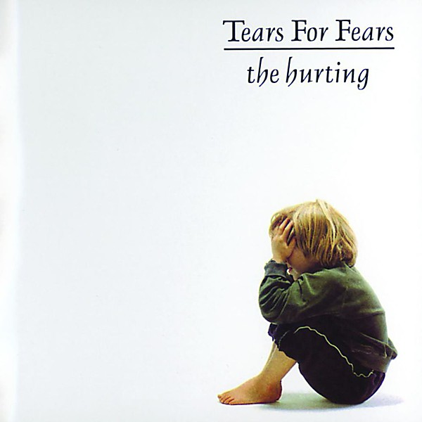

# The Hurting

By **Tears for Fears**

## Album Data

- **Catalog:** Beets
- **Format:** Digital, Album
- **Album:** The Hurting
- **Artist:** Tears For Fears
- **Albumartist:** Tears for Fears
- **Genre:** Synthpop
- **MusicBrainz Album Artist ID:** [7c7f9c94-dee8-4903-892b-6cf44652e2de](https://musicbrainz.org/artist/7c7f9c94-dee8-4903-892b-6cf44652e2de)
- **MusicBrainz Album ID:** [b3ecd77a-2afe-4381-86c3-688c90a8b1f1](https://musicbrainz.org/release/b3ecd77a-2afe-4381-86c3-688c90a8b1f1)
- **MusicBrainz Release Group ID:** [6901aa79-3c37-32eb-8bd2-4061049b40c5](https://musicbrainz.org/release-group/6901aa79-3c37-32eb-8bd2-4061049b40c5)
- **Year:** 2000
- **Catalog #:** 838 730-2
- **Label:** Fontana
- **Total Tracks:** 08

## Album Tracks

### Track 01 - Woman in Chains

- **Artist:** Tears for Fears
- **Format:** ALAC
- **Genre:** Synthpop
- **Length:** 6:30
- **MusicBrainz Track ID:** [a913401f-3a6a-405a-bc41-381e23f4674b](https://musicbrainz.org/recording/a913401f-3a6a-405a-bc41-381e23f4674b)
- **Title:** Woman in Chains
- **Track:** 01
- **Year:** 1989

### Track 02 - Badman’s Song

- **Artist:** Tears for Fears
- **Format:** ALAC
- **Genre:** Neo-Psychedelia
- **Length:** 8:32
- **MusicBrainz Track ID:** [e7c9b8d8-c949-4254-b3cf-5d5c89a67e4f](https://musicbrainz.org/recording/e7c9b8d8-c949-4254-b3cf-5d5c89a67e4f)
- **Title:** Badman’s Song
- **Track:** 02
- **Year:** 1989

### Track 03 - Sowing the Seeds of Love

- **Artist:** Tears for Fears
- **Format:** ALAC
- **Genre:** Synthpop
- **Length:** 6:19
- **MusicBrainz Track ID:** [c4334400-581d-42cd-88e9-e0e963c57f50](https://musicbrainz.org/recording/c4334400-581d-42cd-88e9-e0e963c57f50)
- **Title:** Sowing the Seeds of Love
- **Track:** 03
- **Year:** 1989

### Track 04 - Advice for the Young at Heart

- **Artist:** Tears for Fears
- **Format:** ALAC
- **Genre:** New Wave
- **Length:** 4:55
- **MusicBrainz Track ID:** [e06e0227-3877-4479-9c95-ae340013a220](https://musicbrainz.org/recording/e06e0227-3877-4479-9c95-ae340013a220)
- **Title:** Advice for the Young at Heart
- **Track:** 04
- **Year:** 1989

### Track 05 - Standing on the Corner of the Third World

- **Artist:** Tears for Fears
- **Format:** ALAC
- **Genre:** Synthpop
- **Length:** 5:33
- **MusicBrainz Track ID:** [436d71cd-cc35-45ae-b72e-6d76e94df53d](https://musicbrainz.org/recording/436d71cd-cc35-45ae-b72e-6d76e94df53d)
- **Title:** Standing on the Corner of the Third World
- **Track:** 05
- **Year:** 1989

### Track 06 - Swords and Knives

- **Artist:** Tears for Fears
- **Format:** ALAC
- **Genre:** Neo-Psychedelia
- **Length:** 6:20
- **MusicBrainz Track ID:** [c80351a7-4276-461f-acbc-30da4489bc71](https://musicbrainz.org/recording/c80351a7-4276-461f-acbc-30da4489bc71)
- **Title:** Swords and Knives
- **Track:** 06
- **Year:** 1989

### Track 07 - Year of the Knife

- **Artist:** Tears for Fears
- **Format:** ALAC
- **Genre:** Neo-Psychedelia
- **Length:** 6:55
- **MusicBrainz Track ID:** [a239232a-ccbd-447f-9374-5b4833ffc4ec](https://musicbrainz.org/recording/a239232a-ccbd-447f-9374-5b4833ffc4ec)
- **Title:** Year of the Knife
- **Track:** 07
- **Year:** 1989

### Track 08 - Famous Last Words

- **Artist:** Tears for Fears
- **Format:** ALAC
- **Genre:** Neo-Psychedelia
- **Length:** 4:31
- **MusicBrainz Track ID:** [34b2b506-e275-42a5-9ed5-148bc696c092](https://musicbrainz.org/recording/34b2b506-e275-42a5-9ed5-148bc696c092)
- **Title:** Famous Last Words
- **Track:** 08
- **Year:** 1989

## See also

- [Raoul and the Kings of Spain](Raoul_and_the_Kings_of_Spain.md)
- [Songs from the Big Chair](Songs_from_the_Big_Chair.md)
- [The Seeds of Love](The_Seeds_of_Love.md)
