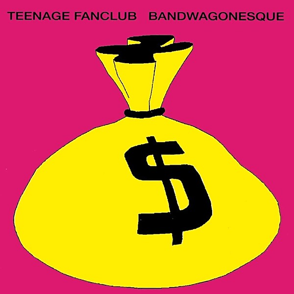

# Bandwagonesque

By **Teenage Fanclub**

## Album Data

- **Catalog:** Beets
- **Format:** Digital, Album
- **Album:** Bandwagonesque
- **Artist:** Teenage Fanclub
- **Albumartist:** Teenage Fanclub
- **Genre:** Indie Rock
- **MusicBrainz Album Artist ID:** [e6f8912b-7df9-4aae-b551-2cd03dc29588](https://musicbrainz.org/artist/e6f8912b-7df9-4aae-b551-2cd03dc29588)
- **MusicBrainz Album ID:** [2acce1e6-3378-3dac-84f3-db2dcc9bef1d](https://musicbrainz.org/release/2acce1e6-3378-3dac-84f3-db2dcc9bef1d)
- **MusicBrainz Release Group ID:** [4119fd8b-9858-33c9-8256-fcc1570bc07f](https://musicbrainz.org/release-group/4119fd8b-9858-33c9-8256-fcc1570bc07f)
- **Year:** 1991
- **Catalog #:** DGCD-24802
- **Label:** Geffen Records
- **Total Tracks:** 13

## Album Tracks

### Track 01 - About You

- **Artist:** Teenage Fanclub
- **Format:** ALAC
- **Genre:** Indie Rock
- **Length:** 2:41
- **MusicBrainz Track ID:** [e1d13a1a-16bc-4f8f-a5b5-aa50129e8f90](https://musicbrainz.org/recording/e1d13a1a-16bc-4f8f-a5b5-aa50129e8f90)
- **Title:** About You
- **Track:** 01
- **Year:** 1995

### Track 02 - Sparky's Dream

- **Artist:** Teenage Fanclub
- **Format:** ALAC
- **Genre:** Indie Rock
- **Length:** 3:17
- **MusicBrainz Track ID:** [2b8f6d16-1199-4465-8376-d20a93a776ed](https://musicbrainz.org/recording/2b8f6d16-1199-4465-8376-d20a93a776ed)
- **Title:** Sparky's Dream
- **Track:** 02
- **Year:** 1995

### Track 03 - Mellow Doubt

- **Artist:** Teenage Fanclub
- **Format:** ALAC
- **Genre:** Indie Pop
- **Length:** 2:42
- **MusicBrainz Track ID:** [33ce094d-4ec8-4457-ad92-412b6f879a2b](https://musicbrainz.org/recording/33ce094d-4ec8-4457-ad92-412b6f879a2b)
- **Title:** Mellow Doubt
- **Track:** 03
- **Year:** 1995

### Track 04 - Don't Look Back

- **Artist:** Teenage Fanclub
- **Format:** ALAC
- **Genre:** Indie Rock
- **Length:** 3:43
- **MusicBrainz Track ID:** [5e36a0ab-6c44-4f53-be64-d8b21633d05e](https://musicbrainz.org/recording/5e36a0ab-6c44-4f53-be64-d8b21633d05e)
- **Title:** Don't Look Back
- **Track:** 04
- **Year:** 1995

### Track 05 - Verisimilitude

- **Artist:** Teenage Fanclub
- **Format:** ALAC
- **Genre:** Indie Rock
- **Length:** 3:31
- **MusicBrainz Track ID:** [20816c67-7b13-4200-b439-a83fd2fc7431](https://musicbrainz.org/recording/20816c67-7b13-4200-b439-a83fd2fc7431)
- **Title:** Verisimilitude
- **Track:** 05
- **Year:** 1995

### Track 06 - Neil Jung

- **Artist:** Teenage Fanclub
- **Format:** ALAC
- **Genre:** Indie Rock
- **Length:** 4:48
- **MusicBrainz Track ID:** [46e5b8df-5ba0-4ad9-87fa-7331c44693da](https://musicbrainz.org/recording/46e5b8df-5ba0-4ad9-87fa-7331c44693da)
- **Title:** Neil Jung
- **Track:** 06
- **Year:** 1995

### Track 07 - Tears

- **Artist:** Teenage Fanclub
- **Format:** ALAC
- **Genre:** Indie Rock
- **Length:** 2:43
- **MusicBrainz Track ID:** [15cbb1c0-e506-4f78-a71d-1ca23e2a938d](https://musicbrainz.org/recording/15cbb1c0-e506-4f78-a71d-1ca23e2a938d)
- **Title:** Tears
- **Track:** 07
- **Year:** 1995

### Track 08 - Discolite

- **Artist:** Teenage Fanclub
- **Format:** ALAC
- **Genre:** Indie Pop
- **Length:** 3:07
- **MusicBrainz Track ID:** [1243ccc6-8ffd-476e-bdc6-379d57514983](https://musicbrainz.org/recording/1243ccc6-8ffd-476e-bdc6-379d57514983)
- **Title:** Discolite
- **Track:** 08
- **Year:** 1995

### Track 09 - Say No

- **Artist:** Teenage Fanclub
- **Format:** ALAC
- **Genre:** Indie Pop
- **Length:** 3:12
- **MusicBrainz Track ID:** [2771c7e7-f450-4449-a8ac-1ccdafa9e908](https://musicbrainz.org/recording/2771c7e7-f450-4449-a8ac-1ccdafa9e908)
- **Title:** Say No
- **Track:** 09
- **Year:** 1995

### Track 10 - Going Places

- **Artist:** Teenage Fanclub
- **Format:** ALAC
- **Genre:** Indie Rock
- **Length:** 4:28
- **MusicBrainz Track ID:** [195fbffe-63cc-4ad6-86fa-0bc5ff7e4d92](https://musicbrainz.org/recording/195fbffe-63cc-4ad6-86fa-0bc5ff7e4d92)
- **Title:** Going Places
- **Track:** 10
- **Year:** 1995

### Track 11 - I'll Make It Clear

- **Artist:** Teenage Fanclub
- **Format:** ALAC
- **Genre:** Indie Rock
- **Length:** 2:33
- **MusicBrainz Track ID:** [62213056-df29-48b7-9c7d-a759856f6ed3](https://musicbrainz.org/recording/62213056-df29-48b7-9c7d-a759856f6ed3)
- **Title:** I'll Make It Clear
- **Track:** 11
- **Year:** 1995

### Track 12 - I Gotta Know

- **Artist:** Teenage Fanclub
- **Format:** ALAC
- **Genre:** Indie Pop
- **Length:** 3:27
- **MusicBrainz Track ID:** [3ecc2780-4f8b-4799-b22d-d7c0f0e3c27d](https://musicbrainz.org/recording/3ecc2780-4f8b-4799-b22d-d7c0f0e3c27d)
- **Title:** I Gotta Know
- **Track:** 12
- **Year:** 1995

### Track 13 - Hardcore/Ballad

- **Artist:** Teenage Fanclub
- **Format:** ALAC
- **Genre:** Power Pop
- **Length:** 1:48
- **MusicBrainz Track ID:** [76ccb7f1-4771-47a7-83ed-7735e52466ec](https://musicbrainz.org/recording/76ccb7f1-4771-47a7-83ed-7735e52466ec)
- **Title:** Hardcore/Ballad
- **Track:** 13
- **Year:** 1995

## See also

- [Grand Prix](Grand_Prix.md)
- [Man-Made](Man-Made.md)
- [Songs From Northern Britain](Songs_From_Northern_Britain.md)
