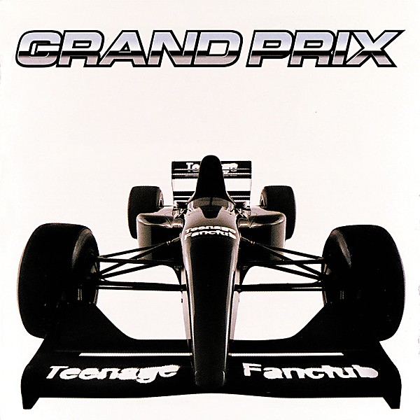

# Grand Prix

By **Teenage Fanclub**

## Album Data

- **Catalog:** Beets
- **Format:** Digital, Album
- **Album:** Grand Prix
- **Artist:** Teenage Fanclub
- **Albumartist:** Teenage Fanclub
- **Genre:** Indie Rock
- **MusicBrainz Album Artist ID:** [e6f8912b-7df9-4aae-b551-2cd03dc29588](https://musicbrainz.org/artist/e6f8912b-7df9-4aae-b551-2cd03dc29588)
- **MusicBrainz Album ID:** [3447ae15-e65d-32b9-8025-9090d1bb8dc2](https://musicbrainz.org/release/3447ae15-e65d-32b9-8025-9090d1bb8dc2)
- **MusicBrainz Release Group ID:** [d243c547-661f-39fc-9311-3c445886f063](https://musicbrainz.org/release-group/d243c547-661f-39fc-9311-3c445886f063)
- **Year:** 1995
- **Catalog #:** MRG262CD
- **Label:** Merge Records
- **Total Tracks:** 12

## Album Tracks

### Track 01 - It's All in My Mind

- **Artist:** Teenage Fanclub
- **Format:** AAC
- **Genre:** Indie Rock
- **Length:** 3:41
- **MusicBrainz Track ID:** [4c383c9c-b1e9-4089-acfe-aa22eb8f1010](https://musicbrainz.org/recording/4c383c9c-b1e9-4089-acfe-aa22eb8f1010)
- **Title:** It's All in My Mind
- **Track:** 01
- **Year:** 2005

### Track 02 - Time Stops

- **Artist:** Teenage Fanclub
- **Format:** AAC
- **Genre:** Indie Rock
- **Length:** 4:11
- **MusicBrainz Track ID:** [3a157619-c40f-4379-a42a-5b3cc55148c8](https://musicbrainz.org/recording/3a157619-c40f-4379-a42a-5b3cc55148c8)
- **Title:** Time Stops
- **Track:** 02
- **Year:** 2005

### Track 03 - Nowhere

- **Artist:** Teenage Fanclub
- **Format:** AAC
- **Genre:** Indie Rock
- **Length:** 3:40
- **MusicBrainz Track ID:** [17f53f04-ce6c-41bb-8883-54d8ae95aed7](https://musicbrainz.org/recording/17f53f04-ce6c-41bb-8883-54d8ae95aed7)
- **Title:** Nowhere
- **Track:** 03
- **Year:** 2005

### Track 04 - Save

- **Artist:** Teenage Fanclub
- **Format:** AAC
- **Genre:** Indie Rock
- **Length:** 4:14
- **MusicBrainz Track ID:** [c4cae643-b21d-4124-b721-5e5d22ab5fdb](https://musicbrainz.org/recording/c4cae643-b21d-4124-b721-5e5d22ab5fdb)
- **Title:** Save
- **Track:** 04
- **Year:** 2005

### Track 05 - Slow Fade

- **Artist:** Teenage Fanclub
- **Format:** AAC
- **Genre:** Indie Rock
- **Length:** 1:54
- **MusicBrainz Track ID:** [aa6c16ea-d449-4406-a6ba-e87d55ec8efe](https://musicbrainz.org/recording/aa6c16ea-d449-4406-a6ba-e87d55ec8efe)
- **Title:** Slow Fade
- **Track:** 05
- **Year:** 2005

### Track 06 - Only With You

- **Artist:** Teenage Fanclub
- **Format:** AAC
- **Genre:** Indie Rock
- **Length:** 4:21
- **MusicBrainz Track ID:** [f12a6810-2a74-4c22-b9e7-ab8e1d92aea3](https://musicbrainz.org/recording/f12a6810-2a74-4c22-b9e7-ab8e1d92aea3)
- **Title:** Only With You
- **Track:** 06
- **Year:** 2005

### Track 07 - Cells

- **Artist:** Teenage Fanclub
- **Format:** AAC
- **Genre:** Indie Rock
- **Length:** 3:20
- **MusicBrainz Track ID:** [3fd709ab-c72b-48f6-8299-2d87572aa4c4](https://musicbrainz.org/recording/3fd709ab-c72b-48f6-8299-2d87572aa4c4)
- **Title:** Cells
- **Track:** 07
- **Year:** 2005

### Track 08 - Feel

- **Artist:** Teenage Fanclub
- **Format:** AAC
- **Genre:** Indie Pop
- **Length:** 3:51
- **MusicBrainz Track ID:** [9eef17b3-0b06-4431-be65-5a8bb42d47c0](https://musicbrainz.org/recording/9eef17b3-0b06-4431-be65-5a8bb42d47c0)
- **Title:** Feel
- **Track:** 08
- **Year:** 2005

### Track 09 - Fallen Leaves

- **Artist:** Teenage Fanclub
- **Format:** AAC
- **Genre:** Power Pop
- **Length:** 3:31
- **MusicBrainz Track ID:** [3f04003e-97d9-4490-af9e-6108077e2d51](https://musicbrainz.org/recording/3f04003e-97d9-4490-af9e-6108077e2d51)
- **Title:** Fallen Leaves
- **Track:** 09
- **Year:** 2005

### Track 10 - Flowing

- **Artist:** Teenage Fanclub
- **Format:** AAC
- **Genre:** Indie Rock
- **Length:** 3:01
- **MusicBrainz Track ID:** [ffbe0100-ed83-4b20-b13c-cf01336774ef](https://musicbrainz.org/recording/ffbe0100-ed83-4b20-b13c-cf01336774ef)
- **Title:** Flowing
- **Track:** 10
- **Year:** 2005

### Track 11 - Born Under a Good Sign

- **Artist:** Teenage Fanclub
- **Format:** AAC
- **Genre:** Indie Pop
- **Length:** 3:00
- **MusicBrainz Track ID:** [6ceb1781-4be5-4ae2-986f-3f8d97b964f1](https://musicbrainz.org/recording/6ceb1781-4be5-4ae2-986f-3f8d97b964f1)
- **Title:** Born Under a Good Sign
- **Track:** 11
- **Year:** 2005

### Track 12 - Don't Hide

- **Artist:** Teenage Fanclub
- **Format:** AAC
- **Genre:** Indie Rock
- **Length:** 4:00
- **MusicBrainz Track ID:** [891dd44c-5715-47a8-a8a9-64a60227eede](https://musicbrainz.org/recording/891dd44c-5715-47a8-a8a9-64a60227eede)
- **Title:** Don't Hide
- **Track:** 12
- **Year:** 2005

## See also

- [Bandwagonesque](Bandwagonesque.md)
- [Man-Made](Man-Made.md)
- [Songs From Northern Britain](Songs_From_Northern_Britain.md)
