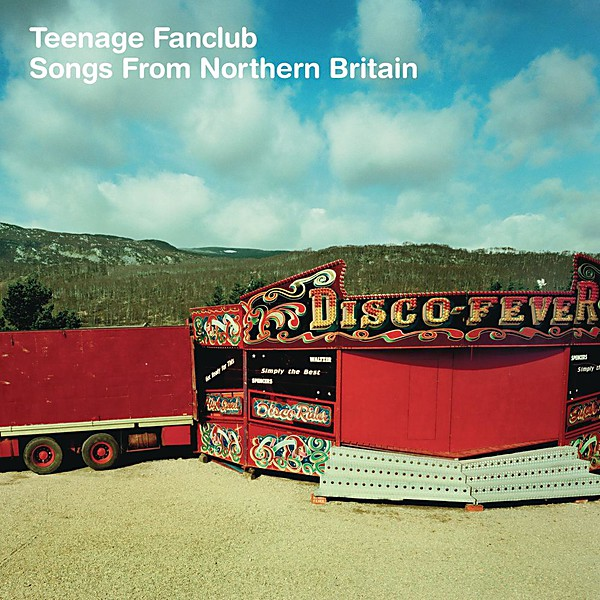

# Songs From Northern Britain

By **Teenage Fanclub**

## Album Data

- **Catalog:** Beets
- **Format:** Digital, Album
- **Album:** Songs From Northern Britain
- **Artist:** Teenage Fanclub
- **Albumartist:** Teenage Fanclub
- **Genre:** Shoegaze
- **MusicBrainz Album Artist ID:** [e6f8912b-7df9-4aae-b551-2cd03dc29588](https://musicbrainz.org/artist/e6f8912b-7df9-4aae-b551-2cd03dc29588)
- **MusicBrainz Album ID:** [8fe5388b-2d68-427b-903a-afa3c2bc3e07](https://musicbrainz.org/release/8fe5388b-2d68-427b-903a-afa3c2bc3e07)
- **MusicBrainz Release Group ID:** [de121879-1170-30d3-9967-6d986155dfd5](https://musicbrainz.org/release-group/de121879-1170-30d3-9967-6d986155dfd5)
- **Year:** 1997
- **Catalog #:** CRECD 196
- **Label:** Creation Records
- **Total Tracks:** 12

## Album Tracks

### Track 01 - Start Again

- **Artist:** Teenage Fanclub
- **Format:** ALAC
- **Genre:** Indie Rock
- **Length:** 3:10
- **MusicBrainz Track ID:** [97a729bd-e054-4742-a806-89827bb76892](https://musicbrainz.org/recording/97a729bd-e054-4742-a806-89827bb76892)
- **Title:** Start Again
- **Track:** 01
- **Year:** 1997

### Track 02 - Ain’t That Enough

- **Artist:** Teenage Fanclub
- **Format:** ALAC
- **Genre:** Shoegaze
- **Length:** 3:42
- **MusicBrainz Track ID:** [bec83bc4-bac8-4e25-9db5-a829d7f47c54](https://musicbrainz.org/recording/bec83bc4-bac8-4e25-9db5-a829d7f47c54)
- **Title:** Ain’t That Enough
- **Track:** 02
- **Year:** 1997

### Track 03 - Can’t Feel My Soul

- **Artist:** Teenage Fanclub
- **Format:** ALAC
- **Genre:** Shoegaze
- **Length:** 3:12
- **MusicBrainz Track ID:** [01fc6623-c084-428c-b274-fbff981ca6bf](https://musicbrainz.org/recording/01fc6623-c084-428c-b274-fbff981ca6bf)
- **Title:** Can’t Feel My Soul
- **Track:** 03
- **Year:** 1997

### Track 04 - I Don’t Want Control of You

- **Artist:** Teenage Fanclub
- **Format:** ALAC
- **Genre:** Shoegaze
- **Length:** 3:08
- **MusicBrainz Track ID:** [08b41d03-7685-4be6-a05a-4cad9f030498](https://musicbrainz.org/recording/08b41d03-7685-4be6-a05a-4cad9f030498)
- **Title:** I Don’t Want Control of You
- **Track:** 04
- **Year:** 1997

### Track 05 - Planets

- **Artist:** Teenage Fanclub
- **Format:** ALAC
- **Genre:** Britpop
- **Length:** 2:50
- **MusicBrainz Track ID:** [4ba2218a-ec61-4460-89a8-1c12ee052a09](https://musicbrainz.org/recording/4ba2218a-ec61-4460-89a8-1c12ee052a09)
- **Title:** Planets
- **Track:** 05
- **Year:** 1997

### Track 06 - It’s a Bad World

- **Artist:** Teenage Fanclub
- **Format:** ALAC
- **Genre:** Shoegaze
- **Length:** 4:20
- **MusicBrainz Track ID:** [84089d37-a701-4a71-8a65-1904a44930d3](https://musicbrainz.org/recording/84089d37-a701-4a71-8a65-1904a44930d3)
- **Title:** It’s a Bad World
- **Track:** 06
- **Year:** 1997

### Track 07 - Take the Long Way Around

- **Artist:** Teenage Fanclub
- **Format:** ALAC
- **Genre:** Power Pop
- **Length:** 3:25
- **MusicBrainz Track ID:** [44197bcc-0143-4424-b87b-bbd6934c2537](https://musicbrainz.org/recording/44197bcc-0143-4424-b87b-bbd6934c2537)
- **Title:** Take the Long Way Around
- **Track:** 07
- **Year:** 1997

### Track 08 - Winter

- **Artist:** Teenage Fanclub
- **Format:** ALAC
- **Genre:** Indie Pop
- **Length:** 3:46
- **MusicBrainz Track ID:** [7c4d8efa-c9bd-41cb-9db2-0cee13e09244](https://musicbrainz.org/recording/7c4d8efa-c9bd-41cb-9db2-0cee13e09244)
- **Title:** Winter
- **Track:** 08
- **Year:** 1997

### Track 09 - I Don’t Care

- **Artist:** Teenage Fanclub
- **Format:** ALAC
- **Genre:** Shoegaze
- **Length:** 3:06
- **MusicBrainz Track ID:** [fcd97e94-6f6d-40ac-b558-d3234c6d47b5](https://musicbrainz.org/recording/fcd97e94-6f6d-40ac-b558-d3234c6d47b5)
- **Title:** I Don’t Care
- **Track:** 09
- **Year:** 1997

### Track 10 - Mount Everest

- **Artist:** Teenage Fanclub
- **Format:** ALAC
- **Genre:** Slowcore
- **Length:** 5:15
- **MusicBrainz Track ID:** [6a87354d-2701-43f7-8258-123075340ab3](https://musicbrainz.org/recording/6a87354d-2701-43f7-8258-123075340ab3)
- **Title:** Mount Everest
- **Track:** 10
- **Year:** 1997

### Track 11 - Your Love Is the Place Where I Come From

- **Artist:** Teenage Fanclub
- **Format:** ALAC
- **Genre:** Sadcore
- **Length:** 3:29
- **MusicBrainz Track ID:** [363255ac-5571-4972-82d9-61ad150427c2](https://musicbrainz.org/recording/363255ac-5571-4972-82d9-61ad150427c2)
- **Title:** Your Love Is the Place Where I Come From
- **Track:** 11
- **Year:** 1997

### Track 12 - Speed of Light

- **Artist:** Teenage Fanclub
- **Format:** ALAC
- **Genre:** Power Pop
- **Length:** 3:52
- **MusicBrainz Track ID:** [686a7962-bace-475f-98fe-17454d788344](https://musicbrainz.org/recording/686a7962-bace-475f-98fe-17454d788344)
- **Title:** Speed of Light
- **Track:** 12
- **Year:** 1997

## See also

- [Bandwagonesque](Bandwagonesque.md)
- [Grand Prix](Grand_Prix.md)
- [Man-Made](Man-Made.md)
