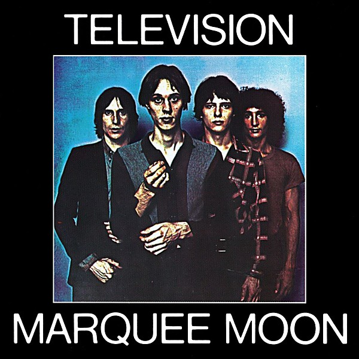

# Marquee Moon

By **Television**

## Album Data

- **Catalog:** Beets
- **Format:** Digital, Album
- **Album:** Marquee Moon
- **Artist:** Television
- **Albumartist:** Television
- **Genre:** Art Punk
- **MusicBrainz Album Artist ID:** [490bde43-5edb-4a93-b3b3-7a0465fd8909](https://musicbrainz.org/artist/490bde43-5edb-4a93-b3b3-7a0465fd8909)
- **MusicBrainz Album ID:** [5fb363d1-3bee-44ce-acfc-43fdb0d7c4aa](https://musicbrainz.org/release/5fb363d1-3bee-44ce-acfc-43fdb0d7c4aa)
- **MusicBrainz Release Group ID:** [2b9f99d8-becf-3fc3-86a6-2bdd4cef93fe](https://musicbrainz.org/release-group/2b9f99d8-becf-3fc3-86a6-2bdd4cef93fe)
- **Year:** 2003
- **Catalog #:** R2 73920
- **Label:** Rhino
- **Total Tracks:** 13

## Album Tracks

### Track 01 - See No Evil

- **Artist:** Television
- **Format:** ALAC
- **Genre:** Art Punk
- **Length:** 3:58
- **MusicBrainz Track ID:** [95e65dad-fb95-478b-9a40-37fec8e8848c](https://musicbrainz.org/recording/95e65dad-fb95-478b-9a40-37fec8e8848c)
- **Title:** See No Evil
- **Track:** 01
- **Year:** 2003

### Track 02 - Venus

- **Artist:** Television
- **Format:** ALAC
- **Genre:** Indie Rock
- **Length:** 3:54
- **MusicBrainz Track ID:** [e4b7f69e-4117-4851-a37a-f4a889e63d36](https://musicbrainz.org/recording/e4b7f69e-4117-4851-a37a-f4a889e63d36)
- **Title:** Venus
- **Track:** 02
- **Year:** 2003

### Track 03 - Friction

- **Artist:** Television
- **Format:** ALAC
- **Genre:** Indie Rock
- **Length:** 4:45
- **MusicBrainz Track ID:** [7625443e-ffd4-4063-a94c-0746ae4103e7](https://musicbrainz.org/recording/7625443e-ffd4-4063-a94c-0746ae4103e7)
- **Title:** Friction
- **Track:** 03
- **Year:** 2003

### Track 04 - Marquee Moon

- **Artist:** Television
- **Format:** ALAC
- **Genre:** Art Punk
- **Length:** 10:47
- **MusicBrainz Track ID:** [8062e29a-16f8-44b8-8132-1bbf5a8ceb8e](https://musicbrainz.org/recording/8062e29a-16f8-44b8-8132-1bbf5a8ceb8e)
- **Title:** Marquee Moon
- **Track:** 04
- **Year:** 2003

### Track 05 - Elevation

- **Artist:** Television
- **Format:** ALAC
- **Genre:** Art Punk
- **Length:** 5:10
- **MusicBrainz Track ID:** [092ae218-6cec-4253-b9b3-7101aba83eca](https://musicbrainz.org/recording/092ae218-6cec-4253-b9b3-7101aba83eca)
- **Title:** Elevation
- **Track:** 05
- **Year:** 2003

### Track 06 - Guiding Light

- **Artist:** Television
- **Format:** ALAC
- **Genre:** Post-Punk
- **Length:** 5:37
- **MusicBrainz Track ID:** [b8e11f27-1f9e-4eac-a54b-5c93f691f132](https://musicbrainz.org/recording/b8e11f27-1f9e-4eac-a54b-5c93f691f132)
- **Title:** Guiding Light
- **Track:** 06
- **Year:** 2003

### Track 07 - Prove It

- **Artist:** Television
- **Format:** ALAC
- **Genre:** Punk Rock
- **Length:** 5:05
- **MusicBrainz Track ID:** [c285d8f0-24df-4e2a-bf16-c497e13600c7](https://musicbrainz.org/recording/c285d8f0-24df-4e2a-bf16-c497e13600c7)
- **Title:** Prove It
- **Track:** 07
- **Year:** 2003

### Track 08 - Torn Curtain

- **Artist:** Television
- **Format:** ALAC
- **Genre:** Art Punk
- **Length:** 7:10
- **MusicBrainz Track ID:** [eda3a2a5-20af-4321-8343-a592c656ac07](https://musicbrainz.org/recording/eda3a2a5-20af-4321-8343-a592c656ac07)
- **Title:** Torn Curtain
- **Track:** 08
- **Year:** 2003

### Track 09 - Little Johnny Jewel, Parts 1 & 2

- **Artist:** Television
- **Format:** ALAC
- **Genre:** New Wave
- **Length:** 7:09
- **MusicBrainz Track ID:** [620e22db-5ad4-44d5-ae98-953854994d19](https://musicbrainz.org/recording/620e22db-5ad4-44d5-ae98-953854994d19)
- **Title:** Little Johnny Jewel, Parts 1 & 2
- **Track:** 09
- **Year:** 2003

### Track 10 - See No Evil (alternate version)

- **Artist:** Television
- **Format:** ALAC
- **Genre:** Punk Rock
- **Length:** 4:40
- **MusicBrainz Track ID:** [4c227f5e-6fad-41f9-bab4-a2457f2b2a8e](https://musicbrainz.org/recording/4c227f5e-6fad-41f9-bab4-a2457f2b2a8e)
- **Title:** See No Evil (alternate version)
- **Track:** 10
- **Year:** 2003

### Track 11 - Friction (alternate version)

- **Artist:** Television
- **Format:** ALAC
- **Genre:** Punk Rock
- **Length:** 4:52
- **MusicBrainz Track ID:** [e50cb81a-7b98-4749-af56-3182936a02ba](https://musicbrainz.org/recording/e50cb81a-7b98-4749-af56-3182936a02ba)
- **Title:** Friction (alternate version)
- **Track:** 11
- **Year:** 2003

### Track 12 - Marquee Moon (alternate version)

- **Artist:** Television
- **Format:** ALAC
- **Genre:** Art Punk
- **Length:** 10:54
- **MusicBrainz Track ID:** [a5a70806-e908-4813-99a6-b60aac6c809b](https://musicbrainz.org/recording/a5a70806-e908-4813-99a6-b60aac6c809b)
- **Title:** Marquee Moon (alternate version)
- **Track:** 12
- **Year:** 2003

### Track 13 - Untitled Instrumental

- **Artist:** Television
- **Format:** ALAC
- **Genre:** Art Punk
- **Length:** 3:22
- **MusicBrainz Track ID:** [d1ad03be-b5fa-4dae-a9cc-6553247aecd2](https://musicbrainz.org/recording/d1ad03be-b5fa-4dae-a9cc-6553247aecd2)
- **Title:** Untitled Instrumental
- **Track:** 13
- **Year:** 2003

## See also

- [Roon: Marquee Moon](../../Roon/Television/Marquee_Moon.md)
